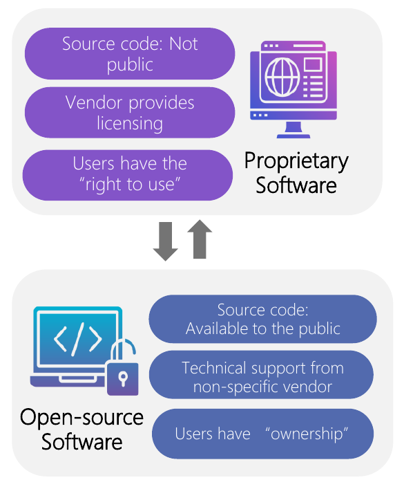
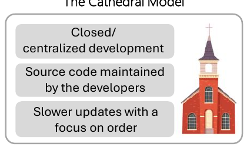
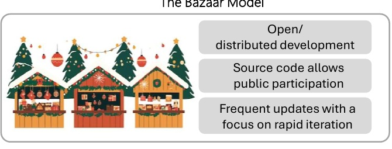
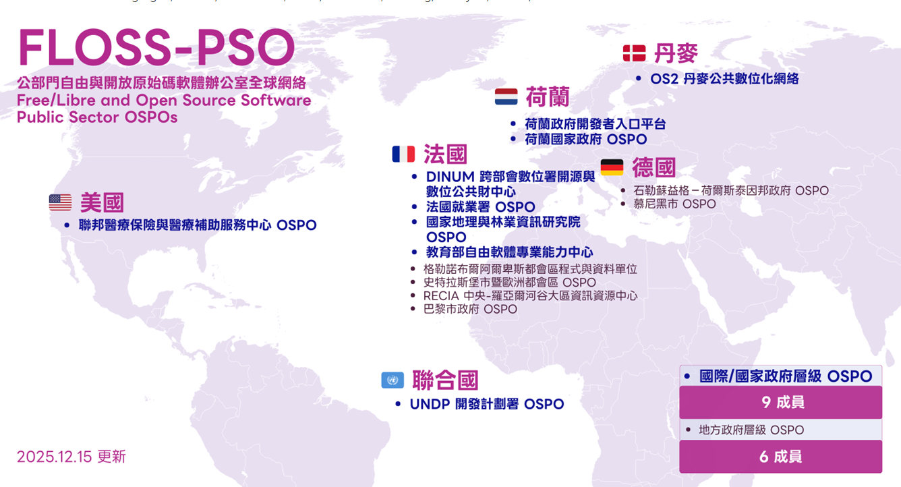
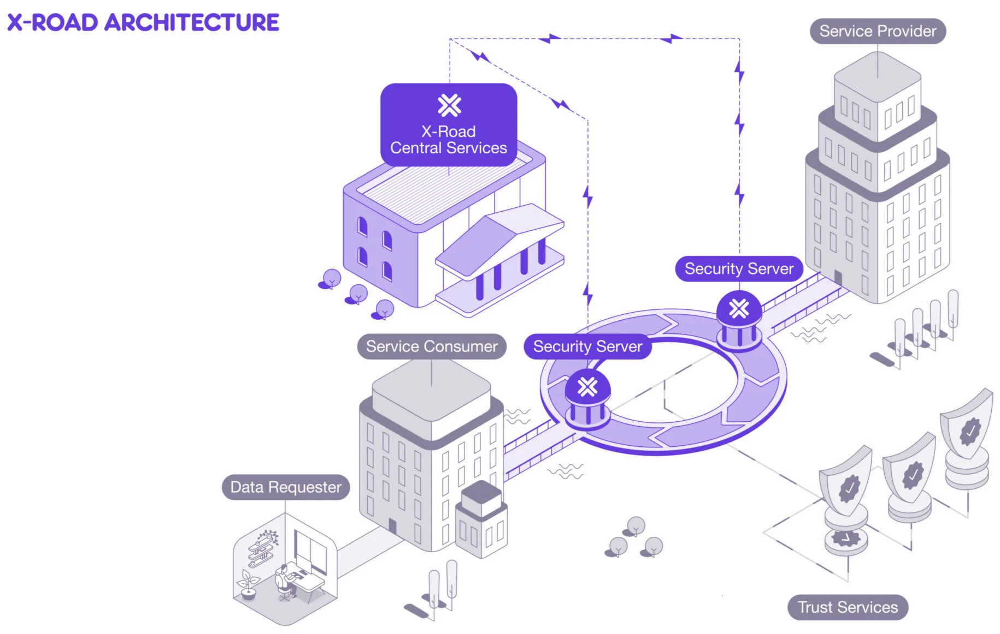
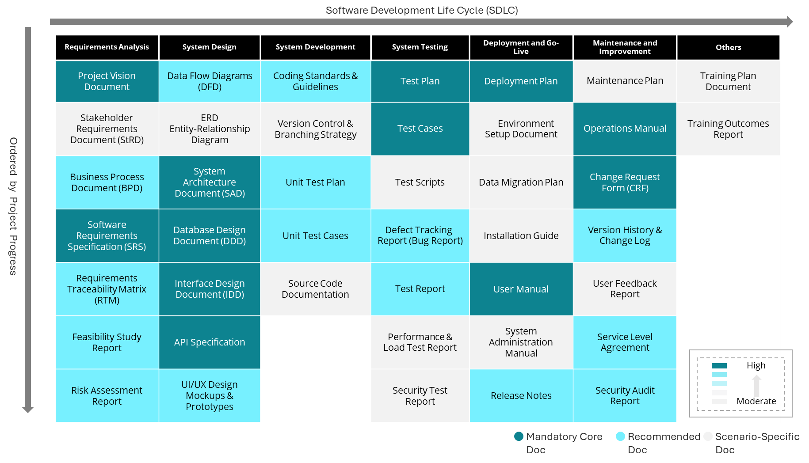

# Public Sector Open-Source Software Playbook

公部門開源軟體應用參考手冊

## Document Revision History {#document-revision-history}

| Version | Summary of Changes | Source Page Count | Release Date |
| --- | --- | --- | --- |
| V1.0 | Initial release | 127 | 114.12.24 |

## Table of Contents

- [Introduction](#introduction)
- [Chapter 1: Introduction to Open-Source Software](#chapter-1-introduction-to-open-source-software)
  - [1.1 How it started](#1-1-how-it-started)
  - [1.2 International Trends and Applications](#1-2-international-trends-and-applications)
  - [1.3 Basic Concept and Licensing Agreement Types of Open-Source Software](#1-3-basic-concept-and-licensing-agreement-types-of-open-source-software)
  - [1.4 Open-Source Software and Public Code](#1-4-open-source-software-and-public-code)
- [Chapter 2: Open-Source Software Application Evaluation](#chapter-2-open-source-software-application-evaluation)
  - [2.1 Difference Between Using Open-Source and Proprietary Software](#2-1-difference-between-using-open-source-and-proprietary-software)
  - [2.2 Open-Source Software Benefits and Risks Analysis](#2-2-open-source-software-benefits-and-risks-analysis)
  - [2.3 Open-Source Software Implementation Model](#2-3-open-source-software-implementation-model)
  - [2.4 Open-Source Software Governance System](#2-4-open-source-software-governance-system)
- [Chapter 3: Open-Source Software Implementation](#chapter-3-open-source-software-implementation)
  - [3.1 Software Development Process: Needs and Cautions when Designing Open-Source Software](#3-1-software-development-process-needs-and-cautions-when-designing-open-source-software)
  - [3.2 Software Development Process: Considerations for Open Source During Development and Testing](#3-2-software-development-process-considerations-for-open-source-during-development-and-testing)
  - [3.3 Software Development Process: Open-Source Considerations for Go-Live and Acceptance](#3-3-software-development-process-open-source-considerations-for-go-live-and-acceptance)
  - [3.4 Releasing Development Outcomes as Open Source](#3-4-releasing-development-outcomes-as-open-source)
- [Chapter 4: Open-Source Software Maintenance and Operations](#chapter-4-open-source-software-maintenance-and-operations)
  - [4.1 Open-Source Software Operations and Maintenance](#4-1-open-source-software-operations-and-maintenance)
  - [4.2 Sustainable Operations](#4-2-sustainable-operations)
  - [4.3 Conclusion](#4-3-conclusion)
- [Appendix I: Terminology](#appendix-i-terminology)
- [Appendix II: FAQ](#appendix-ii-faq)
- [Appendix III: Links](#appendix-iii-links)
- [Appendix IV: Requirements Planning Self-Assessment Checklist](#appendix-iv-requirements-planning-self-assessment-checklist)
- [Appendix V: License Compliance Assessment Checklist](#appendix-v-license-compliance-assessment-checklist)

## Introduction {#introduction}

### Origin {#origin}

In an era of flourishing information technology, rapid development in big data and artificial intelligence, and increasingly strict information-security and risk-management requirements, public agencies face rising demands in information-system development and maintenance. These systems must improve internal administrative and operational efficiency while providing the public with more convenient digital services. At the same time, public-sector IT teams often face limited staffing and slower technological innovation. Against this backdrop, open-source software and Public Code offer new possibilities for change.

Open-source software is a development and licensing model contrasted with proprietary software. In common software-system procurement, an agency defines its business needs, selects a product or tool that already provides the core functions, asks a vendor to customize and deploy it, and pays through buy-out, licensing, or subscription models. After go-live, the agency usually obtains only the right to use the system.

Under the proprietary-software model, the source code is not public, licensing is provided by the original vendor, and agencies typically continue relying on that vendor for maintenance services, which also raises switching costs.

| Type | Source Code | Licensing and Support | User Rights |
| --- | --- | --- | --- |
| Proprietary software | Not public | Licensing provided by the original vendor | Right to use |
| Open-source software | Publicly available | Technical support may come from vendors, communities, or multiple providers | Ownership and reuse flexibility |

The core feature of open-source software is that its source code is publicly available and allows others to use, copy, modify, distribute, and share the technology. Procurement of open-source software systems focuses on establishing collaborative relationships among developers, vendors, and communities. Through this model, agencies can obtain technical support, integration services, and long-term maintenance capabilities while reducing licensing costs, avoiding vendor lock-in, improving technical autonomy and flexibility, and accelerating innovation through global community resources.

At the same time, Public Code echoes the spirit of open-source software. Originating in Europe and later expanding in countries such as the United States and Canada, Public Code follows the principle of “public money, public code.” It encourages the public sector to release source code developed or procured with public budgets under open-source licenses. Public Code can be understood as the public sector’s open-source software repository. It allows agencies with similar needs to reuse existing work, reduces duplicated manpower, budget, and time, and enables the public to inspect the quality of digital services. When services involve the public interest, transparent Public Code helps people understand how systems operate, builds trust, strengthens civic participation, and reinforces national digital infrastructure.

Therefore, the Ministry of Digital Affairs prepared this manual to help agencies understand open-source software and Public Code. The manual assists information-planning personnel in establishing management measures and standards for open-source software, and helps project owners, IT developers, and maintenance teams understand methods for adopting open-source software. In doing so, agencies can respond to international digital-development trends and gradually expand the use of open-source software.

## Chapter 1: Introduction to Open-Source Software {#chapter-1-introduction-to-open-source-software}

### 1.1 How it started {#1-1-how-it-started}

From the 1950s to the 1970s, computers were not yet as popular as they are today and nearly all software was written and developed by academic researchers. It was pretty common for computer users to openly share the source code of the software they used to other users and hardware manufacturers. Because of this, knowledge sharing happened very naturally and it also contributed to the rapid evolution of information technology back then. When the early UNIX systems were released in the 1970s, their source code was also released along with them. However, by the late 1960s and early 1970s, as the software functions needed to accompany hardware became more sophisticated, development costs increased accordingly. To prevent software costs from driving up hardware costs, vendors gradually separated software and hardware releases. With the commercialization of software, along with the involvement of patent and copyright systems, many companies began closing off and “protecting” their source code, prohibiting users from freely modifying or distributing it.

In 1983, Richard Stallman[^1] initiated the GNU[^2] project, inspired by the challenges he personally encountered regarding the inability to freely share software while working at the Artificial Intelligence Laboratory at MIT (MIT AI Lab). At the MIT AI Lab, there was a Xerox printer that frequently jammed or had printing issues. Stallman’s habit when encountering such problems was to directly modify the driver’s source code to add a notification function, allowing users to receive warnings whenever a paper jam occurred.
However, the new driver for this Xerox printer was provided by an external company, with its source code not publicly available. Therefore, Stallman could no longer modify the program as he used to in order to solve the problem. He even approached the vendor to request the source code but was rejected. It was a significant blow to him because the tradition at the AI Lab was that everyone would solve problems and help each other through sharing source code.

To Stallman, vendors refusing to provide access to the source code represented the collapse of a culture of community collaboration. He believed this would isolate programmers from one another, even turning them into “enemies,” since everyone would be forced to guard their own proprietary programs instead of helping one another. For this reason, he believed that accepting proprietary software licenses would be equivalent to endorsing the notion that “not sharing” is acceptable, which contradicted his values of “freedom” and “cooperation.” As a result, he made a drastic decision: to develop a completely free operating system himself so that people would not have to rely on closed source software.
In September 1983, Stallman formally announced the GNU Project on an online newsgroup. His goal was to build a “completely free and Unix-compatible operating system.”
He founded the Free Software Foundation and at the same time promoted the Four Essential Freedoms of “Free Software” and the GNU General Public License (abbreviated as GPL or GNU GPL), thereby safeguarding the rights to freely share and modify software.
The Four Freedoms of Free Software can be summarized as follows:

| Freedom | Meaning |
| --- | --- |
| Freedom 0 | The freedom to run the program for any purpose. |
| Freedom 1 | The freedom to study how the program works and change it to meet your needs. |
| Freedom 2 | The freedom to redistribute copies to help others. |
| Freedom 3 | The freedom to distribute modified versions so the whole community can benefit. |

Open-sourced software (OSS) originated from Eric Raymond[^3]’ essay “The Cathedral and the Bazaar[^4]” in 1997. This essay discussed the two development models: The Cathedral Model and the Bazaar Model and Eric Raymond believed that the Bazaar Model will result in better development quality since “given enough eyeballs, all bugs are shallow.”
The essay contrasts two development models:

| Model | Development Style | Source Code and Release Pattern |
| --- | --- | --- |
| Bazaar model | Open and distributed development | Source code is open to public participation, with frequent releases and rapid iteration. |
| Cathedral model | Closed and centralized development | Source code is maintained by a dedicated developer group, with slower releases and greater emphasis on order. |

This essay was also responsible for inspiring Netscape’s decision to release its “Netscape Communicator” as free software in 1998, which was developed via public collaboration. Netscape Communicator eventually evolved into popular software such as Mozilla Firefox and Thunderbird[^5]. As Netscape announced to make its browser’s source code open source, a group of community leaders began to discuss how to make it easier for the business community to accept this software model and introduce the concept and benefits of free software by Free Software Foundation to the commercial software industry. Thanks to the rapid development of the Linux operating system and the Internet in the 90s, many software projects thrived with public collaboration.

However, there were several challenges when conveying the concept of “free software” to the public:
- “Free” is easily misunderstood as “free of charge” instead of “freedom to use.”
- The narrative has a strong ethical and political framing, which some businesses worry may be perceived as “anti-business.”
Therefore, Eric Raymond, among others, proposed the term “open-source” and established the Open-Source Initiative (OSI), which is responsible for promoting and certifying licensing agreements that meet the “Open-Source Definition” (OSD)[^6].
Software with “open-source licensing agreement” that meets OSI’s definition can be called “open-source software”. The key is that software with publicly available source code does not make it open-source software. It must meet certain conditions with specific licensing agreement to be considered genuinely open-source software.
To make things easier to understand, we generally call free software and open-source software as “free and open-source software” (FOSS) or “free/libre and open-source software” (FLOSS). These two names can prevent confusion while emphasizing the core values shared by both.

The Open-Source Definition (OSD) can be summarized in ten requirements:

| Requirement | Explanation |
| --- | --- |
| Free distribution | The software may be sold or given away without requiring a license fee. |
| Source code | The program must include source code and allow distribution in both source-code and compiled forms. |
| Derived works | The license must allow modifications, derived works, and redistribution. |
| Integrity of the author’s source code | The license may require modified versions to be distributed as patch files, but it must still allow distribution of software built from modified source code. |
| No discrimination against persons or groups | The license must not exclude any person or group. |
| No discrimination against fields of endeavor | The license must not restrict use in specific fields such as business or research. |
| Distribution of license | Redistribution must not require an additional license agreement. |
| License not specific to a product | Rights must remain in effect even when the software is separated from the original distribution. |
| License must not restrict other software | The license must not require other software on the same medium to also be open source. |
| Technology-neutral | The license must not depend on a specific technology or interface. |
In terms of technical applications, whether in operating systems, the Internet, cloud services, or AI computing, the fundamental development, key frameworks, and tools in these fields are largely open-source projects. Linux itself is the world’s mainstream server operating system and the Android operating system for mobile devices is also based on Linux. According to usage statistics provided by W3Techs in November 2025[^7], among identifiable server operating systems worldwide, the free software Linux accounts for 58.4%, while the proprietary Windows accounting for only 10%.

The same W3Techs report also indicates that among identifiable websites on the Internet, the open-source web servers Apache and Nginx together account for 58.2%, exceeding half. Front-end web technologies are dominated even more by open-source projects, such as the WebKit engine used by the Safari browser as well as commonly seen front-end frameworks such as React, Vue, and Angular, all of which are important examples of open-source projects.
In cloud services, Docker has already become an indispensable deployment tool. Its Docker Engine[^8] is a well-known open-source software project licensed under the Apache License 2.0. The core of cloud system management, Kubernetes[^9], is also under the same license and has been widely supported by major cloud service providers such as AWS, GCP, and Azure.
Finally, the foundation of AI computing services—deep-learning frameworks such as PyTorch[^10] and TensorFlow[^11] as well as tools used for training and research, such as NumPy[^12]—are all widely used open-source projects. These examples fully demonstrate that modern digital development is fundamentally built upon free and open-source software.

### 1.2 International Trends and Applications {#1-2-international-trends-and-applications}

This section includes three examples of government agencies adopting open-source software in other countries, which will help us understand the main trend of the adoption of open-source software among government agencies.

#### 1.2.1 German Federal Government Led the Development of openDesk {#1-2-1-german-federal-government-led-the-development-of-opendesk}

*Image source: openDesk.eu*
ZenDiS (short for “Centre for Digital Sovereignty of the Public Administration”) was the organization founded by the German Federal Government in December 2022, with the goal to promote open source and enhance the technological autonomy and digital sovereignty at government agencies. openDesk, a flagship product of ZenDiS, is an

office work and collaborative platform consisting of multiple free and open-source software. Designed for public and administrative agencies, openDesk’s functions include word processing, spreadsheet, email, calendar, contacts, cloud storage, instant messaging, conference calls, project management module and Wiki[^13]. Initially, openDesk was developed under the Sovereign Workplace Project led by Bundesministerium des Innern (BMI). In early 2024, ZenDiS took the reins for the further development and management of openDesk. openDesk was not developed from scratch. Instead, it integrates many mature open-source software from businesses and the public sector and provides a consistent user interface and experience. This allows fast deployment, keeps the maintenance cost in check and reduces duplicate development and waste in resources.
openDesk is more than a collaboration tool. It is part of Germany’s digital sovereignty policy and has the following implications:

- Reduce vendor lock-in: When government agencies over-rely on a single commercial software provider, especially a major foreign vendor, they lose control over data access, maintenance, upgrades, privacy, and oversight. openDesk adopts open source and open standards to emphasize interoperability and replaceability.
- Enhance transparency and security: The source code can be inspected, which helps agencies identify vulnerabilities or backdoors and makes third-party review easier.
- Unify and standardize workflows: A unified collaboration platform reduces the operational burden, training cost, and maintenance cost caused by scattered tools, while improving administrative efficiency and interdepartmental collaboration.
- Support policy and legal goals: The promotion of openDesk echoes the German government’s digital strategy, IT-Planungsrat[^14], and Digital Sovereignty policy, which encourage government agencies to adopt open-source software to preserve autonomy and flexibility.

#### 1.2.2 UN Proposes “Digital Public Goods” {#1-2-2-un-proposes-digital-public-goods}

In addition to the “Public Money, Public Code” initiative promoted by the general public, the United Nations, in its “Secretary-General’s Roadmap for Digital Cooperation” published in 2020, officially proposed the concept of “Digital Public Goods.”
Digital public goods include open data, open-source software, open content, open standards and open artificial intelligence models. UN believes that digital public goods can unleash the potential of digital technologies and data and promote its global Sustainable Development Goals. The UN will formulate relevant standards as new digital public goods become available so that they can be adopted in real life.
Many countries have incorporated similar mindset in their policies. For example, government in the Europe, North America and Australia are implementing policies encouraging the adoption of open-source software or the publishing of the government’s development results in open source, in line with the spirit of “public code.”
The five Digital Public Goods in the UN’s “Secretary-General’s Roadmap for Digital Cooperation” are:

- Open data
- Open-source software
- Open content
- Open standards
- Open artificial intelligence models

#### 1.2.3 The US’ Federal Source Code Policy {#1-2-3-the-us-federal-source-code-policy}

Even though Europe’s digital sovereignty movement has everything to do with multiple measures by the US in recent years, the US itself, it turns out, has also been promoting public code-related policies for years.
In 2016, the Office of Management and Budget (OMB) under the Executive Office of the President of the United States (EOP) proposed the Federal Source Code Policy in a form of memorandum. The policy’s primary goal is to support the sharing and re-use of the custom-developed source codes procured between different government agencies and support the public access to the certain source codes.
Federal Acquisition Regulation is the main source for IT service acquisition regulation related to public code. This Regulation was formulated jointly by the Civilian Agency Acquisition Council (CAAC) and the Defense Acquisition Regulations Council (DARC) under the General Services Administration (GSA), with the goal to set a common standard for the principles and procedures for the federal government’s acquisition.

*Resource: https://obamawhitehouse.archives.gov/sites/default/files/omb/memoranda/2016/m_16_21.pdf*

### 1.3 Basic Concept and Licensing Agreement Types of Open-Source Software {#1-3-basic-concept-and-licensing-agreement-types-of-open-source-software}

Open-source software’s licensing agreement mainly specifies how the software can be used, modified and distributed. It ensures that the rights of the original developers are respected while promoting the sharing and reuse of source code. Different types of licenses also determine whether modified source code must be made public or whether the same license must be used. In Section [1.1](#1-1-how-it-started), we mentioned that the Open-Source Initiative (OSI) is the organization responsible for promoting and certifying licenses that comply with the Open-Source Definition (OSD). Only software released under OSI-approved licenses may be called open-source software.
The OSI website lists more than 120 OSI-approved licenses! Clearly, with so many types of licenses, developers who do not fully understand the differences will inevitably have great difficulty choosing the appropriate one. As a result, websites such as “Choose an Open-Source License” have emerged to help developers select suitable licenses. We will begin by introducing the six common licenses mentioned on that website.

#### 1.3.1 GPL：AGPL、GPL、LGPL {#1-3-1-gpl-agpl-gpl-lgpl}

The GPL family can be understood by the strength of its copyleft obligations:

| License | Copyleft Strength | Core Obligation |
| --- | --- | --- |
| AGPL | Strongest | Web services using AGPL-licensed source code must publish the complete corresponding source code. |
| GPL | Strong | Modified or integrated GPL source code must be released under the same license when distributed. |
| LGPL | Weaker | Files that only use LGPL-licensed code through a library interface generally do not require the entire project to be open sourced. |

The GNU General Public License (GPL) is the strictest copyleft[^15] license with the strongest protection. However, after years of evolution, 3 GPL variants appeared in response to the different computer and Internet environment. They are: AGPL (the strongest), GPL (the standard) and LGPL (the weaker license).
In GPL V3, it requires that “complete source code (including covered works and modified versions of the source code, which also include larger works using that covered works) must be provided under the same license. The copyright and license agreements must stipulate that the author(s) have explicitly granted the patent.” Simply put, in a GPL-licensed project, any modification or integration of the source code to a new project, it must be open-source under GPL license. The only exception is when it is treated as an external tool or standard interface without integrating the source code, then the project can maintain the original license.

#### 1.3.2 Mozilla Public License (MPL) v2 {#1-3-2-mozilla-public-license-mpl-v2}

In contrast to GPL, MPL is a “weak copyleft” and only applies per-file. In other words, once you modify MPL-licensed files, you must make public the file’s source code. However, if you only put MPL-licensed files with other proprietary files in the same project, other files do not have to become open-source. Unlike GPL, MPL does not “infect” the entire project. MPL only requires that “modified files” to continue to comply

with MPL. MPL aims to encourage business utilization and feedback while maintaining its flexibility. One of the best example is Mozilla Firefox,which allows businesses to modify Firefox without worrying that the entire product need to comply with GPL.

#### 1.3.3 Apache License v2 {#1-3-3-apache-license-v2}

Apache License is a type of “permissive license.” It only requires that copyright and license agreement be included and that contributors explicitly grant patent rights (meaning that if someone contributes source code, they cannot later sue others for using that code based on a “patent.” This is intended to protect users and developers).
But licensed works, their modified versions, and larger works containing them can all be released under different licenses without the requirement to publish the source code. It can be said that Apache License has “no copyleft concept at all.” Users may freely modify, redistribute, and even integrate Apache-licensed source code into proprietary software without having to release the modified or complete project source code. Its goal is to maximize adoption, enabling anyone (including private businesses) to use it freely. For example: Hadoop[^16], Spark[^17] and Kubernetes[^18]—large-scale infrastructure software—almost all use Apache v2 because it allows enterprises to adopt and invest resources in their projects confidently.

#### 1.3.4 MIT License {#1-3-4-mit-license}

MIT is a short and simple permissive license agreement. Its only term is that the copyright notice and permission notice must be included. Under this condition, licensed works, modified versions of source code and larger project containing such works can be published under different licenses without making public the source code. The MIT License is used comprehensively (including Node.js[^19] and Ruby on Rails[^20]).

#### 1.3.5 Boost Software License 1.0 {#1-3-5-boost-software-license-1-0}

Boost Software License 1.0 is a simple and permissive license, similar to MIT but even more permissive. Its only term is that the copyright notice and license text must be included when distributing the source code (does not apply to the edited binary file). Covered works, modified version of the software (including larger project containing such works) can be published under different licenses without publishing the source code. Boost Software License 1.0 is commonly used in the C++ community, mainly the Boost Library[^21].

#### 1.3.6 The Unlicense {#1-3-6-the-unlicense}

As the name suggests, this is a “license” with no conditions whatsoever which dedicates works to the public domain. Therefore, unlicensed

works, modifications, and larger works may be distributed under different terms and without license notice or source code. Users do not even have to credit the original author as the author completely gives up their copyright under this license.
The six licenses introduced above can also be placed on a spectrum from strict copyleft to permissive licensing:

| License Type | Requirement |
| --- | --- |
| AGPL / GPL / LGPL | The GPL family requires corresponding open-source release under the same license when its copyleft conditions are triggered. |
| MPL v2 | If an MPL-licensed file is modified, the source code of that file must be made public. |
| Apache License v2 | Requires copyright and license notices, and contributors explicitly grant patent rights. |
| MIT License | Requires copyright and license notices when distributing the source code. |
| Boost Software License 1.0 | Requires copyright and license text when distributing source code, but not when distributing compiled binaries. |
| The Unlicense | Waives copyright and releases the work into the public domain. |

### 1.4 Open-Source Software and Public Code {#1-4-open-source-software-and-public-code}

Summarizing each subsection of Chapter One, open-source software refers to software whose source code is publicly available and allows others to use, copy, modify, distribute, and share the technology. Such software not only reduces procurement costs but also enhances system security and controllability. For the public sector, it is an important tool for promoting digital governance and information autonomy.
When the public sector uses open-source software to develop information systems, it also lays the foundation for developing Public Code. The core mission of the public sector is to promote the public interest, and the software and systems it develops, procures or leases are established for the benefit of the public; therefore, public interest should naturally come first. “Public Code” refers to information systems—or portions of their source code—developed using public funds and made publicly available by the government or public sector, allowing society to freely access and reuse them, thereby enhancing policy transparency and civic participation. Through the promotion of Public Code, the government can facilitate cross-agency collaboration, accelerate innovation in digital services and build a more open and trusted digital environment.

The relationship between open-source software and Public Code can be summarized as follows:

| Aspect | Public-Code Focus |
| --- | --- |
| Mission | Apply the principle of “public money, public code” to software developed or procured by government agencies. |
| Target | Release source code through public-code platforms such as `code.gov.tw`. |
| Supporting measures | Provide manuals, training, governance models, and technical support for agencies and project teams. |
| Basic principles | Allow public access, use, copying, modification, distribution, and use under open-source licenses for both commercial and non-profit purposes. |

## Chapter 2: Open-Source Software Application Evaluation {#chapter-2-open-source-software-application-evaluation}

### 2.1 Difference Between Using Open-Source and Proprietary Software {#2-1-difference-between-using-open-source-and-proprietary-software}

In the planning process of implementing an information system, choosing between open-source software and proprietary software is often a crucial decision faced by information officers. The two differ significantly in financial cost, security management, implementation methods and license management. Understanding these differences helps agencies better grasp the characteristics of open-source software and make the best choice based on actual needs.
It is important to note that open-source software and proprietary software are not always two mutually exclusive categories. Some software has “dual licensing”. Dual licensing is a licensing strategy that allows the same software to be offered under two different licenses: one is an open-source license, usually allowing free use, modification, and distribution; the other is a commercial license, which provides enterprises or specific use cases with additional advanced features,

technical support or exemption from open-source obligations. This model enables developers to balance community contribution and commercial profit while allowing users to choose the licensing model that best fits their needs.
In summary, both open-source software and proprietary software have their respective usage scenarios and risk considerations. When planning system implementation, information officers should comprehensively evaluate the agency’s technical capabilities, budget, resources, customization needs and long-term maintenance strategies before choosing the solution that best aligns with business goals and information-governance principles.

The main differences between proprietary and open-source software are as follows:

| Dimension | Item | Proprietary Software | Open-Source Software |
| --- | --- | --- | --- |
| Financial cost | Software and service costs | Software licensing fees and technical support fees. | Mainly technical service costs. |
| Security management | Source-code transparency | Source code is not public and is maintained by the vendor. | Source code is usually public and can be reviewed by communities and the public. |
| Security management | Vulnerability patching | Security checks and patches are scheduled by the vendor. | Community oversight is strong and updates are frequent; agencies must monitor community activity and establish maintenance processes. |
| Implementation model | Supplier collaboration | Usually involves one vendor, such as the original vendor or an authorized distributor. | A project may work with one or multiple vendors, with fewer restrictions on vendor selection. |
| Implementation model | System integration | Integration and customization depend on the product’s API or protocol. | Open standards are commonly used, providing greater integration flexibility. |
| License management | License model | Proprietary licenses restrict the scope of use. | Open licenses allow modification and redistribution. |
| License management | Use restrictions | Protected by copyright law and licensing contracts, usually prohibiting reverse engineering. | A single system may involve multiple open-source licenses and requires license-compatibility review. |

### 2.2 Open-Source Software Benefits and Risks Analysis {#2-2-open-source-software-benefits-and-risks-analysis}

In Section [2.1](#2-1-difference-between-using-open-source-and-proprietary-software), we have comprehensively compared the differences between proprietary and open-source software in many aspects. In this section, we will summarize the benefits and the potential risks of open-source software to help agencies fully grasp the advantages and what to look for when introducing open-source software. This will help them make the best choices that best meet their needs and are suitable for their information environment.

#### 2.2.1 Open-Source Software Benefits {#2-2-1-open-source-software-benefits}

When the public sector uses open-source software for information-system development, it is not only practicing open and transparent digital governance; it also gains clear benefits in cost, security, customization, system integration, vendor choice, and policy value.

| Benefit | Explanation |
| --- | --- |
| Policy and public value | Choosing open source is both a technical choice and a policy statement: digital tools should serve the public interest, improve transparency and auditability, and strengthen public trust. |
| Predictable financial cost | Open-source software has no licensing fees, and agencies retain fairer bargaining power over future maintenance fees. |
| Vendor flexibility | Agencies are not locked into a designated vendor and may choose local or international providers, reducing vendor-lock-in risk and encouraging industry development. |
| Security-management autonomy | Public source code helps agencies understand and control systems; communities and third parties can identify and fix vulnerabilities earlier. |
| System integration | Open-source software often adopts standard protocols and formats, making it easier to integrate with existing systems and support cross-platform collaboration. |
| Customization | Agencies may modify functions, expand modules, and optimize interfaces according to business processes. |

#### 2.2.2 Risk Analysis of Open-Source Software {#2-2-2-risk-analysis-of-open-source-software}

Even though open-source software offers significant benefits, agencies should still conduct a complete risk assessment during system adoption. This process may be integrated with existing risk-management activities: (1) collect risk issues related to software currently used or planned for adoption; (2) evaluate each risk by likelihood and impact; and (3) prepare response measures for risks whose scores exceed acceptable thresholds.

Common risks include:

| Risk | Description |
| --- | --- |
| Transition risk | Migrating from proprietary software to open-source software may require substantial manpower and time for data migration, process redesign, system validation, and staff training. |
| Vendor quality and maintenance responsibility | Open-source projects may rely on community support; public-sector systems still require reliable development and maintenance teams, clear responsibility, and stable vendor quality. |
| Information-security risk | Agencies must establish security monitoring and patching mechanisms so systems are not exposed to known vulnerabilities. |
| Licensing and legal risk | Open-source licenses such as GPL, MIT, and Apache are legally binding. Agencies should review license compatibility and consult legal advisors when necessary. |
| User acceptance | Staff may be accustomed to proprietary tools such as Microsoft Office or Google Workspace; training and cultural change remain essential. |

### 2.3 Open-Source Software Implementation Model {#2-3-open-source-software-implementation-model}

When implementing open-source software, there are three different strategic pathways available, including: (1) directly adopting existing open-source solutions; (2) identifying the current requirements during preliminary research and forming a new solution by integrating multiple open-source software; or (3) building the system entirely in-house from scratch and then considering subsequent release arrangements due to special requirements. All three approaches and respective considerations will be further introduced in this section.

#### 2.3.1 Development Strategy: Adopt, integrate or self-build? {#2-3-1-development-strategy-adopt-integrate-or-self-build}

When the public sector uses open-source software for information-system development, it should choose an implementation strategy according to project needs, internal capacity, and long-term governance requirements.

1. Adopt: When project requirements can be clearly mapped to mature open-source software, directly adopting the existing solution is efficient and relatively low risk. This approach can reduce implementation time and duplicated development, reuse global community experience, adopt open specifications and standards, and reduce maintenance challenges through public source code and community resources.

2. Integrate: This approach combines multiple open-source projects, such as frameworks, libraries, or data platforms, to form a flexible solution that meets local needs. Germany’s openDesk is an example: it integrates multiple existing open-source services into a sovereign office suite for German public agencies.

3. Self-build: For special requirements or critical and sovereign systems, agencies may need to build systems in-house to ensure legal compatibility, long-term maintenance flexibility, national-security requirements, digital sovereignty, or control over core government services.

Regardless of the strategy, successful open-source adoption depends on an “Open First” approach. Openness should be treated as a design principle from the beginning. Agencies should assume future open-source release early in the project and prepare the architecture, license management, and documentation accordingly. Components should remain closed only when necessary for security, privacy, or unreleased policy reasons. For layered design, agencies may refer to the UK government guideline “Security Considerations When Coding in the Open”[^23], which reminds us that “security should be designed into openness, not into secrecy.”

Open First security governance can be summarized as follows:

| Control | Practice |
| --- | --- |
| Key and certificate separation | Use a secure key-management system and avoid hardcoding certificates in source code. |
| Automated scanning and review | Incorporate automated tools into version control to detect sensitive data and potential risks. |
| Responsible vulnerability reporting | Build an open, transparent, and safe mechanism for reporting vulnerabilities. |

#### 2.3.2 Explore Projects and Referenceable Platform {#2-3-2-explore-projects-and-referenceable-platform}

During the assessment and preliminary research prior to system adoption, agencies or vendors may first look for existing projects that can be reused or adapted. However, searching directly through public code repositories such as GitHub or GitLab is like looking for a needle in a haystack. The following are several renowned Public Code platforms:
| Platform | Operator | Features | Representative Projects |
| --- | --- | --- | --- |
| Software Index openCode.de | Germany’s Centre for Digital Sovereignty (ZenDiS) | Focuses on digital sovereignty and EU compliance, with an emphasis on reuse and sustainable maintenance. | openDesk, FIM (Federated Information Management), Smart Village App. |
| SILL database code.gouv.fr | France’s Interministerial Digital Directorate (DINUM) | Integrates free software adopted and maintained by ministries. | LiiBRE, OpenFisca, GeoNature. |
| Digital Public Goods Registry | Digital Public Goods Alliance (DPGA), jointly maintained by UNICEF, UNDP, and Norad | Focuses on open-source software that promotes the SDGs; each project must pass open-source, ethical, governance, and transparency review. | DHIS2, OpenCRVS, U-Report. |
| Public Code Platform Code.gov.tw | Ministry of Digital Affairs (MoDA), Taiwan | Integrates open-source projects and APIs, and promotes interdepartmental collaboration and open governance. | Data Safe Transfer Verification System, Standard Address Writing API, CodeFest Taipei website. |

When evaluating whether to adopt an existing open-source project, agencies are advised to focus on actual needs, development capacity and governance requirements as the core criteria, rather than relying solely on regional or language differences. After forking, many open-source projects can often meet local requirements through integration and customization while retaining the operational strength of their global communities. For example, Germany’s OpenDesk, based on Nextcloud[^24], was re-integrated into a version that complies with German public-administration security and privacy regulations. Such reuse is not merely a technical extension but also a governance strategy: while maintaining a shared code base, institutional management ensures continued access to community support and maintenance. Similarly, OS2 borgerPC (Citizen PC Workstation), launched by Denmark’s OS2 Alliance[^25] (Offentligt Software Samarbejde), was localized and renamed Medborgare (meaning “citizen”) when adopted in Sweden. While the original OS2 architecture and maintenance processes were preserved, a Sweden-specific localization model was also developed.

The localization of open-source projects demonstrates the continuity and shareability of Public Code across cultures and communities. Taking Taiwan’s recent transition from the National Development Council to the Ministry of Digital Affairs as an example, a forked application of LibreOffice was adopted and further developed into a government-wide common service: the ODF Document Application Tool. This improved version added standardized Taiwanese official-document formats and commonly used functions. Although localized, civil servants can still refer to the original international LibreOffice community documentation and training resources while benefiting in practice from localized naming, functions, and support.

### 2.4 Open-Source Software Governance System {#2-4-open-source-software-governance-system}

The development process for adopting open-source software is no different from that of general software engineering as both include stages such as requirements analysis, design, implementation and testing. The biggest difference lies in the fact that open-source software is connected to a global and continuously evolving collaborative community behind it. When introducing open-source software, an agency should avoid the mindset that this means using free software. Instead, it should focus on how to systematically and strategically incorporate this dynamic open-source ecosystem into the development process. Without a clear internal project governance strategy, it is easy to fall into security, licensing and operational risks or even trigger public-relation crises for the agency.

#### 2.4.1 Open-Source Software Governance System {#2-4-1-open-source-software-governance-system}

Taiwan’s public sector has long collaborated with external vendors for system development. However, most project teams have yet to establish a comprehensive strategic framework for the use and governance of open-source components. As a result, both agencies and the public find it difficult to clearly understand actual maintenance responsibilities and accountability while agencies struggling to verify the origins and security of open-source components. The core objective of this section is to assist agencies in utilizing various open-source resources within a scope that is “controllable, visible, and traceable,” and to establish clear open-source governance practices. This ensures that system operations and maintenance are no longer merely outsourced tasks but rather public digital infrastructure that can be truly understood, managed and confidently sustained over the long term.

Establishing a complete strategy and mindset for open-source governance is what is referred to here as an “Open-Source Software Policy.” Such a policy transforms “the use of open-source software” into “the practice of open thinking.” The “Open-Source Software Policy” described here does not rely on strict legislative procedures. Instead, it can begin by forming unified standards, strategies or shared understandings within a few specific projects, and then gradually evolve into an organization-wide strategy. This strategy should clearly articulate how to “explore, use, contribute to and release” open-source software. When agencies or individual projects lack a clear strategy for the use of open-source software, the following risks will gradually accumulate:
| Risk | Explanation |
| --- | --- |
| Supply-chain blind spots | If vendors do not disclose all open-source components, agencies cannot maintain a complete software bill of materials and may be unable to respond quickly when upstream vulnerabilities appear. |
| Version and maintenance risk | Different systems using different versions of the same open-source component may create long-term maintenance difficulty and internal conflicts. |
| Licensing risk | Open-source licenses are diverse; failure to comply with obligations under GPL, Apache, MIT, and other licenses may cause legal disputes or require source-code release. |

These issues are not merely technical challenges. More importantly, they require strategic governance to address the gaps in risk management. Only after an open-source software policy is formulated can risks be quantified, tracked and managed. The term “policy” here refers to such governance mechanisms and strategies and it also aligns with the Traditional Chinese translation used in international ISO standard documents, thereby facilitating future alignment with international standards and participation in international projects.

#### 2.4.2 Open-Source Software Policy and Software Bill of Materials {#2-4-2-open-source-software-policy-and-software-bill-of-materials}

This section will discuss benchmark case studies in the practical implementation of open-source software policies and introduce supporting tools, including the management of Software Bill of Materials (SBOM), as well as the global rise of public-sector Open-Source Program Offices (OSPOs). These are provided to help agencies gradually strengthen their governance mechanisms by referencing the following:

Benchmark Case Study of the Implementation of Open-Source Software Policy
Case Study 1: KKCompany, the Model Company for Implementing Open-Source Policy in Taiwan
Taiwan-based media technology group KKCompany became the first enterprise to obtain third-party certification under OpenChain ISO/IEC 5230. With the assistance of the Open Culture Foundation (OCF), KKCompany integrated open-source compliance processes into its core business operations. Its motivation was to “empower educational developers” and to build a “trustworthy software supply chain.” This certification not only brought tangible benefits for the company’s operation—such as reducing errors and accelerating time to market—but also demonstrated to global partners KKCompany’s respect for intellectual property rights and commitment to the open-source ecosystem.

Case Study 2: Department of Homeland Security, the USA

The U.S. Department of Homeland Security (DHS), through its Cybersecurity and Infrastructure Security Agency (CISA), serves as the national cyber defense authority. Its open-source policy framework places a strong emphasis on security and risk management, treating open-source software as a component of critical infrastructure and stressing the importance of continuous monitoring and protection.

Case Study 3: Centers for Medicare & Medicaid Services (CMS)

The Centers for Medicare & Medicaid Services (CMS), whose core mission is to provide public healthcare and health services, places greater emphasis in its open-source policy on enhancing transparency, promoting code reuse and collaborating with communities to improve public healthcare systems. CMS has also established a dedicated Open-Source Program Office (OSPO) and developed a series of reusable tools—such as repository templates and maturity models—that significantly lower the barrier to open-source adoption not only within its subordinate agencies but also accelerate the sharing of public code with partner organizations.

Case Study 4: Department of Information Technology, Taipei City Government

“Taipei City Pass” is the open-source version of the “Taipei Pass” service. The Department of Information Technology of the Taipei City Government collaborated with contracted vendors to preserve the full development history of the framework architecture, front-end code, and associated event websites and released them publicly on the “Public Code Platform” under the department’s name. In contract design, the department pre-defined governance rules for post-release open-source management, clearly specifying processes for bug reporting, fixes, pull requests (PRs), and version changes—ensuring that the code was not only “released,” but also continuously maintained. The website for the annual “CodeFest” is similarly built on publicly available source code, iteratively updated each year, and combined with hackathons and hands-on activities. Participants improve user experience on the website while also reporting and fixing real-world operational issues for Taipei City Pass. Although Taipei City is still in the process of establishing a unified and citywide open-source policy, its concrete implementation of open-source clauses and governance mechanisms through individual projects and vendor maintenance contracts has already demonstrated a viable “progressive open-source pathway,” gradually transforming citizen service portals into sustainable and evolving public digital assets.

Software Bill of Materials (SBOM) Management
Among all open-source governance practices, the Software Bill of Materials (SBOM) is a critical management component and is recommended as one of the first management tools to be adopted. However, one key concept must be emphasized: producing the SBOM document itself is not the endpoint, but the starting point. The true value of an SBOM lies in the fact that it is a “dynamic and machine-readable” asset inventory that provides the foundational data for all subsequent automated security and compliance processes. If it is treated merely as a static document to be archived after delivery, its potential in modern software supply chain management will be completely untapped. Agencies may require vendors, during the procurement process, to provide corresponding follow-up actions for dynamic assessment and risk management based on the SBOM.
Core Features of SBOM
| Feature Aspect | Feature Details | Practical Application |
| --- | --- | --- |
| Vulnerability Management | Using automated to tools to continuously compare the components in SBOM with the database of known vulnerabilities (such as CVE) for early warning in time | Information security protection and vulnerability patching |
| Licensing Compliance | Programmatically analyze the license types and terms of all components in a project to ensure compliance with legal and policy requirements. | Open-source license management and compliance audit |
| Transparent Supply Chain | Build a clear and verifiable software dependency chart with a clear list of all software “components” | Software lifecycle tracking and risk control |

Currently, there are two mainstream SBOM formats in the industry. Organizations that focus on legal and procurement processes may prioritize adopting SPDX (Software Package Data Exchange), as it provides more precise descriptions of licensing. Development teams that center on DevSecOps and emphasize rapid iteration and risk responsiveness may consider using CycloneDX, which features a lightweight, security-oriented design. Mature organizations should ultimately be capable of handling both formats. For example, they may require suppliers to provide SBOMs in SPDX format within procurement contracts, while simultaneously generating and analyzing CycloneDX-format SBOMs automatically within internal continuous integration or continuous deployment(CI/CD) pipelines, thereby achieving comprehensive governance coverage.

SPDX vs. CycloneDX Comparison
| Feature | SPDX | CycloneDX | Advice on Public Sector Implementation |
| --- | --- | --- | --- |
| Lead organization | Linux Foundation | OWASP Foundation | Both are internationally recognized authoritative standards. |
| Initial core | License compliance and legal details | Vulnerability management and information security application | The main format will be determined based on the agency’s priority (compliance or information security). |
| Main advantages | Detailed license terms and file-level information, widely adopted by the community. | A lightweight format designed specifically for automation that can clearly describe component dependencies and known vulnerabilities. | SPDX is recommended for procurement and legal audits; CycloneDX is recommended for DevSecOps. |
| Key fields | Detailed component, file, licensing and copyright information. | Components, services, dependencies and vulnerability exploitability exchange (VEX) | Based on the user scenario: Compliance requires SPDX’s licensing field; information security requires the vulnerability fields in CycloneDX. |
| Ecosystems and Tools | A mature ecosystem that supports multiple tools. | High integrability with information security scanning with a rapidly-growing ecosystem. | Both formats have the support of a wide variety of open-source and commercial tools. |
| Supported formats | JSON, XML, YAML, RDF, tag-value | JSON, XML 。 | Both support the mainstream and machine-readable formats with high integrability. |

The Global Emergence of OSPO at the Public Sector
Once open-source policies are gradually established, a role similar to an “Open-Source Program Office” (OSPO) can be created to coordinate open-source–related matters, execute internal policies, consolidate and provide open-source–related training resources, communicate with legal units and manage relationships with communities. In addition to enabling agencies to engage with open-source contributors, it also serves as a medium for interaction with the global open-source community. In recent years, the establishment of OSPOs in the public sector has become an international trend. To this end, a global network called FLOSS-PSO[^26] (Free/Libre and Open-Source Software Public Sector OSPOs) emerged in 2025. This network connects public-sector OSPOs around the world and provides a neutral platform for exchange, allowing members to share experiences, pool resources and initiate collaborative projects. Its members are shown in the figure below.

*CC By 4.0 “FLOSS-PSO Community Map” Resource: OSPO Alliance
If agencies in Taiwan can consolidate their internal open-source strategies and establish their own OSPOs, they will have the opportunity to join this network, engage directly with global pioneers of digital governance, draw on valuable experience and bring Taiwan’s achievements in digital government onto the international stage.

#### 2.4.3 Introduction to International Open-Source Compliance Standards {#2-4-3-introduction-to-international-open-source-compliance-standards}

As open-source policies or OSPOs are gradually established, to ensure rigor and credibility in the process of adopting open-source software, it is recommended that agencies further reference and adopt international standards when formulating a verifiable internal process.
OpenChain is an ISO/IEC international standard, is similar to other open-source policies or governance frameworks mentioned above in that it retains a high degree of flexibility and extensibility. Promoted by the Linux Foundation, its design philosophy focuses on defining “what should be done (what)” and “why it should be done (why),” rather than “how it must be executed.” This allows organizations to implement it flexibly according to their own contexts. OpenChain is applicable to organizations of different sizes: small entities can achieve compliance through simplified and semi-automated processes, while larger agencies can adopt integrated and automated toolchains. It also supports a “start small and scale up” approach—beginning with a single project or government department and gradually expanding to the entire organization, offering considerable implementation flexibility.
The OpenChain framework mainly consists of two international standards: ISO/IEC 5230 (focused on open-source license compliance processes) and ISO/IEC 18974 (focused on open-source security and supply-chain governance). Organizations are not required to adopt both simultaneously. Many countries require only adherence to the core principles in public procurement regulations, or mandate that contractors possess relevant certifications. Subsequent sections will introduce the content of these two standards respectively, as well as the certification adoption approaches that agencies may take.

Ensuring License Compliance: ISO/IEC 5230 (OpenChain License Compliance)

ISO/IEC 5230, an international standard for “license compliance” in open-source software, defines the core requirements that an open-source compliance program must meet. When an organization follows this standard, it signifies the establishment of a systematic approach to managing open-source licenses, thereby significantly reducing legal risks. Its core requirements, mapped to the software lifecycle, can be summarized into four key practice areas: Program Foundation, Management and Support, Process Implementation, and Community Engagement, as detailed in the table below.
Keys to the Implementation of ISO/IEC 5230
| Key | Sub-item | Description |
| --- | --- | --- |
| Program Foundation | Policy formulation | Formulate an open-source policy in writing and make sure that related personnel clearly understand the policy |
| | Roles and responsibilities | Clearly define each role in the open-source compliance process (such as the developers, legal expert and project managers) and their responsibilities |
| | Education and training | Ensure that all parties involved are equipped with the knowledge and skills essential to the fulfillment of their responsibilities and that they understand the policy clearly |

| Key | Sub-item | Description |
| --- | --- | --- |
| Management and Support | Resource allocation | Make sure that the department/staff (such as OSPO) in charge of open-source compliance have enough resources and budget |
| | Legal support | Must appoint legal experts with the expertise to handle internal/external open-source licensing issues |
| | External communication | Establish an open communication channel that allows any third party to inquire about license compliance issues |
| Process Implementation | Component tracking | Put in place a process for identifying, tracking and keeping record of all open-source components in the software. This is usually achieved by producing SBOM |
| | License review | Review the license agreement of each component to clarify the obligations, restrictions and rights |
| | Management of compliance documentation | Establish a process for generating, delivering and archiving all necessary compliance documentation, including license agreement and source code delivery notice |
| Community Engagement | Contribution policy | Formulate a clear policy regulating organization employees’ contribution behavior for external open-source projects. |
ISO/IEC 5230 Key Documents:
Provide complete license agreement, attribution document and source code (if necessary)
ISO/IEC 5230 Target
The legal department, procurement department, software development team and OSPO

In public-sector applications, Italy’s Agency for Digital Transformation (Agenzia per l’Italia Digitale, AgID) has shifted from a fragmented and project-based procurement model to a collaborative ecosystem centered on open source and reuse. To avoid legal risks and barriers to reuse caused by licensing errors, AgID established an “open-source license decision tree” to assist government agencies in selecting the most appropriate license types during adoption, ensuring that software can be safely reused and shared.
At the same time, Italy’s renowned public IT consortium, CSI Piemonte (Consorzio per il Sistema Informativo del Piemonte), incorporated open-source compliance into its routine organizational processes to meet AgID’s stringent requirements and obtained OpenChain ISO/IEC 5230 certification. As of 2025, it has successfully passed recertification four consecutive times. For CSI Piemonte, this certification has become a continuous and institutionalized mechanism to ensure that all projects are lawful, traceable and reusable. Italy’s experience demonstrates that only when open-source governance becomes a system rather than a project can Public Code truly become a shared digital asset for all citizens.

Another example from the United Kingdom is Interneuron, a company that provides critical healthcare software to the UK National Health Service (NHS) and other public healthcare systems, which has successfully adopted ISO/IEC 5230. This demonstrates that even in highly regulated and risk-averse domains such as healthcare, the process framework provided by this standard is sufficient to establish trust across the supply chain. For government agencies that must handle sensitive data and critical services, this standard is a highly-valuable benchmark.
OpenChain Security Protection: ISO/IEC 18974
Following license compliance, the OpenChain program further applied the same process-management philosophy to security and introduced the ISO/IEC 18974 standard. The core objective of this standard is to help organizations establish a systematic process for identifying, tracking and responding to known security vulnerabilities in the open-source software they use, such as vulnerabilities recorded in the CVE database.
The requirements of ISO/IEC 18974 correspond structurally to those of ISO/IEC 5230, together forming a comprehensive governance framework. Its key practice areas, mapped to the software development lifecycle as described in the table below:

ISO/IEC 18974 Key Practices
| Key | Sub-item | Description |
| --- | --- | --- |
| Policy and Scope | Policy scope | Formulate an open-source “security protection policy” in writing with its applicable scope clearly defined |
| Threat and Vulnerability Management | Vulnerability detection | Establish a method to detect whether or not open-source components utilized have any known vulnerabilities. This is usually achieved with an automated tool that scans SBOM. |
| | Risk response | For known vulnerabilities that have been discovered, the organization must follow up by tracking and handling these vulnerabilities and verify that the risks have been mitigated before launching the program. |
| | Continued monitoring | There must be a method in place to continuously analyze if newly-published vulnerabilities have any impact on current products even after the software launch. |
| Incident Response and Communication | External reporting channel | Establish an open channel allowing third parties to report security vulnerabilities. |
| | Internal response process | Put in place an internal process that handles vulnerabilities reported from outside the organization. |
| | Client communication | There must be a method to send the information related to the vulnerability to impacted users or clients if necessary. |
ISO/IEC 18974 Key documents:
Vulnerability list, risk evaluation report, patching schedule and record
ISO/IEC 18974 Target:
Information security department, DevSecOps, software development team and OSPO

ISO/IEC 5230 and ISO/IEC 18974 are complementary to each other. The former addresses “legal and compliance risks” by ensuring that organizations comply with the license terms of the open-source software they use, thereby reducing legal risks; the latter addresses “technical and security risks” by ensuring that organizations can effectively manage known security vulnerabilities in the open-source software they use, thereby reducing information-security risks. When an agency complies with both standards, it signifies that it has established a comprehensive and verifiable governance framework covering the major risk domains of open-source software.
3. Certification Pathway: Build Trust
Certified compliance with the standards above can be obtained via the two pathways below:
Self-certification
Third-party certification
Organizations can hire an independent certification organization to audit them. Once they pass the audit, they will receive the official conformance certification.
As shown in the KKCompany’s example, this method can provides a strong external endorsement for an organization’s open-source governance capacity, which is crucial for building trust with clients, partners and even regulatory agencies.
OpenChain provides a free self-certification chart online.
Organizations can use this chart for internal audit and gap analysis and determine if they have met all requirements in the chart.

Moving from policy formulation to the adoption of international standards is an essential path for transforming open-source software from a potential risk into a strategic advantage. Organizations can refer to appendix IV, “Self-Assessment Checklist for Public-Sector Project Adoption of Open-Source Software (or Public Code) Requirements Planning, while conducting self-assessment.
Institutional strategies can’t be built all at once. By gradually establishing a verifiable governance framework aligned with international best practices, Taiwan’s public sector can not only effectively manage risks but also enhance the quality and resilience of digital services while actively participating in global digital innovation and collaboration as a responsible and trustworthy partner.

## Chapter 3: Open-Source Software Implementation {#chapter-3-open-source-software-implementation}

### 3.1 Software Development Process: Needs and Cautions when Designing Open-Source Software {#3-1-software-development-process-needs-and-cautions-when-designing-open-source-software}

The key during the open-source requirements assessment phase is to confirm the agency’s business objectives and technical requirements. This is combined with a review of existing systems and resources to evaluate the functional suitability, security, community activity and maintenance capabilities of open-source options, as well as to analyze long-term costs and risks, ensuring that the selected open-source technologies or projects can achieve the expected outcomes of the initiative.

#### 3.1.1 Open-Source Software Evaluation and Type Selection Process {#3-1-1-open-source-software-evaluation-and-type-selection-process}

The open-source software evaluation and selection process is mainly divided into five steps, which are explained one by one below. To ensure completeness in planning, agencies may refer to [Appendix IV](#appendix-iv-requirements-planning-self-assessment-checklist), “Self-Assessment Checklist for Public-Sector Project Adoption of Open-Source Software (or Public Code) Requirements Planning,” to conduct a self-review.
1. Clarify requirements and identify project objectives and constraints
Confirm the core objectives of the project and plan the functions that the system requires in order to define specification requirements, ensuring support for the intended users and usage scenarios. At the same time, review whether there are regulatory or information-security policy constraints, such as personal data protection requirements or the applicability of internal organizational security standards to avoid risks arising during later adoption and to establish the basic conditions for selecting the type of software.
2. Modularize requirements, replacing overdesign with extensible and participatory specifications
In information procurement management, overly detailed specifications are often set at an early stage, leading to overdesign. When dealing with projects that use open-source software or are intended to be released as open source, a better strategy is to divide overall requirements into several independently developable, replaceable, and freely composable “modules,” clearly defining the needs of each module.

This should be combined with participatory design involving multiple stakeholders, using collaborative discussions to determine more detailed functionalities.
The advantage of this approach is that individual modules can be upgraded or replaced in the future without affecting the entire system, greatly enhancing technical flexibility. The Ministry of Digital Affairs, for example, adopted a modular architecture when developing the Digital Wallet system, combined with diverse forms of civic participation and collaboration with technical communities, gradually refining its various future applications.
Requirements design should not be the product of closed-door meetings, but should instead be open to participation by diverse roles, including community developers, frontline operational staff, second-line administrative personnel and the public. The UK Government Digital Service (GDS), for instance, conducts extensive user research and prototype testing, iteratively refining designs to ensure that final products genuinely address public pain points. This is similar to many public infrastructure and cultural heritage restoration projects in Taiwan, where part of the professional effort involves participatory design or multi-stakeholder consultations that meaningfully influence project direction.
When designing the next-generation healthcare IT infrastructure, NHS Digital[^27] of the United Kingdom,did not build a massive monolithic system. Instead, it established a set of open API standards that allow

different service providers to connect in a modular manner, promoting market competition and innovation.
3. Inventory potential open-source software and search for suitable projects
Collect open-source software options that meet project requirements and review factors such as community activity, maintenance frequency, version update status and license terms. For highly common functional requirements, agencies may prioritize evaluating the feasibility of adopting open-source software.
Common & Universal Functional Modules
| Fill out the form/upload the data | Case management | Map information display | Data retrieval | Data analysis |
| --- | --- | --- | --- | --- |
| Public service notification | Web performance detection | Automatic translation | Identity verification | Word processing |

4. Component selection evaluation: 3 key checkpoints
When adopting external open-source components, the public sector should prioritize trustworthiness and maintainability. Although open-source components can rapidly improve development efficiency, a lack of evaluation and tracking may lead to licensing disputes or security risks. Therefore, it is recommended that every open-source component

incorporated into government projects follow open-source policy and pass the following three key checkpoints.
Conduct an in-depth analysis of the component’s license terms, paying particular attention to “copyleft” licenses such as the GPL and whether they may conflict with other proprietary-licensed components in the project.
License compatibility
Security
Review whether the component has any known security vulnerabilities (CVEs) and whether its maintenance team has a long-term and stable record of issuing security updates.
A healthy community is key to whether a project can be maintained over the long term. Assess whether the project has active maintainers and contributors and whether the community’s discussion environment is friendly and open.
Community health
5. Risk analysis: Prevention is Better Than Cure
Before adopting or developing any open-source system, risk assessment should be regarded as an integral part of the governance process rather than an after-the-fact remedy. Only by incorporating security and privacy considerations at the design stage can project operations remain stable over time and comply with regulatory requirements.

Threat modeling: Potential attacks should be anticipated during the design phase with corresponding defense mechanisms planned in advance.
Data design: Especially for architectures involving personally identifiable information, rigorous planning and encryption design must be carried out upfront to avoid architectural flaws that are difficult to remediate later.
Taking Estonia’s X-Road as an example, it uses a highly modular digital platform as the core of its e-government system. The platform itself does not store data; instead, it functions as a secure data-exchange layer that allows systems from different government agencies to securely access each other’s data based on authorization.

*Image source: X-Road*

Building on the flexible foundation and open-source component selection established during the requirements and design phases, the development and testing stages must continue to uphold the open-source spirit. This includes making effective use of stakeholder resources and automated management mechanisms established earlier, in order to ensure the quality of open-source project development.

### 3.2 Software Development Process: Considerations for Open Source During Development and Testing {#3-2-software-development-process-considerations-for-open-source-during-development-and-testing}

#### 3.2.1 Upstream First: Avoid “Fork Fatigue” {#3-2-1-upstream-first-avoid-fork-fatigue}

The goal of a project is not merely “to make the functionality work,” but more importantly to “ensure that the results can be continuously maintained and are easy for the community to accept and contribute to.” The core principle at this stage is “Upstream First,” ensuring that localized modifications do not result in isolated “islands” detached from the mainstream version. The second key practice is the adoption of “automated governance,” allowing every code submission to be automatically checked and validated, significantly reducing long-term maintenance risks and strengthening the foundation of trust for cross-departmental or cross-border collaboration.
When modifying or adding functionality to open-source components, the first question should be: “Is this modification generally applicable? Can it be contributed back to the original (upstream) project?” Whenever possible, modifications should be contributed upstream rather than maintaining a local customized version.Long-term maintenance of an independent branch will inevitably lead to growing divergence from the upstream version, making upgrades increasingly difficult and eventually resulting in “fork fatigue.”

#### 3.2.2 Version Control and Automated Integration {#3-2-2-version-control-and-automated-integration}

Introducing “automated governance” allows every code submission to be automatically inspected and verified, significantly reducing long-term maintenance risks and strengthening the foundation of trust for cross-departmental or cross-border collaboration. Version control and automated workflows are not merely technical management issues; they are governance tools that ensure project transparency, traceability, and sustainability, enabling future maintainers and audit bodies to clearly understand the system’s evolution.
Integration of SBOM and CI/CD
Version control
Use Git as the foundation for version control and adopt clear forking strategies and commit-message conventions so that every version difference is clearly traceable.
In continuous integration/continuous deployment (CI/CD) automated pipelines, include steps to automatically generate and inspect Software Bill of Materials (SBOMs), ensuring that for every build, all dependency components are clearly identifiable.
Automated compliance checks
Vulnerability patching and record
Establish standardized vulnerability patching processes and thoroughly track patching histories, ensuring that the maturity and security of the software foundation are transparent and verifiable.
During the testing phase, automated tools should be integrated concurrently to perform license scanning, compliance checks and vulnerability scanning.

When developing its national digital identity system, the German federal government extensively adopted GitLab’s automated testing and security scanning capabilities to ensure that every code submission meets stringent security requirements. At the same time, the U.S. Department of Energy requires open-source projects it funds to provide a complete SBOM prior to deployment and to pass automated compliance checks before formally entering the production stage, thereby institutionalizing supply-chain security.

Automated governance key points

Version control
Use Git as the foundation for version control and adopt clear forking strategies and commit-message conventions.

Integration of SBOM and CI/CD
Include steps to automatically generate and inspect Software Bill of Materials (SBOMs).

Automated compliance checks
Perform license scanning, compliance checks and vulnerability scanning.

Vulnerability patching and record
Establish standardized vulnerability patching processes and thoroughly track patching histories.

System go-live is not the end of a project but the beginning of another governance cycle. Compared to traditional acceptance processes that merely verify whether functions meet specifications, greater emphasis should be placed on the project’s transferability. At this stage, the mindset must shift from “delivering a product” to “incubating a public asset.” The core questions in accepting an open-source project are: Can the project be easily understood, taken over and continued by other teams? And can we effectively avoid long-term lock-in to a single vendor’s proprietary technologies or knowledge barriers?
This section focuses on project acceptance criteria, emphasizing the project’s potential as a sustainable digital public infrastructure. Planning and execution at this stage will determine whether a publicly funded project ultimately becomes a truly public digital asset that can continuously evolve and be comprehensively reused or merely a one-off deliverable that quickly fades once the contract ends. We will examine three key acceptance priorities—transferability, readability, and sustainability—along with concrete and actionable guidelines.

### 3.3 Software Development Process: Open-Source Considerations for Go-Live and Acceptance {#3-3-software-development-process-open-source-considerations-for-go-live-and-acceptance}

#### 3.3.1 Open-Source Software License Compliance Review (Checklist) and Risk Management Recommendations {#3-3-1-open-source-software-license-compliance-review-checklist-and-risk-management-recommendations}

For open-source software adopted within a project, it is recommended to use the “License Compliance Assessment Checklist for Public-Sector Use of Open-Source Software (or Public Code)” as the review tool (please refer to [Appendix V](#appendix-v-license-compliance-assessment-checklist), “License Compliance Assessment Checklist for Public-Sector Use of Open-Source Software (or Public Code)” and

[Appendix V](#appendix-v-license-compliance-assessment-checklist)I, “License Compliance Assessment Checklist Sample” of this manual). The checklist primarily includes three sections: basic project information, review items and development outcomes as public code. It assists agencies in identifying risks associated with the use of open-source software and in planning appropriate risk-mitigation measures. Based on the results of completing the assessment checklist, agencies should pay particular attention to the following items in order to strengthen the quality of risk management when using open-source software.
When a system integrates open-source software released under different license terms.
If a system includes code licensed under different licenses, attention must be paid to the requirements of each license. For example, when integrating GPL-licensed code with MIT- or Apache-licensed code, the resulting derivative work must comply with the GPL requirement that it “must also be licensed under the GPL”.
When there is a need to integrate code into proprietary software.
Since the GPL is a license that mandates source-code disclosure, integrating GPL-licensed code into a closed-source system that provides external services without releasing the source code would constitute a license violation.
Planning for open-source release and maintenance after go-live.
If a system is released as Public Code, appropriate resources may need to be planned to handle issues, continuously monitor community activity and establish version upgrade mechanisms and strategies (see Chapter 4 for details).

#### 3.3.2 The core of acceptance: Transferability, Readability and Sustainability {#3-3-2-the-core-of-acceptance-transferability-readability-and-sustainability}

In the context of open-source projects, the focus of acceptance must go beyond functional conformance and deeply assess the project’s long-term health and autonomy. Transferability, readability and sustainability form the core of modern acceptance, ensuring that public investment generates long-term social value rather than being locked into short-term technical delivery. Key acceptance points are as follows:
Readable and complete technical documentation
Technical documentation is key to ensuring that project knowledge can be passed on and to avoiding “soft lock-in.” “Soft lock-in” means that even if the code is open source, the lack of clear documentation results in no team—other than the original developer—being able to effectively understand, maintain or extend the system. Therefore, during acceptance, documentation must be treated as a deliverable equally as important as the source code. This documentation should enable a technical team with no prior exposure to the project to complete the following tasks solely based on the documentation:
Install all required dependency components
Establish a development environment from scratch
Install and compile the software
Deploy the software to the production environment
Understand the overall architecture

License Models That Allow Legal Modification and Reuse
License Models That Allow Legal Modification and Reuse
Ensure that after the contract ends, the public sector retains full control and freedom of choice over the project. This involves multiple dimensions, including contracts, technical architecture and governance models. At the procurement contract level, ownership of intellectual property rights and licensing models should be clearly specified. Reference may be made to the “Information Services Procurement Guidelines” issued by Taiwan’s Public Construction Commission of the Executive Yuan, which recommends that agencies adopt a “license to use” approach that grants economic rights, facilitating subsequent system maintenance, management and functional enhancements. Key items should include:
Reproduction rights
Sublicensing rights
Preparation of the Final Deliverables Package
A complete and final compliance documentation package serves as the ultimate proof that a project has fulfilled its responsibilities in legal, security and supply-chain management. This is not merely a formal document submission but a concrete display of the project’s maturity and trustworthiness. At a minimum, this package should include:
Information security risk assessment report
License compliance report
Software Bill of Materials (SBOM)

#### 3.3.3 Aligning with International Standards: Assessing Project Completion Using the Public Code Standard Framework {#3-3-3-aligning-with-international-standards-assessing-project-completion-using-the-public-code-standard-framework}

To make acceptance criteria more objective and internationally aligned, project managers may map the various deliverables described above to the specific provisions of the Standard for Public Code[^28] (SfPC). SfPC is a quality framework for open-source projects designed specifically for the public sector, with the goal of ensuring that Public Code is reusable, sustainable and capable of collaboration. Aligning acceptance items with SfPC not only enables a systematic evaluation of a project’s open-source maturity, but also demonstrates to domestic and international communities that the project adheres to global best practices.

The ultimate goal of adopting open source is to transform a single development outcome into a sustainably maintained “Public Code.” This is not merely the reuse of software assets, but an institutional commitment: all digital software/programs built with public funds should be designed so that they can be directly adopted and improved by other government agencies—or even communities in other countries. This approach maximizes the return of public investment, reduces resource waste caused by duplicate development and enhances cross-domain and cross-border collaboration efficiency.
This section explores how, from a governance perspective, a completed open-source project can be elevated into a Public Code asset with long-term value and impact.

### 3.4 Releasing Development Outcomes as Open Source {#3-4-releasing-development-outcomes-as-open-source}

#### 3.4.1 Key Governance Considerations for Public Code {#3-4-1-key-governance-considerations-for-public-code}

For a project to evolve from being merely “open-source” into “Public Code,” careful planning at the governance level is essential. This means that project quality, documentation, maintenance commitments, and community interaction models must all be assessed in terms of their future maintenance level and project positioning. Consideration must also be given to the completeness of documentation and file structures at the time of release, with the goal of fostering the broadest possible trust and collaboration.

Determining Different Public Code Maintenance Levels Based on Needs
| Does your project repository have more than one contributor? |
| --- |
| Does your project repository have plans to release new versions on an ongoing basis? |
| Does your project repository have contributors outside your organization or agency collaborating with you? |
| Do contributors outside your organization also participate in maintenance and operations? |
| Do contributors outside your organization also participate in setting future project goals? |

*Image source: The repo-scaffolder project under DSACMS in the United States*
Not all Public Code requires perpetual official maintenance by the government. A common misconception is that all open-source projects must remain permanently active. In reality, many unmaintained but still-used legacy projects become potential security risks. Therefore, in alignment with the acceptance phase, future maintenance levels must be clearly planned based on project importance, community activity and available resources.

Tier 0–1: Source Code Archive Only
Applicable scenarios: Projects that have completed their phase-based objectives and are no longer under active development. Examples include websites developed for one-time large-scale events or analysis tools used in completed research projects. These projects are highly unlikely to receive major future updates. Tier 0 may apply to projects with only a single contributor, while Tier 1 may apply when occasional future updates are possible.
Governance focus: Clearly mark the project as “Archived” in the “README” file and on the project website. Source code and documentation remain publicly available for reference, academic research or reuse by others, but no official support, frequent updates or security guarantees are provided. Nevertheless, such projects may still hold value for reference and reuse by other organization.
Tier 2: Official Long-Term Support
Applicable scenarios: Critical systems that support core public services and have high strategic importance, such as tax filing system, digital identity services or Public Warning System.
Governance focus: The government allocates recurring budgets and forms dedicated internal teams or commissions professional vendors to carry out continuous development, maintenance and security updates. This represents the highest level of commitment, ensuring system stability and reliability.

Tier 3–4: Community Stewardship
Applicable scenarios: Highly practical tools or platforms that have formed active user or contributor communities but are not classified as critical infrastructure, such as data visualization tools, internal project management templates or government website design systems.
Governance focus: The government’s role shifts from “lead developer” to “community enabler.” Instead of writing all code, the government provides essential infrastructure (such as code repositories and forums), establishes clear governance rules and encourages and guides community members to take on primary maintenance and development responsibilities.

#### 3.4.2 Establishing Clear and Friendly Community Contribution Processes {#3-4-2-establishing-clear-and-friendly-community-contribution-processes}

Making maintenance-tier decisions during project acceptance is a proactive risk-management strategy. Every government IT project should have a long-term strategic perspective and clearly define the scope of its long-term commitments. Publicly declaring a project as “archived” is not an admission of failure, but a responsible action that sets clear expectations and clarifies the government’s maintenance responsibilities.
Regardless of whether a project is Tier 1 or Tier 2, if it seeks to benefit from external community contributions, it must establish a clear, transparent and welcoming contribution process. This not only attracts valuable external contributions but also ensures that all incoming code meets quality and security standards. A sound community contribution mechanism should include the following elements:

The code repository should include key governance documents to set clear codes of conduct and expectations for all participants.

Core governance documents

This includes detailed guidance on how to submit code contributions, such as: how to open issues, how to submit pull requests via CONTRIBUTING.md, coding style requirements and requirements for including tests.
CONTRIBUTING.md

Clearly define a community code of conduct to ensure a respectful, inclusive and professional collaborative environment.
CODE_OF_CONDUCT.md

Governance model documentation（GOVERNANCE.md）
Describe the project’s decision-making processes, as well as the roles and responsibilities of the primary maintainers.

All bug reports, feature proposals and technical discussions should be conducted through a public issue-tracking system.
Issue tracking

All code contributions must be reviewed by at least one maintainer to verify architectural soundness, coding style, and security standards before being merged into the main fork.
Code review

#### 3.4.3 Active community support and engagement {#3-4-3-active-community-support-and-engagement}

Building a successful community cannot rely solely on sitting and waiting for contributions. Instead, agencies should proactively provide multiple feedback channels (such as email and forums), encourage developers to share open-source examples of how they use the data and—where resources permit—regularly host events such as hackathons to actively engage with the developer community. In doing so, they will build an energetic ecosystem around open-source data. This proactive support is key to transforming “users” into “contributors.”

## Chapter 4: Open-Source Software Maintenance and Operations {#chapter-4-open-source-software-maintenance-and-operations}

### 4.1 Open-Source Software Operations and Maintenance {#4-1-open-source-software-operations-and-maintenance}

This chapter is recommended as priority reading for IT operations and maintenance personnel at all agencies.

Although open-source software may differ in technical architecture and tool choices, its post-deployment operations and maintenance share many core concepts with general information systems. However, source code maintenance often involves global community participation. Agencies or maintenance vendors therefore need to understand available resources and operating models and integrate them into practical O&M workflows. This chapter outlines seven key O&M work items, along with practical approaches and recommended tools for operating information systems built on open-source software.

| Description of O&M Work Items | |
| --- | --- |
| System Monitoring | Real-time tracking and analysis of system operation to ensure service and performance stability. |
| Log Management | Collect, store and analyze system logs for troubleshooting and audits. |
| Capacity Management | Forecast and adjust resource usage to prevent overloads or resource waste. |
| Information Security Management | Measures to protect systems and data from unauthorized access, attacks or leakage. |
| Functional Maintenance | Continuous bug fixes and system optimization to ensure stability and alignment with requirements. |
| Version Control | Management of change log to support collaboration and maintain version consistency. |
| Documentation Management | Maintenance of system documentation to ensure completeness, traceability and ease of reference. |

#### 4.1.1 System Monitoring {#4-1-1-system-monitoring}

After a system goes live, its operational status must be monitored in real time to enable rapid response to anomalies. System monitoring includes continuous collection of metrics such as CPU usage, RAM usage, hard drive I/O and network traffic, as well as the configuration of alert thresholds—for example, automatically notifying O&M personnel when service response times exceed limits or error rates spike abnormally.

If an agency has no existing monitoring tools, it may consider adopting an open-source monitoring stack designed for cloud-native architectures, such as Prometheus paired with the visualization dashboard Grafana. Prometheus provides a powerful time-series database and query language (PromQL). Its core capabilities include data collection, time-series storage, alert rule configuration and flexible scalability. It also supports containerized environments such as Kubernetes and Docker—making it suitable for government agencies gradually adopting microservices architectures. Grafana is an open-source visualization tool commonly used with Prometheus to display monitoring data and build dashboards. It also supports multiple data sources, including Elasticsearch, MySQL, PostgreSQL and InfluxDB, making it well suited for integrating heterogeneous system data. Additionally, Grafana allows access control by user role, enabling layered internal management.

*Image source: Grafana.com*

#### 4.1.2 Log Management {#4-1-2-log-management}

System logs record the historical events and operational traces of systems and applications. They are used for troubleshooting, security audits and behavior analysis. For example, information such as when users log in, API error responses or server anomalies is a core source of data for system operations and cybersecurity audits. Log management should centrally collect logs from the application layer, system layer and security events and enable visual analysis. Agencies should, in accordance with cybersecurity policies, define log retention periods and access controls and establish log-tracking procedures for abnormal events, ensuring that logs can be quickly located and investigated in cases of unauthorized access or system errors.

Four Key Areas for Log Management
Structured Logging
Centralized Collection
Aggregate logs from different servers and services into a single platform to facilitate searching and analysis.
Use JSON or standardized formats to enable automated parsing and comparison by systems.
Compliance and Auditing
Real-Time Search and Analysis
Quickly locate specific errors or patterns, such as sources of abnormal traffic.
Retain necessary log records to meet security and legal requirements (e.g., GDPR, ISO 27001).

#### 4.1.3 Capacity Management {#4-1-3-capacity-management}

The purpose of capacity management is to assess and tune system resources to ensure that they effectively support business needs while remaining flexible for future growth. The scope typically includes CPU, memory, storage and network bandwidth. Through continuous monitoring tools, operational metrics are collected and. By using historical data and statistical models, future resource demands are predicted to identify potential bottlenecks or risks. This enables resource optimization, capacity expansion planning or the introduction of automated scaling mechanisms (such as auto-scaling).
Compared to proprietary systems that often provide all-in-one capacity management solutions, open-source systems usually adopt a modular architecture, selecting and integrating multiple tools based on actual needs—for example, Prometheus and Grafana mentioned earlier. While this approach places higher demands on the technical team’s familiarity and integration capabilities, its flexibility allows agencies to rapidly adjust monitoring metrics and capacity strategies according to business requirements.

#### 4.1.4 Information Security Management {#4-1-4-information-security-management}

Information security management refers to protecting system resources and data confidentiality, integrity and availability through a combination of policies, technologies and processes. Common measures include identity authentication, access control, data encryption, intrusion detection, firewall configuration, vulnerability scanning and log auditing. These measures prevent unauthorized access, malicious attacks and data breaches while ensuring that the system can detect, respond to and recover from security threats.

Key Elements of Information Security Management

Multiple authentication mechanisms available, such as LDAP, OAuth, SAML, and multi-factor authentication.
Agencies can select authentication mechanisms that fit their IT environment without compromising security due to the open-source nature.

System Function Modules
Identity Authentication

Uses public encryption algorithms (e.g., AES, RSA; symmetric and asymmetric encryption algorithms) to verify security
Choose encryption algorithms based on data volume and application scenarios without compromising security due to the open-source nature.

Data Encryption

Customize role-based access control (RBAC) and attribute-based access control (ABAC) as needed
Agencies can configure controls according to system management needs without compromising security due to the open-source nature.

Access Control

Can be paired with appropriate firewall tools, such as rule-granular iptables or GUI-based solutions like Palo Alto.
Since both proprietary and open-source firewalls are available, system security is not affected by being open source.

Management Tools
Firewall Configuration

Can integrate suitable intrusion detection tools, including network-based (NIDS), host-based (HIDS) or hybrid solutions.
Both proprietary and open-source tools are available without compromising security due to the system being open-source.

Intrusion Detection

Maintenance Process
Source code transparency enables faster vulnerability disclosure and broader community participation in maintenance.
Requires other maintenance mechanisms deployed and close monitoring of community updates; open source is not inherently less secure but demands proactive updates.

Vulnerability Management

Processes typically follow a cycle of collection, transmission, storage, analysis, auditing, and response.
Management effectiveness depends on integration across stages and the rigor of organizational processes without compromising security due to the open-source nature.

Log Auditing

#### 4.1.5 Functional Maintenance {#4-1-5-functional-maintenance}

Functional maintenance of an information system refers to the ongoing inspection of existing system functions, bug fixes and feature optimization to ensure that the system operates stably and accurately supports business needs while continuously improving user experience. In addition, as business processes evolve and expand, system functionality must have the flexibility for adjustments and expansions to meet new requirements. Functional maintenance also bears responsibility for information security and compliance. Through regular updates and patches, it ensures that the system meets relevant regulations and security standards.
Since open-source software is typically community-driven, its functional maintenance does not rely on a single vendor but instead benefits from continuous involvement and improvement by developers worldwide. Issue trackers (such as GitHub Issues) allow developers to address feedbacks from the community, implement fixes, and submit updates. Under this model, agencies must regularly review community releases and security patches and publish them as needed and integrate third-party components or develop new features as needed.

Open-Source Software Issue Tracking and Resolution Workflow

Discussion and Additional Information
Categorization and Labeling
Create an Issue
Release and Documentation
PR Review and Merger
Fix and Submit a PR
Users or developers submit issues in the project’s issue tracker. The issue should include a title, description, reproduction steps, expected results and actual results.
Project maintainers label issues based on their nature (e.g., bug, question, security) and assign them to the relevant developers or teams.
Developers and community members can comment under the issue to clarify details, provide reproduction methods or suggest solutions.
Developers fix the code based on the issue and submit a Pull Request (PR), typically linking it to the corresponding issue (e.g., Fixes #123).
Maintainers review the PR to ensure correctness then merge it into the main fork and close the related issue.
The fix is included in the next release and recorded in the changelog for user reference.

#### 4.1.6 Version Control {#4-1-6-version-control}

The purpose of version control is to ensure system stability, traceability and consistency throughout ongoing maintenance. Effective version control enables agencies to clearly track the content, timing and impact of each system change and to quickly roll back to a stable version in case of anomalies, thereby reducing operational risk.
Version control covers multiple aspects, including source code management, system configuration records, database schema changes and API updates. Every new feature, bug fix or performance improvement should be recorded and managed with standardized naming conventions and version numbers. In practice, version control should be combined

with tools such as Git or SVN and continuous integration platforms (e.g., Jenkins, GitLab CI) to automatically record changes, run tests and deploy to testing or production environments. Before each release, comprehensive testing and acceptance should be conducted, followed by review and approval through change management processes to ensure version quality and system stability.
GitHub Version Control Process Diagram

Create a fork
（Branch）
Develop and commit
Push to GitHub
（Push）
Create an issue

Create a PR
（Pull Request）
Tag and release version
Merge PR
Code Review

#### 4.1.7 Documentation Management {#4-1-7-documentation-management}

In the development and operation of information systems, documentation management is not only a medium for technical communication but also a critical foundation for quality control, knowledge transfer and compliance audits. Effective documentation management ensures consistency, traceability, and transparency in the development process, while reducing risks from personnel changes or system modifications.

Documentation management spans the entire system development lifecycle, including requirements analysis, system design, software development, testing and acceptance, deployment, and operational support. Documents such as requirement specifications, design diagrams, test plans, change logs and user manuals should all be included in a unified documentation management mechanism. Each document should have clear identifiers, version labels, authorship, and dates, be regularly reviewed and maintained and be organized according to standardized formats and naming conventions. Documentation should also be paired with version control tools and collaboration platforms to ensure that update histories are traceable, multi-party collaboration is supported and agency review and approval processes are properly enforced.

### 4.2 Sustainable Operations {#4-2-sustainable-operations}

To support government agencies at all levels in effectively adopting and maintaining open-source systems over the long term, sustainable operations encompass five key areas: talent development, community engagement, technology upgrades, license compliance, and public contribution. These serve as reference pillars for agencies planning and executing open-source adoption, helping them establish a robust open-source governance framework and promoting innovation and sharing in government digital services.
Open-Source Software Sustainability Strategy
Open-source talent development and culture building.
Community activity monitoring and continuous integration.
Establishment of system management and upgrade strategies.
License management and code resue.
Connecting communities and public code platforms.

#### 4.2.1 Open-Source talent development and culture building {#4-2-1-open-source-talent-development-and-culture-building}

The sustainable promotion of open-source software begins with establishing a solid talent pool and an open and open-source-oriented development culture. This includes government staff and partner vendors’ understanding of open-source fundamentals, license comprehension, hands-on experience and an open mindset.

To this end, the Ministry of Digital Affairs will continue to offer related training programs each year, covering open-source technical architectures, community participation, license compliance, and operational practices. Currently, eight public-code-related courses are available on the “e-Learning for Civil Servants+” platform, which agencies are encouraged to leverage to gradually build open-source adoption and management capabilities.
| Basic Public Code Courses 101 | Basic Public Code Courses 102 | Basic Public Code Courses 103 | Basic Public Code Courses 104 |
| --- | --- | --- | --- |
| Global trends and ecosystems of open source. | From open source to public code: concept introduction. | From open source to public code: benefits and daily applications. | Basic standards and elements of software management. |
| Advanced Public Code Courses 201 | Advanced Public Code Courses 202 | Advanced Public Code Courses 203 | Advanced Public Code Courses 204 |
| International public code case studies and policies. | Domestic public-code and open-source case studies. | Introduction to public-code procurement documents: requirement assessment and license terms. | International standards for public-code vendor management. |

#### 4.2.2 Community Activity Monitoring and Continuous Integration {#4-2-2-community-activity-monitoring-and-continuous-integration}

The vitality of open-source software comes from active communities. Regularly reviewing community announcements, security patches, and feature expansions of adopted open-source projects is critical to maintaining system security and stability. Open-source communities typically communicate and collaborate through platforms such as

GitHub, GitLab, forums, mailing lists or instant-messaging platforms (e.g., Slack, Discord). These platforms serve not only as channels for bug reporting and issue tracking but also as key sources for feature proposals and version planning.
By continuously monitoring these community activities, agencies can promptly identify potential security risks and technology trends and take timely countermeasures, avoiding exposure from outdated or vulnerable versions.
Beyond passive notification reception, agencies using open-source software should establish routine tracking mechanisms to monitor version updates and synchronize or upgrade versions as needed. These mechanisms can be paired with automated tools to regularly check dependency updates and use CI pipelines for testing and validation, ensuring that upgrades do not affect existing functionality and will improve overall operational stability and flexibility.

#### 4.2.3 Establishing System Management and Upgrade Strategies {#4-2-3-establishing-system-management-and-upgrade-strategies}

Before deploying new versions, agencies should comprehensively review their compatibility with existing system architectures, database schemas, API interfaces and third-party components. If incompatibilities are found, agencies may leverage the modifiable nature of open-source software to implement code fixes and adjustments independently, without waiting for upstream releases. This self-maintenance capability is one of the strengths of open source and requires corresponding technical capacity building and collaboration mechanisms.

Upgrade strategies should follow the principle of “controlled risk and stable functionality,” supported by tools and automated testing frameworks to ensure each upgrade is thoroughly tested and can be quickly rolled back. Particular caution is required for critical components (such as databases and authentication systems) to avoid dependency conflicts. Regular reviews of project maintenance status and community activity also help assess whether agencies should continue use this project or should consider other alternatives.

#### 4.2.4 License Management and Code Reuse {#4-2-4-license-management-and-code-reuse}

License management is a critical aspect of information system governance as different open-source licenses impose varying rights and obligations regarding use, modification, distribution and commercialization. Improper management may result in legal or compliance risks, especially when an agency is integrating open-source components and therefore must pay extra attention to license compatibility and obligations.
It is therefore recommended to establish a license management mechanism that includes: adoption of open-source license scanning tools (e.g., FOSSA), establishment of component review processes and regular license compliance audits. When reusing or further developing source code, agencies should carefully examine the original license terms to determine whether the same license must be applied, whether source code disclosure is required and the appropriate disclosure scope. This process affects not only legal compliance but also future system openness and reusability.

Through these measures, agencies can enjoy the flexibility and innovation benefits of open source while reducing legal risks and ensuring all components meet organizational compliance and security requirements.

#### 4.2.5 Connecting Communities and Public Code Platforms {#4-2-5-connecting-communities-and-public-code-platforms}

“Walking alone is fast; walking together goes far.” To promote a positive open-source ecosystem cycle, agencies should consider contributing results back to upstream communities or publishing them on government public-code platforms after major feature development or fixes. This demonstrates governmental support for open-source principles, enhances technical transparency and public participation and further strengthens the foundation for sustainable open-source development.

### 4.3 Conclusion {#4-3-conclusion}

The adoption of open-source software and public code is not merely a technical choice but a transformation of digital governance and a key milestone toward an open government. Through the international case studies, evaluation methods, adoption processes and operational practices of open-source software and management guidelines and sustainability strategies compiled in this manual, the goal is to help agencies promote open-source adoption while balancing technical benefits, license compliance, and long-term value.
The value of open-source software lies not only in reducing duplicated development and increasing public trust but also in fostering cross-agency collaboration, strengthening community participation and building more open and transparent interactions between the government and society. Going forward, the Ministry of Digital Affairs will continue advancing related policies and allocating support resources—including public code platforms, practical manuals, and capacity-building programs for open source and public code—to help agencies more smoothly align with international trends of open-source software and public code adoption. This will position open-source software and public code as integral components of our national digital infrastructure, jointly building a secure, resilient, and shared digital public environment.

## Appendix I: Terminology {#appendix-i-terminology}

| Number | Term | Description |
| --- | --- | --- |
| 1 | Public Code | Software code developed or procured by government agencies that is released in the form of open-source code. |
| 2 | Open Source | Code that is made publicly available and allows others to use, copy, modify, distribute and share the technology for commercial or non-commercial purposes. |
| 3 | Open-Source Software, OSS | Software whose source code is publicly available and allows others to use, copy, modify, distribute, and share the technology. Such software is governed by specific open-source license terms, ensuring that users enjoy the freedom to use it while complying with the license conditions. |
| 4 | Open Source License | Licenses used by open-source software that comply with international standards and are recognized by the Open Source Initiative (OSI), including provisions governing copyright, reproduction rights and other matters. |
| 5 | Proprietary Software | Software whose intellectual property rights are exclusively owned by a specific individual or organization. |
| 6 | Public Code Platform (code.gov.tw) | A platform that aggregates public code released by government agencies, making such public code available for public use, review, and maintenance. |

| Number | Term | Description |
| --- | --- | --- |
| 7 | Codebase | Any independently separable integrated package that contains the complete set of content required to implement a policy or software, including code (source code and policies), tests and documentation. |
| 8 | Open standard | Any standard that complies with the Open Source Initiative’s Open Standards Requirements is considered an open standard. |
| 9 | Source Code | Computer program text that is human-readable and can be translated into machine instructions. |
| 10 | Version Control | A process for managing changes to source code and related files. Changes are typically identified by codes known as “revision numbers” (or similar terms). Each revision records the time of the change and the author, making it easy to trace the evolution of the code. Version control systems can be used to compare differences between versions and to review how content changes over time. |
| 11 | Contribute Guidelines | Guidelines intended to direct how contributions are made to a code repository or project, including processes and rules for submitting new features, fixing bugs and proposing improvements. These are commonly documented in a CONTRIBUTING.md file. |

## Appendix II: FAQ {#appendix-ii-faq}

Since 2023, the Ministry of Digital Affairs has organized seminars and related activities to introduce and exchange ideas on the concept of Public Code and its adoption by the public sector. The table below includes frequently-asked questions and their responses from these seminars based on the real-world experience shared in these activities.
| No. | Question | Answer |
| --- | --- | --- |
| 1 | Will making software source code public create cybersecurity risks? | Public Code only opens the system’s source code architecture, not the content data. Moreover, because the code can be publicly reviewed, vulnerabilities can be identified by more people when they arise and even poorly written or inefficient code from earlier development stages can be improved. Security depends on maintenance mechanisms and usage practices, not on whether the code is open source. |
| 2 | How is using open-source software or Public Code different from conventional information system development? | In traditional information system development, requirements are usually defined from scratch and systems are developed accordingly. By contrast, using open-source software or Public Code allows customization based on systems whose requirements and development have already been completed, reducing duplicated development effort. |
| 3 | Are other developed countries’ governments also promoting Public Code? | 。Many countries are actively promoting Public Code policies, treating government-developed information and communication systems’ source code as public assets and making them open for public use. For example, Estonia, Finland |

| No. | Question | Answer |
| --- | --- | --- |
| | | and Iceland jointly maintain the open-source X-Road system, allowing governments to freely use it domestically and submit fixes when issues are discovered so that other entities can update simultaneously. The United Kingdom has also modularized internal government form-design and submission mechanisms into independent services that can be shared not only across UK government agencies but also applied for by other countries’ governments. |
| 4 | If an organization wishes to use open-source software or Public Code, which system development vendors are available? | Any vendor that complies with the relevant open-source license requirements may customize and maintain Public Code, expanding opportunities for government agencies to collaborate with a wider range of vendors. |
| 5 | In procurement processes, how can vendors be required to reuse Public Code or release development outcomes as Public Code? | Tender documents may specify that development outcomes (or parts thereof) must reuse or reference designated Public Code projects, clearly define the software licensing terms, or include vendors’ past open-source or Public Code contributions and development experience as evaluation criteria. |
| 6 | Can open-source software be integrated with existing commercial systems? | Most open-source software supports standard formats and APIs and can be integrated with commercial systems. |

| No. | Question | Answer |
| --- | --- | --- |
| 7 | What should IT vendors undertaking government projects be aware of when reusing Public Code? | Each Public Code project may use a different open-source license, so it is necessary to understand in advance whether the license has specific requirements. For example, the Apache 2.0 license requires that reused code include attribution and a NOTICE file. In addition, although Public Code complies with security standards, the responsibility for the security of systems developed using reused Public Code still lies with the system development vendor. |
| 8 | How should open-source software and third-party components in an information environment be managed? | SBOM (Software Bill of Materials) scanning tools can be used to establish an inventory of all components in use, including versions, sources, and licensing information. This helps agencies with vulnerability tracking, compliance reviews and supply-chain security management. |
| 9 | How are responsibilities defined when using Public Code? | The open-source licenses used by Public Code typically include disclaimers. This means that government agencies and IT vendors reusing Public Code remain responsible for the information security, copyright and operation of the systems they develop. |
| 10 | How are projects on the Public Code platform maintained? | During the period when Public Code is open to the public, in addition to the government agency that provides the code, others may also submit code modification proposals through the code repository (e.g., GitHub) as part of civic participation in the realm of code. |

## Appendix III: Links {#appendix-iii-links}

Public Code Platform by MODA:
https://code.gov.tw/

Standard for Public Code- Guidance for government open source collaboration:
https://standard.publiccode.net/

Open Source Initiative:
https://opensource.org/

OSI Approved Licenses:
https://opensource.org/licenses

Real-world case study of open-source software and public code-OpenDesk:
https://www.openDesk.eu/en/about

## Appendix IV: Requirements Planning Self-Assessment Checklist {#appendix-iv-requirements-planning-self-assessment-checklist}

This self-assessment checklist is designed to assist public-sector IT project officers when introducing open-source software or public code. It can be used during the project formulation stage or while drafting the “Requirements Specification” to conduct an initial self-review. The purpose is to help clarify considerations for subsequent project implementation, enabling a smoother, step-by-step integration of open-source concepts and compliance governance together with cooperating vendors.
IT project officers may, based on their agency’s needs, refer to the assessment items for each stage and evaluate the level of adoption with reference to the “Benefits to the Agency.” They may also consult the concrete implementation recommendations to adjust or review their requirements specification, thereby progressively putting open-source practices into action.
| Phase | Review Item | Benefits to the Agency | Practical Implementation Recommendation |
| --- | --- | --- | --- |
| I. Project Requirement Planning and Procurement Evaluation | □ Procurement requirements written in a technology-neutral manner | Ensures that both open-source and proprietary software solutions are eligible for evaluation | The requirements document must not directly specify a particular vendor, product name or proprietary platform. Both open-source and proprietary solutions must be treated equally. |
| | □ Attach a Total Cost of Ownership (TCO) comparison analysis | Ensures that all proposed solutions account for the agency’s long-term maintenance costs | The requirements document shall state: “Vendors must submit a Total Cost of Ownership (TCO) comparison analysis between ‘open-source software’ and ‘proprietary software’ solutions for this project, covering a period of \_\_\_ years from system go-live. The report shall at a minimum include licensing fees, maintenance costs, upgrade or migration costs, replacement risk costs and future expansion costs along with a detailed comparison for informed decision-making”. |

| Phase | Review Item | Benefits to the Agency | Practical Implementation Recommendation |
| --- | --- | --- | --- |
| I. Project Requirement Planning and Procurement Evaluation | □ Integrated solution evaluation | When adopting integrated solutions, ensures that the agency clearly understands which proprietary and open-source components will be used. | The requirements document shall state: “Vendors must clearly describe the software platforms, development tools and libraries they propose to use, explicitly identifying proprietary components and open-source components.” Vendors must also explain the open standards followed by each component, assess the feasibility of future technology transfer or replacement and provide an evaluation of the agency’s ability to operate and maintain the system independently, ensuring that the project can be developed in a diverse manner in the future. |
| | □ Analysis of system development transparency and openness | For new systems developed by government agencies, ensures that the architecture can allow going open source in the future without requiring restructuring | The requirements document should require: “During the system design phase, vendors shall, in alignment with government transparency principles, provide an analysis of ‘privacy/confidential data segregation’ and ‘modules eligible for external release or reuse.’” The analysis must clearly identify which system modules can be reused externally or released as open source, along with corresponding technical planning to ensure future compliance with government data openness and software reuse policies. |

| Phase | Review Item | Benefits to the Agency | Practical Implementation Recommendation |
| --- | --- | --- | --- |
| II. Project Governance and Open-source Compliance | □ Requirement to deliver an SBOM | Ensure that the agency can fully understand and control the delivered outputs from either open-source or proprietary software utilized. | The requirements document should explicitly state: “The vendor shall submit the latest version of the Software Bill of Materials (SBOM) at each acceptance milestone (design review, initial acceptance, secondary acceptance, and project closure). Regardless of whether open-source software, commercial off-the-shelf software, or self-developed components are used, the SBOM must include all components. |
| | □ Open-source compliance processes and training mechanisms | Confirm software origins, fulfillment of license obligations, copyright risk management, and documentation retention, thereby strengthening the agency’s overall open-source governance capabilities. | The requirements document should explicitly state: “The vendor’s project team shall, in accordance with the principles of ISO/IEC 5230 (OpenChain), establish internal processes for the use of open-source software and license compliance, and assist the agency in establishing corresponding training mechanisms.” |
| | □ Operations security and incident response and notification mechanism | Ensure system security and controllability throughout the entire lifecycle. | The requirements document should explicitly state: “The vendor’s project team shall, with reference to ISO/IEC 18974, establish complete incident response and notification procedures for open-source security events during operations, and coordinate emergency collaboration points of contact with the agency.” |

| Phase | Review Item | Benefits to the Agency | Practical Implementation Recommendation |
| --- | --- | --- | --- |
| II. Project Governance and Open-source Compliance | □ Self-assessment and third-party compliance verification | Encourage vendors to proactively improve the quality of open-source governance and security management, thereby enabling agencies to enhance their own open-source governance capabilities. | The requirements document may encourage vendors to: “For the international open-source compliance and security standards ISO/IEC 5230 and ISO/IEC 18974, free self-assessment mechanisms are available. Vendors may submit completed self-assessment documentation as evidence of project governance practices and may also consider assisting the agency in obtaining third-party certification as an additional value-added service.” |
| III. Requirement Analysis and System Design Phase | □ Modular Requirement Specifications | To ensure system flexibility and scalability and to proactively establish possibilities for future expansion. | It is recommended that the requirements document should explicitly state: “The vendor shall propose a solution based on a modular architecture, decomposing system functions into modules that can be independently developed and replaced.” Avoid overly detailed specifications at the initial stage that could constrain future adjustments. The vendor should also explain the interface mechanisms and dependency relationships among modules. |
| | □ Multi-stakeholder Participatory Design | To ensure system functionality aligns with real-world usage scenarios, meets user needs and enables collaboration among agencies, developers and the community. | It is recommended that the requirements document should explicitly state: “The vendor shall introduce mechanisms for multi-stakeholder participation during the requirements elicitation and system design phases,” including end-user research interviews, prototyping and testing, and iterative requirement refinement processes. Vendors may describe how user feedback will be collected and incorporated to continuously optimize requirements. |

| Phase | Review Item | Benefits to the Agency | Practical Implementation Recommendation |
| --- | --- | --- | --- |
| III. Requirement Analysis and System Design Phase | □ Trusted and Compliant Component Selection Review | To ensure selected components are from reliable sources without any licensing disputes and can be sustainably maintained with community support, thereby reducing technical debt risks. | It is recommended that the requirements document explicitly state: “The vendor shall conduct reviews on source trustworthiness, license compliance and operational sustainability for all software components to be adopted (including open-source and proprietary components),” and submit a complete component list as the basis for future SBOM preparation. |
| | □ Risk Analysis and Security Design | .To ensure that information security and regulatory compliance considerations are incorporated from the outset of system design. | It is recommended that the requirements document explicitly state: “The vendor shall conduct a comprehensive risk analysis during the system design phase, including threat modeling, data protection requirements and license compliance risks,” and, based on this analysis, propose corresponding security design solutions and subsequent security update mechanisms. These requirements will form the foundation for future operations and security management. |
| VI. System Development and Testing Phase | □ Upstream-First Principle and Fork Management | To avoid long-term maintenance of private forks that could hinder future upgrades by the agency. | It is recommended that the requirements document stipulate that: “If modifications to open-source components adopted in this project or new features are required in the future, both parties shall prioritize handling them in accordance with the ‘Upstream First’ principle.” Development should aim to remain compatible with upstream projects. If maintaining a localized fork is unavoidable, the vendor must document and explain differences from upstream versions in detail to facilitate the agency’s future development. |

| Phase | Review Item | Benefits to the Agency | Practical Implementation Recommendation |
| --- | --- | --- | --- |
| VI. System Development and Testing Phase | □ Upstream-First Principle and International Contributions | To encourage vendors to assist agencies in engaging with upstream projects and to highlight the government’s contributions to international open-source communities. | It is recommended that the requirements document may state: “For development work within the scope of this project, upstream contributions may be made after discussion with the agency and such contributions may be submitted to upstream projects by either the vendor or the agency.” |
| | □ Version Control and Automated Integration Processes | To ensure that all code submissions, builds and deployments at each milestone acceptance are fully documented to reduce risks of human error and to ensure that project outcomes can be maintained and evolved over the long term. | It is recommended that the requirements document explicitly state: “The vendor shall use a version control system (such as Git) to manage all source code of this project and shall establish automated build and testing pipelines (including code quality checks, security scans, and license compliance checks).” |
| V. Open-source Go-Live and Acceptance Phase | □ Ensure the transferability of the project results | Allows the agency to take over operations and maintenance in the future, while retaining possibilities for further development. | The requirements document should explicitly state: “Complete technical documentation must be submitted, including but not limited to system architecture, deployment procedures, build scripts, and environment requirements; dependencies on any specific proprietary or open-source technologies must be clearly identified.” |

| Phase | Review Item | Benefits to the Agency | Practical Implementation Recommendation |
| --- | --- | --- | --- |
| V. Open-source Go-Live and Acceptance Phase | □Confirm System Sustainability | Ensures the system can be used and upgraded over the long term, allowing the agency to plan for continued procurement and operation. | The requirements document should explicitly state: “The vendor must submit a five-year operations and maintenance feasibility analysis, including but not limited to third-party dependency risks and future upgrade strategies and recommendations.” |
| | □Confirm the Readability of Technical Documentation | Ensures that subsequent agencies or outsourced teams can directly understand the source code and make necessary adjustments. | The requirements document should explicitly state: “The source code must include sufficient comments, consistent naming conventions and be accompanied by API documentation, data dictionaries, logical flow diagrams and a reproducible build environment.” |
| | □Align with the Standard for Public Code (SfPC) Review | Aligns with international standards, enhances system reusability and public value and facilitates cross-agency adoption in the future. | The requirements document may explicitly state: “The vendor must submit a compliance mapping table aligned with the Standard for Public Code (SfPC), covering documentation quality, testing, reusable design, use of open standards and version governance. |
| | □Prepare Repository Structure for Open-Source Release | Enables the agency to publish project deliverables as open-source software and connect with open-source communities in the future. | The requirements document should explicitly state: “The project repository must include, at a minimum, publicly releasable source code, a README, release notes, data structure documentation, contribution guidelines and Issue/Patch templates to ensure that the project is release-ready.” |

| Phase | Review Item | Benefits to the Agency | Practical Implementation Recommendation |
| --- | --- | --- | --- |
| V. Open-source Go-Live and Acceptance Phase | □Define Clear Community Contribution Processes | Creates opportunities for the agency’s system to be collaboratively developed with the open-source community | The requirements document should explicitly state: “The vendor must submit post-delivery contribution workflows, pull request (PR) guidelines, code review processes, and communication channels (e.g., GitHub Discussions) to support post–open-source governance and service scope.” |
| | □Maintenance Tiering and Governance Strategy | Allows the agency to clearly position the project and its future governance model at acceptance, preventing security risks caused by abandoned maintenance. | The requirements document should explicitly state: “Based on project criticality, available resources and community activity, the vendor must propose a maintenance tier (active maintenance / security maintenance / archived), including maintenance scope and recommended resource allocation.” |
| | □Community Engagement and Post-Release Promotion Strategy | Transforms the project into a sustainable public code ecosystem, increasing adoption rates and external support. | The requirements document should explicitly state: “The vendor may propose community engagement approaches after the project goes open source, such as response strategies, instructional documentation, technical articles and sample code and may also consider promotional activities (hackathons, seminars, contribution workshops) as creative outreach or value-added service options.” |

## Appendix V: License Compliance Assessment Checklist {#appendix-v-license-compliance-assessment-checklist}

This assessment checklist is divided into three main sections, including:(1) Basic project information;(2) Review items for the use of open-source software/public code; and(3) Designating development outcomes as public code.
Basic Information
of the Project
This checklist lists the information of the project, system and related functional objectives corresponding to the open-source software or public code adopted in this instance as well as the responsible personnel and vendors.
| License Compliance Evaluation Checklist for the Use of Open-Source Software (or Public Code) by Public Agencies | |
| --- | --- |
| Basic Information of the Project | |
| Project Title | |
| System Name | |
| Project Description | |
| Main Functions | |
| Agency Name | |
| Vendors | |
| Contact Person | |

Review Item
For each open-source software or public code planned to be introduced in this project, the table below lists the product information, integration method and the requirements and compliance approach of its license terms.
(Due to layout constraints of this manual, the table matrix is presented in a transposed format.)
| Category | Review Item | Description |
| --- | --- | --- |
| I. Basic Info | 1. Name and version number of the open-source software / public code:： | |
| | 2. Source of the open-source software / public code (e.g., if downloaded from the internet, please provide the URL): | |
| | 3. Name of the rights holder / licensor: | |
| | 4. The rights holder / licensor is (please check all that apply): | □ Individual |
| | | □ Business |
| | | □ Government |
| | | □ Academia institution |
| | | □ Foundation/Non-profit |
| | 5. Are you aware of any intellectual property issues (patents, ownership) or other disputes related to this open-source software / public code? | □ Yes, please specify: |
| | | □ No, please specify: |

| Category | Review Item | Description |
| --- | --- | --- |
| II. License Information | 1. License of the open-source software / public code (please include version number, e.g., Apache-2.0): | |
| | 2. Where was the license information found? (please check all that apply): | □ license.txt or readme.txt |
| | | □ Source Code or Header File |
| | | □ Website, please specify: |
| | | □ Others, please specify: |
| | 3. Does the license allow the use of later versions (e.g., versions after GPL-2.0 or GPL-3.0)? | □ Yes |
| | | □ No |
| | 4. Does the license include a “commercial version” (also called “dual license)? | □ Yes, please specify |
| | | □ No |
| III. Intended Use | 1. Intended use of the open-source software / public code (please check all that apply): | □ As an internal development tool within the organization |
| | | □ Internal use only (e.g., software applications or services) |
| | | □ As a product to be distributed outside the organization |
| | | □ Others |
| | 2. Will all or part of the open-source software / public code (including libraries or redistributable individual components or modules) be distributed to or used by the following parties? (please check all that apply) | □ Organization employee |
| | | □ Employees of affiliated entities (e.g., subsidiaries) |
| | | □ Downstream vendors or consultants of the organization |
| | | □ Other third parties |

| Category | Review Item | | Description |
| --- | --- | --- | --- |
| III. Intended Use | 3. If the answer to any of the following questions is “Yes,” please provide a description: | | |
| | 1）Will the open-source software / public code be modified? | □ Yes, please specify:： | □ Yes, please specify:： |
| | | □ No | □ No |
| | 2） Will any portion of the source code be used by other code? | □ Yes, please specify: | □ Yes, please specify: |
| | | □ No | □ No |
| | 3） Will the open-source software / public code be used by other code through static or dynamic linking? | □ Yes, please specify: | □ Yes, please specify: |
| | | □ No | □ No |
| | 4） Will the open-source software / public code be linked with other code in a shared address space? | □ Yes, please specify: | □ Yes, please specify: |
| | | □ No | □ No |
| | 5） Will the open-source software / public code exchange complex internal data structures with other code? | □ Yes, please specify: | □ Yes, please specify: |
| | | □ No | □ No |
| | 6） Will the open-source software / public code be combined with other code and exist as separate and independent parts within a single program? | □ Yes, please specify: | □ Yes, please specify: |
| | | □ No | □ No |
| | 7） Will the open-source software / public code communicate with other code through mechanisms other than APIs, pipes, sockets or command-line arguments? | □ Yes, please specify: | □ Yes, please specify: |
| | | □ No | □ No |

| Category | Review Item | Description |
| --- | --- | --- |
| IV. License Compliance | 1. Does the license require that modifications, derivative works, or contributions be licensed under the same terms? | □Yes, how do you recommend complying with the license requirements? |
| | | □ No, the intended use does not fall under the license’s requirements regarding modifications, derivative works or contributions. |
| | 2. Does the license include requirements such as “Provide Source Code Upon Request” or similar wording? | □Yes, how do you recommend complying with the license requirements? |
| | | □ No, the intended use does not trigger source code provision requirements. |
| | 3. Does the license require distribution or propagation of source code? | □Yes, how do you recommend complying with the license requirements? |
| | | □ No, the intended use does not trigger source code distribution or propagation requirements. |

Publishing the Development Results as Public Code
For projects using open-source software or public code, assess the feasibility of releasing the development results as public code and verify whether the necessary conditions are met.
| Publishing the Development Results as Public Code | |
| --- | --- |
| 1. All source code in use (except source code used for fraud detection or involving sensitive matters) SHOULD be publicly available and accessible to the public. | □ Yes □ No, please specify |
| 2. The codebase SHOULD include contribution guidelines, such as a “CONTRIBUTING” file, explaining the types of contributions welcomed and how contributors may participate in development, and should allow anyone to propose changes to the codebase. | □ Yes □ No, please specify |
| 3. The codebase includes documentation describing objectives, such as purpose, mission, or goals, that developers and designers can understand, enabling them to use or contribute to the codebase. | □ Yes □ No, please specify |
| 4. If the codebase supports data exchange, it adopts open standards that comply with the Open Standards Requirements defined by the Open Source Initiative (OSI). | □ Yes □ No, please specify |
| 5. All source code and documentation are licensed under terms that allow free reuse, modification, and redistribution. | □ Yes □ No, please specify |

## Notes

[^1]: Richard Stallman: Founder of the Free Software Foundation. He also launched the GNU Project and the Free Software Foundation, which later brought tremendous changes to the computer world.
[^2]: GNU: A recursive acronym for “GNU is Not Unix”. A recursive acronym is one that refers to itself, creating a humorous, self-referential loop, a tradition started among hackers in the early days, especially at MIT.
[^3]: Eric Raymond: Generally recognized as one of the main leaders for the open-source movement since 1997. He is also one of the founders of the Open-Source Initiative.
[^4]: The Cathedral and the Bazaar: These are two different development models for free software. Under the Cathedral Model, the software is managed and monitored by a dedicated team. Under the Bazaar Model, the software is made public during its development, allowing public collaboration for fast correction and rapid releases.
[^5]: Mozilla Firefox and Thunderbird: Mozilla’s two main open-source projects. Firefox is a web browser that evolved from Netscape; Thunderbird is an email application, which also supports personal information management (such as “Contacts”).
[^6]: Open-Source Definition, OSD: https://opensource.org/osd
[^7]: Comparison of the usage statistics of Linux vs. Windows for websites: https://w3techs.com/technologies/comparison/os-linux%2Cos-windows
[^8]: Docker Engine: https://docs.docker.com/engine/#licensing
[^9]: Kubernetes: https://kubernetes.io/
[^10]: PyTorch: https://en.wikipedia.org/wiki/PyTorch
[^11]: Tensorflow: https://github.com/tensorflow/
[^12]: NumPy: https://en.wikipedia.org/wiki/NumPy
[^13]: Wiki: A website that allows multiple parties to edit and maintain. Its greatest feature is “collaboration and real-time updates”- meaning that any authorized user can add, edit or delete content on the page without needing any programing knowledge.
[^14]: IT-Planungsrat: Founded jointly by Germany’s federal government and its federal states with the goal to coordinate the collaboration between the Federal Republic and federal states on IT and e-Government.
[^15]: Copyleft: A license that protects users’ rights to use the software freely utilizing the current copyright system. Copyleft software licenses are considered protective or reciprocal (in contrast with permissive free software licenses)
[^16]: Hadoop: A distributed storage and processing framework, designed specifically for batch processing of large-scale datasets.
[^17]: Spark: A fast and disputed computing engine that support ram computing, suitable for big data analysis and real-time processing
[^18]: Kubernetes: An open-source development platform for containers for automating deployment, scaling, and management of containerized applications.
[^19]: Node.js: A JavaScript runtime environment, suitable for processing high-concurrency and asynchronous I/O.
[^20]: Ruby on Rails: A web application framework written in the Ruby programming language, designed for rapid development with “convention over configuration”.
[^21]: Boost: A set of high-performance and cross-platform C++ libraries that provides data structures, algorithms and supports new tools. expansion.
[^22]: Red Hat （2022）: https://www.redhat.com/en/enterprise-open-source-report/2022
[^23]: The UK Government guideline ‘When Code Should Be Open or Closed”: Guidance issued by the UK Government Digital Service that explains the position that public authorities should prioritize releasing code as open source when using or developing software, while also outlining the reasons why code must remain closed in certain circumstances.”
[^24]: Nextcloud: An open-source cloud storage and collaboration platform similar to Google Drive or Microsoft OneDrive
[^25]: OS2 Alliance: Offentligt Digitaliseringsfæ llesskab, an open-source community jointly maintained by the public sector and IT vendors in Denmark that believes that “public code owned by the public sector with vendor choice.” OS2 also develops and maintains the government’s IT solutions
[^26]: FLOSS PSO: A global community led by open-source community volunteers and supported by the OSPO alliance, established specifically for organizations within the public sector that set up or operate OSPOs. It collects and organizes lists and practices of OSPOs from public institutions around the world, promotes experience sharing, policy co-creation, and opportunities for collaboration, and aims to root the spirit of open-source software within governments. Website: https://floss-pso.network/.
[^27]: NHS Digital: NHS Digital established a centralized API management platform and adopted open standards to lower the barriers for third-party service integration, enabling diverse services to continuously expand on a shared modular API architecture and forming a healthy and competitive digital ecosystem. Source: How NHS Digital used API Management to support APIs at scale.
[^28]: Public Code Standard: A quality framework for open-source projects designed for the public sector. The Chinese version is available at: https://pdis.github.io/publiccodenet.standard/
