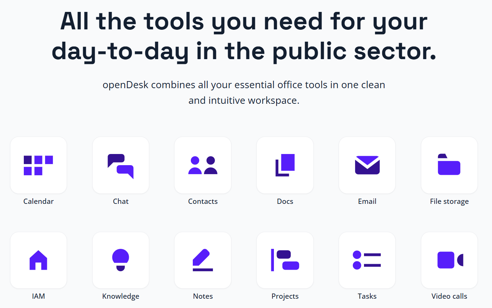
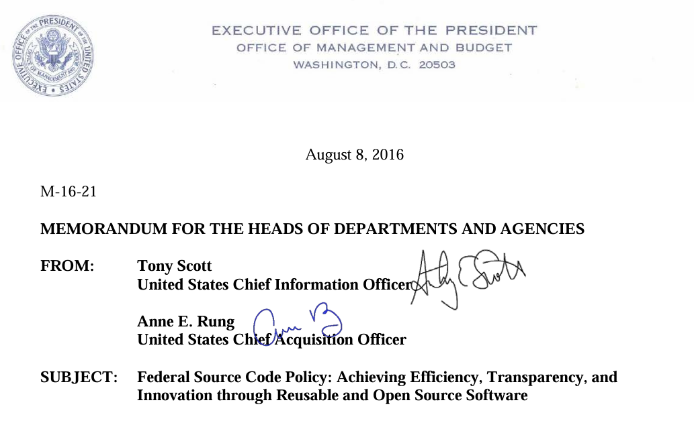
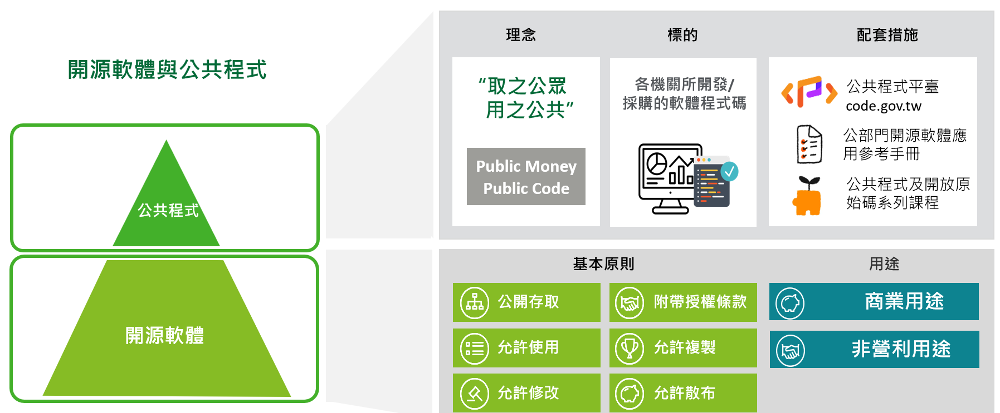
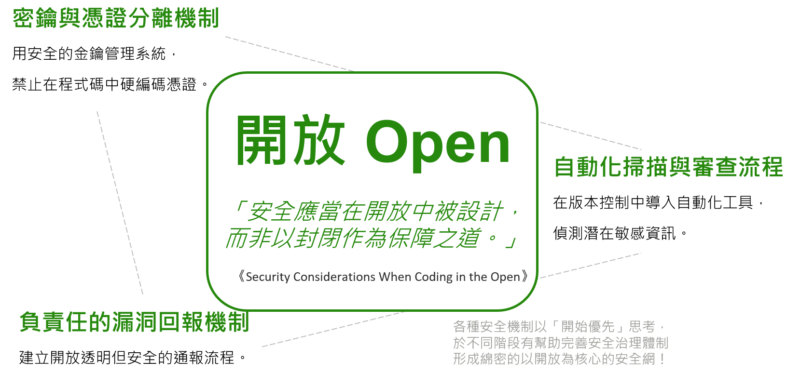
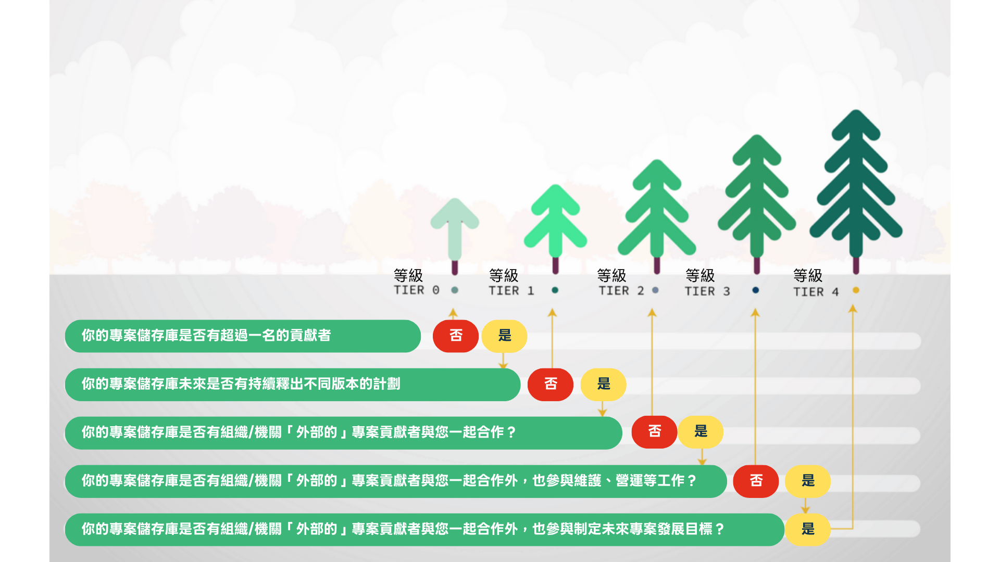
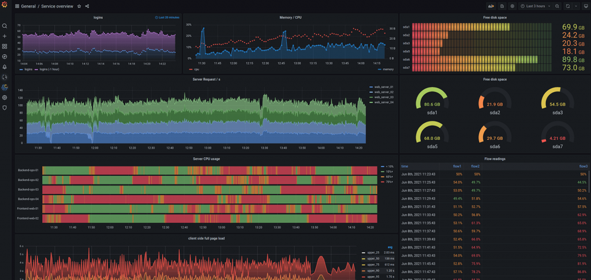
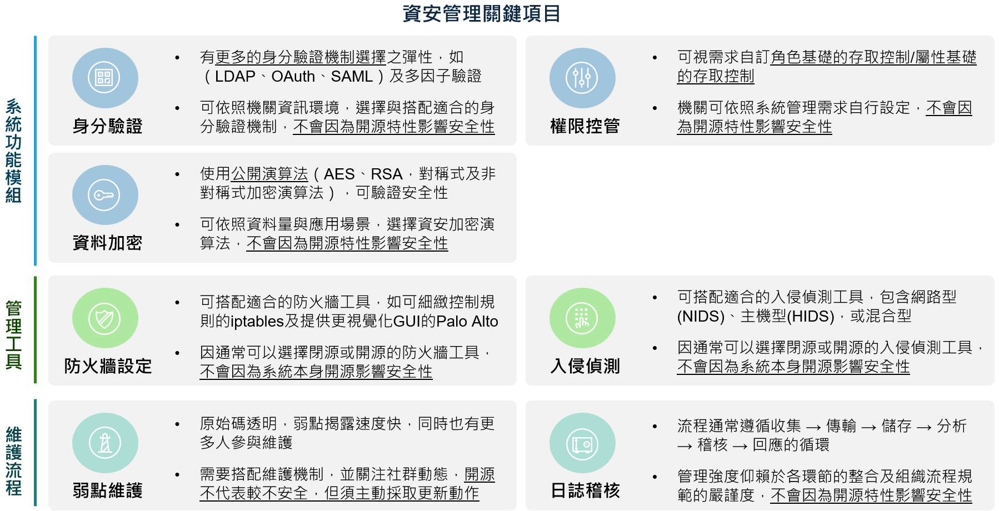
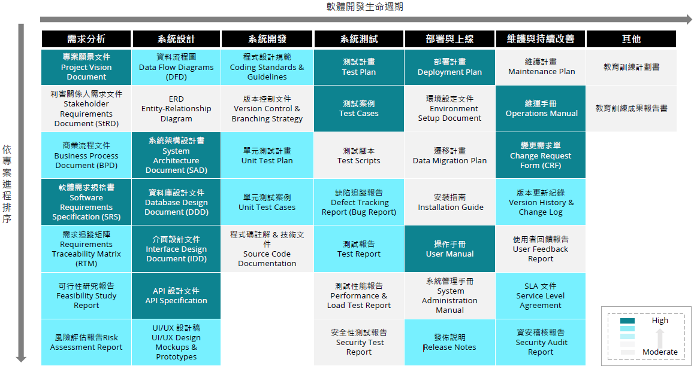

# 公部門開源軟體應用參考手冊

Public Sector Open-Source Software Playbook

## 文件修訂歷史

| 版本 | 變更內容摘要 | 原稿頁數 | 發布日期 |
| --- | --- | --- | --- |
| V1.0 | 初版制定 | 88 | 114.10.15 |
| V1.1 | 初版修改（完稿第一版） | 97 | 114.12.01 |
| V2.0 | 完稿第二版 | 97 | 114.12.05 |
| V2.1 | 完稿修訂版 | 88 | 114.12.15 |
| V2.2 | 完稿第三版 | 89 | 114.12.24 |

## 目錄

- [緒論](#introduction)
- [第一章 開源軟體介紹](#chapter-1-introduction-to-open-source-software)
  - [1.1 開源軟體發展背景](#1-1-how-it-started)
  - [1.2 開源軟體國際趨勢與應用](#1-2-international-trends-and-applications)
  - [1.3 開源軟體基本概念與授權條款類型](#1-3-basic-concept-and-licensing-agreement-types-of-open-source-software)
  - [1.4 開源軟體與公共程式](#1-4-open-source-software-and-public-code)
- [第二章 開源軟體應用評估](#chapter-2-open-source-software-application-evaluation)
  - [2.1 使用開源軟體及專有軟體差異說明](#2-1-difference-between-using-open-source-and-proprietary-software)
  - [2.2 開源軟體使用效益與風險評估](#2-2-open-source-software-benefits-and-risks-analysis)
  - [2.3 開源軟體導入模式](#2-3-open-source-software-implementation-model)
  - [2.4 開源軟體治理制度](#2-4-open-source-software-governance-system)
- [第三章 開源軟體導入方法](#chapter-3-open-source-software-implementation)
  - [3.1 軟體開發流程：需求與設計開源注意事項](#3-1-software-development-process-needs-and-cautions-when-designing-open-source-software)
  - [3.2 軟體開發流程：開發與測試開源注意事項](#3-2-software-development-process-considerations-for-open-source-during-development-and-testing)
  - [3.3 軟體開發流程：上線與驗收開源注意事項](#3-3-software-development-process-open-source-considerations-for-go-live-and-acceptance)
  - [3.4 將開發成果開源釋出](#3-4-releasing-development-outcomes-as-open-source)
- [第四章 開源軟體維護與營運](#chapter-4-open-source-software-maintenance-and-operations)
  - [4.1 開源軟體維運](#4-1-open-source-software-operations-and-maintenance)
  - [4.2 開源軟體永續經營](#4-2-sustainable-operations)
  - [4.3 結語](#4-3-conclusion)
- [附錄一 名詞解釋](#appendix-i-terminology)
- [附錄二 常見問答 FAQ](#appendix-ii-faq)
- [附錄三 參考資源](#appendix-iii-links)
- [附錄四 需求規劃自主檢核表](#appendix-iv-requirements-planning-self-assessment-checklist)
- [附錄五 授權合規評估檢核表](#appendix-v-license-compliance-assessment-checklist)

## 緒論 {#introduction}

### 緣起 {#origin}

在資訊科技百花齊放，大數據、人工智慧應用百家爭鳴，而資訊安全、風險管理的管控力道亦大幅強化的趨勢下，公部門在資訊系統開發、維護的作業需求與要求皆日漸提升，以達對內提升機關行政及業務運作效能，對外提供民眾更便捷的數位服務之目的。然而，公部門資訊單位普遍面臨資訊人手有限、技術創新速度慢等挑戰；在此背景下，開源軟體（Open-Source Software）與公共程式（Public Code）的應用提供了一個新的可能與改變的契機。

開源軟體是一種相對於專有軟體（Proprietary Software）開發與授權模式。談到軟體系統的採購，大家所習以為常的，便是依據業務需求，尋求市場上已具備大致功能的產品或工具，再由廠商進行客製化開發、建置等服務，並搭配買斷、授權或訂閱等計價方案，在系統上線後由機關取得系統「使用權」的建置模式。

以上是「專有軟體」的運作規則。專有軟體上線後，機關通常持續由原廠提供維護服務，轉換成本也相對較高。

| 類型 | 原始碼狀態 | 技術支援與授權 | 使用者取得 |
| --- | --- | --- | --- |
| 專有軟體 | 原始碼不公開 | 原廠提供授權 | 使用權 |
| 開源軟體 | 原始碼公開 | 可由不特定廠商或社群支援 | 所有權與再利用彈性 |

另一方面，開源軟體的核心概念，是其原始程式碼公開、允許他人使用、複製、修改、散布及共用技術，採用此模式的軟體系統採購，著重於和開發廠商與社群建立協作關係，在進行系統導入的同時，取得技術支援、整合服務與長期維運能力，此模式下，不僅讓機關真正取得系統的「所有權」，更有助於降低授權成本、避免特定廠商綁定，提升機關技術自主性與彈性，同時也能透過全球性的社群資源與開源生態系，加速創新與問題解決能力。

在此同時，公共程式（Public Code）呼應開源軟體推動的精神，從歐洲萌芽，並在美國、加拿大等先進國家開枝散葉。公共程式以「取之公共、用之公眾」之概念為原則，鼓勵公部門將以公務預算開發或採購之資訊軟體，搭配開放原始碼授權條款釋出程式碼，可以想像為「公部門的開源軟體庫」；機關所釋出的公共程式，除了可以讓有共同需求的其他機關有效利用，減少重複開發的人力、預算、時間外，更可以透過開放系統程式碼，讓民眾公開檢視資訊服務的品質，尤其當服務牽涉到公眾利益時，透明的公共程式將讓公眾理解系統如何運作，並因此帶來信任、提升公民參與，強化我國數位基礎建設。

故數位發展部撰寫本手冊，期許以簡要之說明，幫助各機關了解開源軟體與公共程式，協助各機關資訊規劃人員逐步建立適用開源軟體的資訊管理措施及規範，並使資訊專案承辦人員、IT 開發與維運人員瞭解開源軟體的導入方法，以有效因應國際數位發展趨勢，漸進實現開源軟體的普及應用。

## 第一章 開源軟體介紹 {#chapter-1-introduction-to-open-source-software}

### 1.1 開源軟體發展背景 {#1-1-how-it-started}

在 1950 年代到 1970 年代，當時的電腦尚未如現在普及，幾乎所有軟體都是由從事學術的研究人員寫作開發的。電腦的使用者之間，以及電腦使用者與硬體製造商之間將所使用的軟體程式原始碼公開出來互相分享其實是非常正常的事。也因為這種特性，讓知識的共享十分自然地發生，也促成了資訊科技的快速演進。1970 年代早期的 UNIX 系統在釋出時，原始碼也都是跟著一起釋出的，直到 1960 年代末期與 1970 年代早期，因為搭配硬體所需的軟體功能開始增強，開發成本也跟著提高，廠商為了避免硬體成本被軟體墊高，逐漸將軟硬體的釋出分離，並隨著軟體商業化與專利、著作權制度的介入，許多公司開始將原始碼封閉「保護」起來，禁止使用者自由修改或散布。

1983 年，Richard Stallman[^1] 發起 GNU[^2] 計畫，起源是他在麻省理工學院的人工智慧實驗室（MIT AI Lab）工作時，親身遇到了一些關於軟體不再能自由分享的困難。在 MIT AI Lab，有一台 Xerox 印表機，經常出現卡紙或列印問題。Stallman 習慣在遇到這種情況時，直接修改驅動程式的原始碼，加入通知功能，讓使用者在卡紙時會收到警告。

然而，這台 Xerox 印表機的新驅動程式是由外部公司提供的，原始碼是封閉的。 Stallman 便無法再依照以往的方式修改程式來解決問題。他甚至去找廠商要求原始碼，但被拒絕。這件事對他打擊很大，因為在 AI Lab 的傳統裡，大家都是透過分享原始碼來解決問題、互相幫助的。

對 Stallman 而言，廠商將原始碼封閉保護起來的作法，代表著社群合作文化的崩解。他認為這樣會讓程式設計師彼此隔絕，甚至「變成敵人」，因為每個人都只能守著自己的私有程式，而不能互相幫助。因此他認為，若他選擇接受專有軟體授權，等於承認「不分享」是合理的。他覺得這違背了自己對「自由」與「合作」的價值觀。於是，他做出一個激烈的決定：自己來開發一個完全自由的作業系統，讓人們不必依賴封閉軟體。1983 年 9 月，Stallman 在網路新聞群組上正式宣布 GNU 計畫。他的目標是建立一個「完全自由的 Unix 相容作業系統」。他成立了自由軟體基金會（Free Software Foundation），同時推動了「自由軟體」（Free Software）的四大自由與 GNU 通用公共授權（GNU General Public License，簡稱 GPL 或 GNU GPL），藉此確保自由分享與修改軟體的權利。

自由軟體的四大自由可整理如下：

| 自由 | 內容 |
| --- | --- |
| 自由之零 | 為了任何目的執行程式的自由。 |
| 自由之一 | 研究程式如何運作的自由，並依需求修改程式。 |
| 自由之二 | 再次散布程式的自由，以幫助他人。 |
| 自由之三 | 改善程式的自由，並將這些改進回饋給社群。 |

《大教堂與市集》所對比的兩種模式可整理如下：

| 模式 | 開發方式 | 原始碼與更新特性 |
| --- | --- | --- |
| 市集模式 | 開放、分散式開發 | 原始碼公開供大眾參與，更新頻繁，強調快速迭代。 |
| 大教堂模式 | 封閉、集中式開發 | 原始碼由開發者維護，更新較慢，強調秩序。 |

而開源軟體（Open-Source Software，或稱「開放原始碼軟體」，簡稱為 OSS）則是源自於 1997 年 Eric Raymond[^3] 的一篇論文《大教堂與市集[^4]》。論文中探討了「大教堂」（The Cathedral Model）與「市集」（The Bazaar Model）兩種開發模式，認為市集模式的「讓夠多人看到原始碼，錯誤將無所遁形」（given enough eyeballs, all bugs are shallow）方式開發品質更好。

這篇論文也促成了網景公司（Netscape）在 1998 年將它所開發的網路套件「網景通訊家」（Netscape Communicator）以自由軟體方式釋出，採用公開協作的開發方式，演變為現在許多人使用的 Mozilla Firefox 與 Thunderbird[^5] 等軟體。網景公司宣布將其瀏覽器原始碼開放，促使一群社群領袖開始討論如何讓企業界更容易接受這種軟體模式，將自由軟體基金會的自由軟體概念及優點帶入商業軟體產業。由於 90 年代隨著 Linux 作業系統與網際網路的快速發展，越來越多軟體專案依靠公開協作而蓬勃。然而，「Free Software」一詞在大眾溝通上卻遇到一些困難：

- 英文中的 “Free” 容易被誤解為「免費」而非「自由」。
- 論述帶有倫理／政治色彩，部分企業擔心可能被視為「反商業」。

因此 Eric Raymond 等人提出了 Open-Source（開放原始碼）一詞，並成立「開放原始碼促進會」（Open-Source Initiative，OSI），負責推廣與認證符合「開放原始碼定義（Open-Source Definition, OSD）[^6]」的授權條款。

採用符合 OSI 所認可的「開放原始碼授權條款」的軟體，即可稱之為「開源軟體」或「開放原始碼軟體」。在這裡需要強調的是，僅僅將原始碼公開並不意味著它是開放原始碼軟體。原始碼的釋出必須符合特定的條件和授權條款，才能被視為真正的開放原始碼軟體。

為了簡化和促進理解，我們通常將自由軟體和開放原始碼軟體統稱為「自由開源軟體」（Free and Open-Source Software, FOSS 或 Free/Libre and Open-Source Software, FLOSS）。這樣的統稱有助於減少混淆，並強調兩者共同的核心價值。

開放原始碼定義（OSD）可整理為下列十項要件：

| 要件 | 說明 |
| --- | --- |
| 自由再散布 | 軟體可自由銷售或贈送，不需支付授權費。 |
| 原始碼公開 | 須提供原始碼，且允許以原始碼或編譯後形式散布。 |
| 允許衍生作品 | 授權必須允許修改與再散布。 |
| 維護原始碼完整性 | 可要求修改版以補丁型式提供，但須允許散布修改後的程式。 |
| 不得歧視個人／群體 | 授權不得排除任何人。 |
| 不得限制用途領域 | 不得禁止在特定領域使用，例如商業或研究。 |
| 授權隨軟體傳遞 | 再散布時不需額外簽署授權。 |
| 授權不依附特定產品 | 軟體脫離原始發行版仍保有同樣權利。 |
| 不得限制其他軟體 | 不得要求同媒介上的其他軟體也必須開源。 |
| 技術中立 | 授權不得依賴特定技術或介面。 |

在技術應用層面，無論是作業系統、網際網路、雲端服務，以及 AI 人工智慧運算等領域，其發展基礎及關鍵框架與工具亦多為開源專案。

Linux 本身即為全球主流的伺服器作業系統，而手機等行動裝置所採用的 Android 作業系統也是奠基於 Linux 發展出來的；根據 W3Techs 在 2025 年 11 月提供的使用統計[^7] 中，全世界可辨識的伺服器所採用的作業系統中，自由軟體 Linux 佔了 58.4%，而專有授權之 Windows 則只佔了 10%。

在 W3Techs 的同一份報告也指出，在網際網路可辨識出的網站中，採用開放原始碼的網頁伺服器 Apache 與 Nginx 合計佔了 58.2%，超過一半以上；網頁前端技術更是開放原始碼專案的天下，如：Safari 瀏覽器的核心 WebKit，以及常見的前端技術框架如 React、Vue、Angular，皆為開放原始碼專案的重要案例。

雲端服務中，Docker 已是不可或缺的部署工具，其 Docker Engine[^8] 即為著名的開源軟體，採用 Apache License 2.0 授權條款；而雲端系統管理的核心 Kubernetes[^9] 採用的也是相同的授權條款，並已廣泛被主流雲端服務大廠 AWS、GCP、Azure 等支援。

最後，AI 的運算服務的基礎：深度學習框架 PyTorch[^10] 及 Tensorflow[^11] 以及訓練與研究用的工具，如 NumPy[^12] 皆為廣泛使用的開源專案。

以上的例子充分顯示出，現代數位發展可以說以自由開源的開放原始碼作為基礎。

### 1.2 開源軟體國際趨勢與應用 {#1-2-international-trends-and-applications}

本節將說明國際上其他政府機關應用開源軟體的三個案例，這些案例將帶我們了解公部門採用開放原始碼的主要趨勢。

#### 1.2.1 德國聯邦政府主導開發 openDesk {#1-2-1-german-federal-government-led-the-development-of-opendesk}

*圖片來源：openDesk.eu*

ZenDiS（Zentrum Digitale Souveränität），全名「公共行政的數位主權中心」（Centre for Digital Sovereignty of the Public Administration），是德國聯邦政府在 2022 年 12 月成立的一個組織，目的是為了推動開放原始碼，在公共部門中強化技術自主性與數位主權。

openDesk 則是 ZenDiS 的旗艦產品之一，是一套由多個自由開源軟體組件整合而成的辦公與協作平臺，專為公共行政機構設計。openDesk 的功能包含文字處理、試算表、電子郵件、行事曆、聯絡人、雲端儲存、聊天、視訊會議、專案管理模組、Wiki[^13] 等。最初 openDesk 是由德國聯邦內務部（Bundesministerium des Innern, BMI）主導的「Sovereign Workplace」（主權工作桌面／工作環境方案）專案開發，並在從 2024 年初完全過渡到 ZenDiS，進一步開發與管理。

openDesk 並不是從頭研發所有功能，而是將多個已經在企業／公共領域中成熟的開源軟體整合起來，並提供統一介面與使用者體驗。這樣做有利於快速部署、維護成本控制，且減少重複開發、資源浪費的問題。

openDesk 不只是協作工具，更是數位主權政策實踐的一部分，其意義包含：

- 減少對專有／單一供應商的依賴（Vendor Lock-In）：公部門若過度依賴單一商業軟體供應商，特別是境外大型公司，便可能在資料存取、維護、升級、隱私與監管等層面缺乏控制權。openDesk 採用開放原始碼與開放標準，強調可互通性與可替換性，避免政府機構被單一供應商綁定。
- 提升透明度與安全性：開源軟體的原始碼可被檢查，有助於發現安全漏洞或後門，也更容易接受第三方審核；透明度提升後，也有助於法律與監管層面的信任。
- 統一與標準化：統一的協作平臺可減少多套分散工具造成的操作負擔、訓練成本與維護成本，並提升行政效率與跨部門協作。openDesk 也在使用者介面與使用者體驗上追求一致性。
- 政策與法律支持：openDesk 的推動呼應德國政府的數位策略、IT 規劃委員會（IT-Planungsrat[^14]）「Digital Sovereignty（數位主權）」政策，鼓勵公部門使用開源軟體以確保自主性與彈性。

#### 1.2.2 聯合國提出「數位公共財」的概念 {#1-2-2-un-proposes-digital-public-goods}

除了民間推動的「Public Money, Public Code」倡議之外，聯合國也在 2020 年發表的《秘書長數位合作路線圖》（Secretary-General’s Roadmap for Digital Cooperation）中，正式提出了「數位公共財」（Digital Public Goods）的概念。

數位公共財涵蓋五大類型，包含：開放資料、開源軟體、開放內容、開放標準以及開放人工智慧模型。聯合國認為，數位公共財能夠釋放數位技術與資料的潛能，推動全球永續發展目標的實現，將同步透過制定相關標準，使其能在實務上被廣泛運用。

各國在政策層面上也多有呼應，例如歐洲、北美及澳洲等地的政府紛紛推行鼓勵採用開源軟體或將政府開發成果以開源形式公開的政策，落實「公共程式」的精神。

聯合國《秘書長數位合作路線圖》提出的五大數位公共財包含：

- 開放資料
- 開源軟體
- 開放內容
- 開放標準
- 開放人工智慧模型

#### 1.2.3 美國的《聯邦程式碼政策》 {#1-2-3-the-us-federal-source-code-policy}

雖然歐洲數位主權運動，與美國近年的多項措施有密切關係，但美國本身，其實也已推動公共程式相關政策多年。

2016 年美國總統行政辦公室（Executive Office of the President of the United States, EOP）轄下的行政管理和預算局（Office of Management and Budget, OMB）以備忘錄形式所提出《聯邦程式碼政策》（Federal Source Code Policy），該政策的首要目標在允許跨部門流通所採購之客製化程式碼，並且將部分成果對民間開放釋出。

公共程式相關的美國資訊服務採購規範，主要可見於《聯邦採購規則》（Federal Acquisition Regulation）之中，該規則由聯邦總務署（General Services Administration, GSA）轄下文官機構採購委員會（Civilian Agency Acquisition Council, CAAC）與國防採購規範委員會（Defense Acquisition Regulations Council, DARC）共同制定，目的在於對聯邦政府採購的原則與程序制定共同標準。

*圖片來源：https://obamawhitehouse.archives.gov/sites/default/files/omb/memoranda/2016/m_16_21.pdf****

### 1.3 開源軟體基本概念與授權條款類型 {#1-3-basic-concept-and-licensing-agreement-types-of-open-source-software}

開源軟體授權條款的主要功能是規範使用者如何合法使用、修改與散布原始碼，它確保原作者的權利受到尊重，同時促進原始碼的流通與再利用，不同授權類型也會影響是否需要公開修改後的原始碼或採用相同授權方式。在 1.1 小節裡我們提到，「開放原始碼促進會」（Open-Source Initiative，簡稱 OSI）是負責推廣與認證符合「開放原始碼定義（Open-Source Definition, OSD）」之授權條款的組織，而惟有採用 OSI 所認可的授權條款，才能被稱為開源軟體。

OSI 的網站上列出了所有 OSI 認可的超過一百二十種授權條款！明顯地，如此多種授權條款，若開發者不是很瞭解其間的差異，在選擇上必然會有很大的困難。所以出現了像是「Choose an Open-Source license」 這樣的網站來幫忙開發者選擇適當的授權條款。我們就先從這個網站上提到的常見的 6 種授權條款開始介紹。

#### 1.3.1 GPL 類：AGPL、GPL、LGPL {#1-3-1-gpl-agpl-gpl-lgpl}

GPL 家族可依著佐權義務強度整理如下：

| 授權條款 | 著佐權強度 | 核心義務 |
| --- | --- | --- |
| AGPL | 最嚴謹 | 使用 AGPL 授權檔案程式碼提供網路服務時，也必須公開完整原始碼。 |
| GPL | 嚴謹 | 修改、整合或合併 GPL 授權檔案程式碼時，須以相同授權條款開源。 |
| LGPL | 較寬鬆 | 僅透過函式庫介面使用 LGPL 授權檔案程式碼時，通常無需將整體專案開源。 |

由 Richard Stallman 提出的 GNU GPL 授權條款，屬於最嚴格、最強的著佐權[^15]（Copyleft）授權條款。但在經過多年的演變，為了符合現今電腦、網路環境的不同，因此出現了最強的 AGPL、標準的 GPL 與較寬鬆的 LGPL 三種變異。

在 GPL 第三版的授權條款中，標準的 GPL 要求「完整的原始碼，包括被授權作品與其修改版本（其中也包含使用了該授權作品而形成的較大型作品），必須在相同授權下提供。著作權與授權聲明必須保留，貢獻者明確授予專利權」。用比較容易懂的說法，如果一個專案用了 GPL 授權，任何人修改它、或把它的原始碼整合、合併進新的專案，都必須一併用 GPL 開源釋出。唯一的例外是——若只是把它當外部工具或透過標準介面使用，而不是把它的原始碼搬進來，那專案就可以保持自己的授權方式。

#### 1.3.2 Mozilla Public License（MPL）v2 {#1-3-2-mozilla-public-license-mpl-v2}

相對於 GPL，MPL 屬於「弱著佐權條款」（weak copyleft）。相對於 GPL，MPL 的範圍限制在「檔案層級」：只要修改了 MPL 授權的檔案，就必須公開該檔案的原始碼。但如果只是將 MPL 授權的檔案和其他專有檔案放在同一個專案裡，其他檔案可以保密、不必開源。它不像 GPL 會「污染」整個專案，MPL 只要求「被修改的檔案」繼續遵守 MPL。它希望鼓勵企業使用與回饋，但又保留彈性。Mozilla（Firefox）就是典型例子：企業可以在 Firefox 上做延伸，不必擔心整個產品都被 GPL 化。

#### 1.3.3 Apache License v2 {#1-3-3-apache-license-v2}

Apache License 是一種「寬鬆授權（permissive license）」。它僅要求必須保留著作權與授權聲明、貢獻者明確授予專利權（意思是如果某人貢獻了原始碼，他不能之後回頭用「專利」來起訴別人使用該原始碼。這是為了保障使用者和開發者）。

但被授權作品、其修改版本，以及包含它們的較大型作品，都可以在不同條款下發佈，且無需公開原始碼。它可以說「完全沒有著佐權概念」。使用者可以隨意修改、重新發佈，甚至把 Apache 授權的原始碼整合進專有軟體，而不用公開修改或整體專案的原始碼。它的目標是追求最大化採用率，希望任何人（包含商業公司）都能自由使用。例如：Hadoop[^16]、Spark[^17]、Kubernetes[^18] 等大型基礎設施軟體幾乎都用 Apache v2，因為要讓企業放心採用並投入資源。

#### 1.3.4 MIT License {#1-3-4-mit-license}

MIT 是一個簡短且簡單的寬鬆授權條款，它唯一的條件就是：必須保留著作權與授權聲明。在這條件之下，被授權作品、修改版本，以及包含該作品的較大型專案，都可以用不同的授權條款發佈，甚至不需要釋出原始碼。它被極廣泛使用（例如：Node.js[^19]、Ruby on Rails[^20] 等）。

#### 1.3.5 Boost Software License 1.0 {#1-3-5-boost-software-license-1-0}

Boost Software License 1.0 一個簡單的寬鬆授權條款，類似 MIT 條款，但更寬鬆一點。它的唯一條件是：在散布原始碼時必須保留著作權與授權聲明（但散布編譯過的二進位檔時則不強制）。被授權作品、修改版本，以及包含該作品的較大型專案，都可以用不同的授權條款發佈，且不必公開原始碼。常見於 C++ 社群，主要用於 Boost 函式庫[^21]。

#### 1.3.6 The Unlicense {#1-3-6-the-unlicense}

顧名思義，一個完全沒有任何條件的「授權」，它直接將作品釋放到公共領域（public domain）。因此，被授權作品、修改版本，以及包含該作品的較大型專案，都可以用不同的授權條款發佈，甚至不帶授權聲明、不附原始碼。使用者甚至不必標註原作者。作者徹底放棄對作品的著作權。

上述六種授權條款可由嚴謹到寬鬆整理如下：

| 授權類型 | 核心要求 |
| --- | --- |
| AGPL／GPL／LGPL | GPL 家族在觸發著佐權條件時，要求以相同授權條款釋出對應原始碼。 |
| MPL v2 | 只要修改 MPL 授權檔案，就必須公開該檔案的原始碼。 |
| Apache License v2 | 必須保留著作權與授權聲明，且貢獻者明確授予專利權。 |
| MIT License | 散布原始碼時須保留著作權與授權聲明。 |
| Boost Software License 1.0 | 散布原始碼時須保留著作權與授權聲明，散布編譯後二進位檔時則不強制。 |
| The Unlicense | 放棄著作權，將作品釋放至公共領域。 |

### 1.4 開源軟體與公共程式 {#1-4-open-source-software-and-public-code}

總結第一章各小節的說明，開源軟體是指其原始碼公開，允許他人使用、複製、修改、散布及共用技術的軟體。這類軟體提升系統安全性與可控性，對公部門而言，是推動數位治理與資訊自主的重要工具。

當公部門使用開源軟體來開發資訊系統時，便也同時奠定了發展公共程式的基石。公部門的運作核心是促進公共利益，所開發、採購、租賃的軟體與系統也是為了公眾而設置，因此公眾利益理當擺在第一位。「公共程式」即是指政府或公部門將其以公務預算開發的資訊系統，或系統的一部份程式碼公開，供社會各界自由取用與再利用，強化政策透明度與公民參與。透過公共程式的推廣，政府能促進跨機關合作、加速數位服務創新，並建立更開放、令人信任的數位環境。

## 第二章 開源軟體應用評估 {#chapter-2-open-source-software-application-evaluation}

### 2.1 使用開源軟體及專有軟體差異說明 {#2-1-difference-between-using-open-source-and-proprietary-software}

在資訊系統導入的規劃過程中，選擇使用開源軟體或專有軟體是資訊承辦人員面臨重要決策。上述兩者在財務成本、安全管理、導入方法、授權管理等面向皆有顯著差異，理解這些差異，有助於單位更了解開源軟體的特性，並依據實際需求做出最適合的選擇。

需要特別留意的是，開源軟體與專有軟體不一定是非黑即白的兩類產品，以授權管理面向而言，部份軟體可能就是採用「雙重授權」模式。雙重授權是一種軟體授權策略，讓同一套軟體同時以兩種不同的授權方式提供：一種是開源授權，通常允許自由使用、修改與散布；另一種是商業授權，針對企業或特定用途提供額外的進階功能、技術支援或免除開源義務。這種模式讓開發者能兼顧社群貢獻與商業獲利，也讓使用者可依自身需求選擇合適的授權方式。

總結而言，開源軟體與專有軟體各有其適用情境與風險考量。資訊承辦人員在規劃系統導入時，應綜合評估單位的技術能力、預算資源、客製化需求與長期維運策略，選擇最符合業務目標與資訊治理原則的方案。

專有軟體及開源軟體主要差異如下：

| 面向 | 評估項目 | 專有軟體 | 開源軟體 |
| --- | --- | --- | --- |
| 財務成本 | 軟體及服務成本 | 軟體授權費與技術服務費。 | 以技術服務費用為主。 |
| 安全管理 | 程式碼透明度 | 程式碼不公開，由廠商維護。 | 程式碼通常完全公開，可由社群及大眾共同檢視。 |
| 安全管理 | 漏洞修補機制 | 由廠商排程進行安全檢測與漏洞修補。 | 社群監督強、更新頻繁，機關須關注社群動態並建立維護流程。 |
| 導入方法 | 供應商合作 | 與單一廠商合作，通常為原廠或授權代理商。 | 專案中可與一至多家廠商合作，選商限制較少。 |
| 導入方法 | 系統整合 | 系統整合與客製化取決於產品提供之 API 或協定。 | 通常使用開放標準，具較大的系統整合彈性。 |
| 授權管理 | 授權模式 | 專屬授權，限制使用範圍。 | 開放授權，允許修改與再散布。 |
| 授權管理 | 使用限制 | 受著作權法保障，授權契約明確規範使用限制，通常禁止逆向工程。 | 單一系統可能涉及多種授權條款之管理，並需檢查不同開源授權間的相容性。 |

### 2.2 開源軟體使用效益與風險評估 {#2-2-open-source-software-benefits-and-risks-analysis}

在 2.1 小節裡面，我們完整地比較了專有軟體和開源軟體在不同面向的差異，本節中，我們將總結開源軟體的效益並了解潛在風險，以利各機關在評估與管理開源軟體時，可以充分理解其優勢及導入時的關注重點，針對實務需求及機關資訊環境，進行適宜決策。

#### 2.2.1 開源軟體的使用效益 {#2-2-1-open-source-software-benefits}

公部門使用開源軟體進行資訊系統開發，除了是一項公開透明的數位治理實踐，在成本、安全性、客製化、系統整合力、合作廠商選擇以及政策價值等面向上也具備顯著效益。

| 效益 | 說明 |
| --- | --- |
| 政策與公共價值 | 公部門採開源不僅是技術選擇，更是政策宣示，強調數位工具服務公眾利益，提升系統透明度與可審查性，增進公民信任。 |
| 財務成本可預期性高 | 開源軟體免授權費，且未來維護費用機關具公平議價能力。 |
| 合作廠商選擇彈性高 | 開源軟體導入無須指定廠商，單位可自由選擇在地或國際廠商合作，降低供應商鎖定風險。 |
| 安全管理自主性高 | 公開原始碼有助公部門掌握系統、強化資安，社群與第三方也可及早發現並修補漏洞。 |
| 高度系統整合力 | 開源軟體多採標準協定與格式，易整合既有系統，並支援跨平臺協作。 |
| 高度客製化能力 | 開源軟體可自由修改，公部門可依業務流程調整功能、擴充模組與優化介面。 |

#### 2.2.2 使用開源軟體風險評估 {#2-2-2-risk-analysis-of-open-source-software}

即使開源軟體的應用具備顯著效益，在資訊系統導入時仍須針對選型項目進行完整風險評估。風險評估流程可以與機關既有風險管理活動整合，包含：

-（1）蒐集目前及預計採用的開源軟體可能涉及的風險議題；

-（2）依據風險議題的發生機率與影響進行風險評分；

-（3）針對評分結果超過可接受風險值之風險議題，擬定因應方式。

常見風險如下：

| 風險 | 說明 |
| --- | --- |
| 轉型風險 | 從既有專有軟體轉換到開源軟體時，仍可能需投入大量人力與時間，包括資料遷移、流程再設計、系統驗證與員工訓練。 |
| 合作廠商品質與維護責任 | 開源專案雖有社群支援，但公共行政具備高度責任導向特性，仍須確保可靠的開發與維護團隊，並明確維護責任。 |
| 資安風險 | 使用開源軟體需搭配資安監控機制，以即時識別與修補軟體漏洞。 |
| 授權與法律風險 | 開源授權條款具有法律效力，若未妥善處理授權相容性，可能導致侵權風險。 |
| 使用者接受度 | 使用者可能已習慣 Microsoft Office 或 Google Workspace 等專有工具，需透過教育訓練與文化轉變提高採用意願。 |

### 2.3 開源軟體導入模式 {#2-3-open-source-software-implementation-model}

導入開源軟體時，有三個不同的策略路徑可以採用，包含：（1）直接採用現有的開源方案；（2）在前置研究時即發現本次需求，得以用整合多個開源軟體形成新的解決方案；或者，（3）因為需求特殊，必須要純粹自建從無到有開發，再來考慮後續釋出事宜。在這些模式的說明及注意事項，將於此節進一步介紹。

#### 2.3.1 開發策略選擇：應用、整合或自主開發？ {#2-3-1-development-strategy-adopt-integrate-or-self-build}

公部門使用開源軟體進行資訊系統開發時，應依專案需求、內部能力與長期治理需求選擇導入策略。

1. 應用（Adopt）：當專案需求已能明確對應至成熟開源專案軟體時，直接採用既有方案是具效率且風險較低的做法。其優勢包含節省建置時間、減少重複開發、共享全球社群經驗與安全更新、採用開放規格與標準，以及降低維運挑戰。
2. 整合式導入（Integrate）：透過組合多個開源專案（如框架、函式庫、資料平臺）形成具彈性且符合在地需求的解決方案。德國 openDesk 即是整合多項既有開源服務，打造符合公務機關需求的主權辦公套裝軟體。
3. 自主開發（Self-built）：在特殊需求或關鍵應用（Critical or Sovereign Systems）情境下，若既有開源專案無法滿足國內法規、行政流程、文化語言需求、國家安全或數位主權要求，應考量以自主開發為核心。

無論選擇哪一種策略，開源導入的成功關鍵在於「開放優先」（Open First）。專案初期即應預設未來可開源，並在系統架構、授權管理、文件撰寫上做好準備；只有在安全、隱私或尚未公開政策等必要理由下，才保留封閉部分。分層設計細節可參考英國政府指引《程式碼何時應開放或封閉》（Security Considerations When Coding in the Open）[^23]，其提醒：「安全應該設計在開放中，而不是封閉中」。

#### 2.3.2 查找專案及可參考的平臺 {#2-3-2-explore-projects-and-referenceable-platform}

機關或廠商在導入前期評估前置研究時，可以先查找是否已有可重用或改作的專案。然而直接於 GitHub 或者 GitLab 等公開的程式碼儲存庫中研究無疑是大海撈針，提供幾個具代表性的公共程式平臺如下：

| 平臺 | 營運單位 | 資料庫特色 | 代表性專案 |
| --- | --- | --- | --- |
| Software 目錄 openCode.de | 德國 ZenDiS（Zentrum für Digitale Souveränität，數位主權中心） | 聚焦數位主權與歐盟法遵性，強調重用與可持續維護。 | openDesk、FIM（Federated Information Management）、Smart Village App。 |
| SILL 資料庫 code.gouv.fr | 法國 DINUM（Direction Interministérielle du Numérique，跨部會數位總署） | 整合各部會已採用並維運的自由軟體。 | OpenFisca、GeoNature。 |
| Digital Public Goods Registry | 聯合國數位公共財聯盟（Digital Public Goods Alliance, DPGA），由 UNICEF、UNDP、Norad 共同維運 | 聚焦得以促進 SDGs 永續發展目標的開源軟體，每個專案均通過開源、倫理、治理與透明性審查。 | DHIS2、OpenCRVS、Wikipedia。 |
| 公共程式平臺 Code.gov.tw | 我國數位發展部（Ministry of Digital Affairs, MoDA） | 我國政府逐步建立公共程式釋出平臺，整合開源專案與 API，推動跨部門協作與開放治理。 | 數位憑證皮夾、地址標準寫法 API、臺北程式設計節活動網站。 |

在評估是否採用既有開源專案時，建議各機關以實際需求、開發量能與治理需求為核心，而非僅以地區或語言差異作為判斷依據。多數開源專案在 Fork（分支）後，往往能透過整合與客製化達成在地需求，同時保留其全球社群維運能量。例如德國 OpenDesk，其基礎即源自 Nextcloud[^24]，重新整合為符合德國公共行政資安與隱私規範的版本，這樣的再利用不僅是技術延伸，更是一種治理策略：在維持共用程式基礎的同時，有制度的管理確保能獲得來自社群的支援維護。類似地，丹麥 OS2 聯盟[^25]（Offentligt Software Samarbejde）所推出的 OS2 borgerPC（市民電腦工作站），在瑞典重新在地化時被命名為 Medborgare（意為「公民」），但仍延續原始 OS2 架構及維運流程，但也發展出瑞典在地化的模式。

開源專案的「在地化」的落地導入與運用，是以跨文化、族群展現公共程式的延續性與共享性。以我國近年從國發會承繼數位部的實踐，例如 LibreOffice 的分支應用，在導入該開源文書套裝軟體後，推出改良版本政府共通應用服務 ODF 文件應用工具，增添我國公文制式格式與常用功能。然固然產品已在地化，公務員仍可參考 LibreOffice 的原始國際社群文件與教學資源，但在實務操作上又擁有在地化的名稱、功能與支援。

### 2.4 開源軟體治理制度 {#2-4-open-source-software-governance-system}

採用開源軟體的開發流程與一般軟體工程並無不同，其中都有需求分析、設計、實作與測試等階段，但最大的差別在於：它背後連結著一個全球性、持續滾動的協作社群。導入開源應避免使用免費軟體的思維，而是怎樣在開發流程系統性、策略性地加入這個動態的開源生態系。若缺乏明確的專案內治理策略，則很容易陷入安全、授權與營運風險，甚至是機關的公關危機。

#### 2.4.1 鼓勵制定開源軟體政策 {#2-4-1-open-source-software-governance-system}

我國公部門長期與外部廠商合作進行系統開發，然而外部廠商在開源套件的使用與治理上，目前多半尚未建立整體性的策略脈絡，不僅讓機關與民眾難以掌握實際的維護內容與責任追溯，也造成機關難以確認開源元件的來源與安全性。本節的核心目標為協助機關在「可控、可見、可追溯」的範圍內運用各種開源資源，建立清楚的開源治理方法，讓系統維運不再只是委外，而是能真正被理解、掌握並放心長期運作的公共數位基礎建設。

建立一套完整的開源治理的策略與思維，就是這邊所指稱的「開源軟體政策」（Open Source Software Policy），是讓各專案在「開放原始碼的使用」變成「開放思維的實踐」。這裡的「開源軟體政策」，並非依賴嚴謹的立法程序，可以先從特定幾個專案內形成統一的規範、策略或者共識，進而在機關內逐步形成其整體的策略，清楚說明在「探索、使用、貢獻與釋出」開源軟體時該怎麼做。當每個機關或專案內缺乏明確的開源使用策略之時時，下述風險會逐漸累積：

| 風險 | 說明 |
| --- | --- |
| 供應鏈盲點 | 廠商若未揭露所有使用的開源套件，機關便無法掌握完整軟體物料清單；一旦上游開源元件出現漏洞，下游將難以及時應變。 |
| 版本與維運風險 | 不同系統使用同一開源元件的不同版本，可能造成長期維運困難與潛在衝突。 |
| 授權風險 | 開源授權繁多，例如 GPL、Apache、MIT；若未遵循義務，可能導致法律糾紛或被迫公開整個系統。 |

這些問題其實非單純技術層面的難題，更重要是要有策略的治理這些風險的缺口，當開源軟體政策建立，風險才能被量化、追蹤、管理。這邊使用「政策」（Policy）稱呼這樣的治理機制與策略，同時也是對齊國際間的 ISO 標準規範書的正體中文翻譯，以利於後續接軌國際標準與國際專案合作。

#### 2.4.2 開源軟體政策及軟體物料清單 {#2-4-2-open-source-software-policy-and-software-bill-of-materials}

在這一節將從實踐開源軟體政策的標竿案例展開討論，並介紹配套工具：軟體物料清單 – SBOM 表的管理，以及全球公部門 OSPO（Open Source Program Office），崛起，以利各機關可參考下述項目逐步完備其治理機制。

##### 實踐開源軟體政策的標竿案例

###### Case Study 1：我國企業導入開源政策典範 - KKCompany

我國媒體科技集團 KKCompany 成為首家取得 OpenChain ISO/IEC 5230 第三方認證的企業。KKCompany 在財團法人開放文化基金會（Open Culture Foundation，以下簡稱 OCF）的協助下，將開源合規流程融入其業務核心，其動機在於「賦能教育開發者」建立「值得信賴的軟體供應鏈」。這項認證不僅為公司營運帶來實質效益，如減少錯誤、加速產品上市時間，更向全球合作夥伴證明了，其對智慧財產權的尊重與對開源生態的承諾。

###### Case Study 2：美國聯邦政府國土安全部

美國國土安全部（Department of Homeland Security，DHS）下轄的網絡安全和基礎設施安全局（Cybersecurity and Infrastructure Security Agency，CISA），作為國家網路防禦機構，其開源政策框架高度聚焦於安全與風險管理，將開源軟體視為關鍵基礎設施的一部分，強調對其進行持續的監控與保護。

###### Case Study 3：美國聯邦政府醫療保險和醫療補助服務中心

美國醫療保險和醫療補助服務中心（Centers for Medicare & Medicaid Services，CMS）作為一個核心職能為提供公共醫療與衛生服務的機構，其開源政策則更側重於提升透明度、促進程式碼重用，並與社群協作以改善公共醫療系統。同時 CMS 也成立了專責的開源計畫辦公室（OSPO），並開發如程式儲存庫模板、成熟度模型等一系列可重用工具，大幅降低所屬機關開源門檻，也加速與其他機關程式碼的介接與共享。

###### Case Study 4：臺北市政府資訊局

臺北城市通是「臺北通」服務的開源版本，由臺北市政府資訊局與承攬廠商協作，將框架架構、前端程式與搭配活動網站的開發歷程完整保留，並以資訊局名義公開釋出於「公共程式平臺」。 在合約設計上，資訊局即預先約定開源後的治理規則，明定錯誤回報（bug）、修補（fix）、修改建議（Pull Request, PR）及版本調整等流程，使程式碼不僅「開得出來」，也有人負責持續維護。每年辦理的「程式設計節」網站同樣以公開程式碼為基礎逐年更新，並結合黑客松與活動實作，讓參與者在改善服務體驗的同時，也替臺北城市通回報與修正實際運作中的問題。臺北市目前正逐步建立一套涵蓋全府層級的統一開源政策，但透過個別標案與廠商維護合約中具體落實開源條款與治理機制，已展現出一條可行的「漸進式開源路徑」，讓市民服務入口逐步轉化為可持續演化的公共數位資產。

##### 管理軟體物料清單（SBOM 表）

在所有開源治理的實踐中，軟體物料清單（Software Bill of Materials，下簡稱 SBOM 表）是管理的重要環節，也是建議最先導入的管理工具。然而，必須強調一個關鍵觀念：產出 SBOM 表其文件本身不是終點，而是起點。SBOM 表真正價值在於它是一份「動態的、機器可讀的」資產清單，為後續所有自動化的安全與合規流程提供了基礎資料。若僅將其視為一份交付後便存檔的靜態文件，將完全錯失其在現代化軟體供應鏈管理中的潛力，機關可在採購流程中要求承辦廠商對應著提供相關動態評估、風險控管的後續實際作為。

##### SBOM 表核心功能說明

| 功能面向 | 功能說明 | 實際應用 |
| --- | --- | --- |
| 漏洞管理 | 透過自動化工具，持續比對 SBOM 表中的元件與已知漏洞資料庫（如 CVE），即時預警風險。 | 資安防護與弱點修補 |
| 授權合規 | 程式化分析專案中所有元件授權類型與義務，確保符合法遵政策。 | 開源授權管理 法遵稽核 |
| 供應鏈透明化 | 建立清晰可驗證的軟體依賴關係圖，掌握軟體「成分」。 | 軟體生命週期追蹤 風險管控 |

目前業界主流的 SBOM 格式有兩種，一個以法務和採購流程為重心的組織，可優先採用 SPDX（Software Package Data Exchange），因其在授權描述上的較為精確。而一個以 DevSecOps 為核心、強調快速迭代與風險反應的開發團隊，可考量使用 CycloneDX ，其具有輕量化與安全導向設計。成熟的組織最終應具備同時處理這兩種格式的能力，例如，在採購合約中要求供應商提供 SPDX 格式的 SBOM，同時在內部的持續整合/持續部署（CI/CD）流程中，自動生成並分析 CycloneDX 格式的 SBOM，以實現全面的治理覆蓋。

##### 主要 SBOM 格式比較：SPDX vs. CycloneDX

| 特性 | SPDX | CycloneDX | 公部門應用建議 |
| --- | --- | --- | --- |
| 主導組織 | Linux 基金會 | OWASP 基金會 | 兩者皆為國際公認的權威標準。 |
| 初始核心 | 授權合規與法律細節 | 漏洞管理與資安應用 | 根據機關首要關切點（法遵或資安）決定主要格式。 |
| 主要優勢 | 授權條款描述精確，檔案層級資訊詳盡，社群廣泛採用。 | 格式輕量，專為自動化設計，能清晰描述元件依賴關係與已知漏洞。 | 採購與法務審查建議採用 SPDX；開發維運流程（DevSecOps）建議採用 CycloneDX。 |
| 關鍵欄位 | 詳盡的套件、檔案、授權及著作權資訊。 | 元件、服務、依賴關係、漏洞參考（VEX）等。 | 依據使用情境選擇，法遵情境需 SPDX 的授權欄位，資安情境需 CycloneDX 的漏洞欄位。 |
| 生態與工具 | 生態系成熟，支援工具眾多。 | 與資安掃描工具整合度高，生態系快速成長。 | 兩種格式皆有豐富的開源與商業工具支援。 |
| 支援格式 | JSON, XML, YAML, RDF, tag-value。 | JSON, XML。 | 兩者皆支援主流的機器可讀的格式，整合性高。 |

##### 全球公部門 OSPO 的崛起

當開源政策逐步確立後，可以建立類似於「開源計畫辦公室」（OSPO）的角色，以協調開源相關事務，執行內部規範、提供彙整開源相關教育訓練資源、與法務單位溝通，並管理與社群關係，除了使機關有機會與開源貢獻者交流外，更可作為與全球開源社群互動的窗口。近年來，公部門設立 OSPO 已成為國際趨勢。為此，於 2025 年一個名為 FLOSS-PSO[^26]（Free/Libre and Open Source Software Public Sector OSPOs）的全球性網絡應運而生。該網絡連結世界各地的公部門 OSPO，提供一個中立的交流平臺，讓成員能夠分享經驗、共享資源、發起合作專案，其成員詳如下圖。

我國各機關若可凝聚內部開源策略，並建立起自己的 OSPO，便有機會加入此網絡，與全球的數位治理先驅直接交流，汲取寶貴經驗，並將我國在數位政府領域的成果推向國際舞台。

*CC By 4.0 “FLOSS-PSO 網絡地圖” 資料來源：OSPO 聯盟*

#### 2.4.3 開源合規國際標準介紹 {#2-4-3-introduction-to-international-open-source-compliance-standards}

當開源政策或 OSPO 逐步形成過程中，為確保開源軟體導入過程的嚴謹性與可信度，建議可以進一步參考國際標準，建立一套可驗證的內部流程。

OpenChain 是一項 ISO/IEC 國際標準，但它與其他前述的開放原始碼政策或治理一樣，保有高度彈性與延展性。這項標準由 Linux 基金會推動，其設計理念著重於定義「應該做什麼」（What）與「為何要做」（Why），而非規定「如何執行」（How），讓各組織能依自身情境靈活落實。OpenChain 能夠適用於不同規模的組織。小型單位可透過簡化的半自動流程達成合規，大型機關則可採自動化工具鏈整合，同時也支援「由小而大、循序導入」的推行方式——從單一專案或政府部門起步，逐步擴展至整體機關有其發展彈性。

OpenChain 的架構主要分為兩項國際標準：ISO/IEC 5230（聚焦於開源授權的合規流程）與 ISO/IEC 18974（著重於開源安全的供應鏈治理）。組織不一定需要同時導入兩者，許多國家僅在公共採購規範中要求遵循其核心精神，或要求承包廠商具備相關認證。後續小節將分別介紹這兩項標準的內容，以及機關可採取的認證導入方式。

##### 確保授權合規：ISO/IEC 5230（OpenChain 授權合規）

ISO/IEC 5230 是針對開源軟體「授權合規」的國際標準，它定義了一個開源合規計畫所需具備的核心要求。當組織遵循此標準，意味著建立了一套系統性的方法來管理開源授權，從而顯著降低法律風險。其核心要求在對應軟體生命週期，可歸納出計畫基礎（Program Foundation）、管理與支援（Management and Support）、流程實踐（Process Implementation），以及社群參與（Community Engagement）等四項關鍵實踐重點，詳如下表說明：

###### ISO/IEC 5230 關鍵實踐重點

| 實踐重點 | 子項目 | 說明 |
| --- | --- | --- |
| 計畫基礎 | 政策建立 | 必須制定一份成文的開源政策，並確保所有相關人員都知曉其內容 |
| | 角色與職能 | 明確定義參與開源合規流程的各個角色（如開發人員、法務專家、專案經理）及其職責 |
| | 教育訓練 | 確保所有參與者都具備履行其職責所需的知識與技能，並對政策有充分的認知 |
| 管理與支援 | 資源配置 | 確保負責開源合規的單位或人員（如 OSPO）擁有足夠的資源與經費 |
| | 法務支援 | 必須指定具備專業能力的法律專家，以處理內外部的開源授權議題 |
| | 外部溝通 | 建立一個公開的聯絡管道，供第三方就授權合規問題進行詢問 |
| 流程實踐 | 元件追蹤 | 建立一套流程，用以識別、追蹤並記錄軟體中所包含的所有開源元件。這通常透過產出 SBOM 來實現 |
| | 授權審查 | 對每個元件的授權條款進行審查，以確定其義務、限制與權利 |
| | 合規產物管理 | 建立流程來生成、交付並存檔所有必要的合規文件，例如授權聲明、原始碼提供通知等 |
| 社群參與 | 貢獻政策 | 制定明確的政策，規範組織員工對外部開源專案的貢獻行為。 |

- ISO/IEC 5230 關鍵產物：完整的授權聲明、姓名標示文件、原始碼提供（若需要）
- ISO/IEC 5230 相關對象：法務部門、採購部門、軟體開發團隊、OSPO

在公共部門的應用上，義大利的數位轉型部（Agenzia per l’Italia Digitale，AgID）從過去零散的專案採購模式，轉向以開源與再利用為核心的協作生態系。為避免授權錯誤帶來法律風險與再利用障礙，AgID 制定了「開源授權決策樹」，協助政府機關在導入時選擇最合適的授權類型，確保軟體能被安全重用與共享。

同時，義大利代表性的公共資訊聯盟（CSI Piemonte，Consorzio per il Sistema Informativo del Piemonte），為滿足 AgID 的嚴格要求，將開源合規納入組織日常流程，並取得 OpenChain ISO/IEC 5230 認證，至 2025 年已連續四次通過再認證。對他們而言這認證已經是持續而是制度化地確保所有專案都能合法、可追溯且可重用。義大利的經驗顯示：開源治理若能成為制度，而非專案，才能讓公共程式真正成為全民共享的數位資產。

另一個來自英國的案例為 Interneuron 為英國國民保健署（NHS）等公醫體系提供關鍵醫療軟體的公司，已成功導入 ISO/IEC 5230。這證明了在醫療這種高度管制、風險規避的領域，此標準所提供的流程框架足以建立供應鏈上下游的信任，對於需要處理敏感資料與關鍵服務的政府機關而言，其參考價值不言而喻。

##### OpenChain 安全保障：ISO/IEC 18974

繼授權合規之後，OpenChain 計畫進一步將同樣的流程管理理念應用於安全性，推出了 ISO/IEC 18974 標準。此標準的核心目標是協助組織建立一套系統化的流程，用以識別、追蹤並應對其使用的開源軟體中已知的安全漏洞（Known Vulnerabilities），例如已登錄於 CVE 資料庫的漏洞。

ISO/IEC 18974 的要求與 ISO/IEC 5230 的結構相互對應，共同構成一個全面的治理框架。其對應軟體開發流程關鍵實踐領域，詳如下表。

###### ISO/IEC 18974 關鍵實踐重點

| 實踐重點 | 子項目 | 說明 |
| --- | --- | --- |
| 政策與範疇 | 政策範疇 | 制定一份書面的開源軟體「安全保障政策」，並明確其適用範圍。 |
| 威脅與漏洞管理 | 漏洞偵測 | 必須建立方法來偵測所使用的開源元件中是否存在已知漏洞。這通常是透過自動化工具掃描 SBOM 來實現。 |
| | 風險應對 | 針對發現的已知漏洞，必須有後續的追蹤與處理流程，並在軟體發布前驗證風險是否已得到緩解。 |
| | 持續監控 | 即使軟體已經發布，也必須有方法持續分析新發布的漏洞是否對現有產品造成影響。 |
| 事件應變與溝通 | 外部通報管道 | 建立一個公開管道，允許第三方通報安全漏洞。 |
| | 內部應變流程 | 制定內部程序，以應對外部通報的漏洞事件。 |
| | 客戶溝通 | 在必要時，有方法將已識別的漏洞資訊傳達給受影響的用戶或客戶。 |

- ISO/IEC 18974 關鍵產物：漏洞清單、風險評估報告、修補計畫與紀錄
- ISO/IEC 18974 相關對象：資安部門、維運團隊（DevSecOps）、軟體開發團隊、OSPO

ISO/IEC 5230 與 ISO/IEC 18974 兩者相輔相成。前者處理的是「法律與合規風險」，確保組織遵循所使用開源軟體的授權條款，降低法律風險；後者處理的是「技術與安全風險」，確保組織能有效管理所使用開源軟體中的已知安全漏洞，降低資安風險。機關若能同時遵循這兩套標準，便意味著其建立了一套涵蓋開源軟體主要風險領域的、全面且可驗證的治理體系。

##### 認證路徑

上述標準的合規認證可以透過以下兩種途徑取得：

- 自我認證：OpenChain 計畫免費提供線上查檢表，機關可利用此工具進行內部稽核與差距分析，逐一檢視是否滿足所有要求。
- 第三方認證：機關可聘請經認可的獨立驗證機構進行稽核。通過稽核後，將獲得正式的符合性證書。此方式如同 KKCompany 的案例所示，能為組織的開源治理能力提供強而有力的外部背書，對於建立客戶、合作夥伴及監管機構的信任至關重要。

從制定政策到導入國際標準，是一條將開源軟體從潛在風險轉化為策略優勢的可行之路，各機關可參考 [附錄四](#appendix-iv-requirements-planning-self-assessment-checklist)「公部門專案導入開源軟體（或公共程式）需求規劃自主檢核表」進行自主檢核。

制度策略並非一口氣完成，透過逐步建立一套可驗證的、符合國際最佳實踐的治理流程，讓機關不僅能有效管控掌握風險，更能藉此提升數位服務的品質與韌性，並以一個負責任、值得信賴的姿態，積極參與全球的數位創新與協作。

## 第三章 開源軟體導入方法 {#chapter-3-open-source-software-implementation}

### 3.1 軟體開發流程：需求與設計開源注意事項 {#3-1-software-development-process-needs-and-cautions-when-designing-open-source-software}

開源需求評估階段的執行重點在於確認機關的業務目標與技術需求，並搭配現有系統與資源的梳理，評估開源方案的功能適配性、安全性、社群活躍度與維護能力，並分析長期成本與風險，以確保選用的開源技術或專案，可達成專案之預期成效。

#### 3.1.1 開源軟體評估與選型流程 {#3-1-1-open-source-software-evaluation-and-type-selection-process}

開源軟體評估與選型流程主要分為五個步驟，以下將逐一說明。針對規劃之完整性，可參考 [附錄四](#appendix-iv-requirements-planning-self-assessment-checklist)「公部門專案導入開源軟體（或公共程式）需求規劃自主檢核表」進行自主檢核。

##### 1. 需求釐清，識別專案目標與限制

確認本次專案的核心目標，並規劃系統所需具備的功能，以設定規格要求，確保能支援預期的使用對象及情境。於此同時，應檢視是否存在法規或資安政策的限制，例如個資保護要求、機關內部的安全規範的適用性，避免後續導入時衍生相關風險，以確定系統選型的基本條件。

##### 2. 模組化需求，以可擴充參與的規格取代過度設計

在資訊採購案管理中，常在初期就設定許多細緻規格而造成過度設計。在面對使用開源或即將開源釋出的專案中，較佳的策略是將整體需求切分為數個可獨立開發、可替換、可自由組合的「模組」，明定各模組需要，搭配多方利害關係人參與式設計，透過參與討論確定較細緻的功能。

這樣做的好處是，未來可以針對單一模組進行升級或替換，而不會影響整個系統，大幅提升了技術的彈性。數發部正在的開發數位皮夾系統時即是設計出模組的架構，搭配著多元的公民參與、技術社群的協作，逐步完備其未來各種運用。

需求設計不應是閉門會議的產物，而應開放給多元角色共同參與，包含社群開發者、第一線業務承辦人、第二線秘書單位承辦人，以及民眾。英國政府的政府數位服務（GDS），即透過大量的使用者研究與原型測試，反覆迭代設計，確保最終產品能真正解決民眾痛點。這就猶如很多我國公共建設、文化資產的修復標案中，都會有部分的勞務工作在於以參與式設計或多方利害關係人參與討論並實質影響專案方向設計。

英國的國家健保系統（NHS），在設計新一代醫療 IT 基礎系統 NHS Digital[^27] 時，並非打造一個龐大的單體系統，而是建立一套開放的 API 標準，讓不同服務的供應商以模組化的方式界接，促進市場競爭與創新。

##### 3. 潛在開源軟體盤點，搜尋合適的開源專案

搜集符合需求的開源軟體方案，並檢視軟體社群活躍度、維護頻率、版本更新情況，以及授權條款內容。機關可針對具高共通性之功能性需求，優先評估採用開源軟體的可行性。

##### 常見之共通性功能模組

| 表單填寫/資料上傳 | 個案管理 | 地圖資訊呈現 | 資料檢索 | 數據分析 |
| --- | --- | --- | --- | --- |
| 公共服務通知 | 網頁效能檢測 | 自動翻譯 | 身分驗證 | 文書處理 |

##### 4. 元件選用評估：三大檢核點

在導入外部開源元件時，公部門應以「可信任與可維運」為首要原則。開源元件雖能快速提升開發效率，但若缺乏評估與追蹤，可能導致授權糾紛或安全風險。為此，每一個被納入政府專案的開源元件，都建議依循開源政策，通過以下三大檢核點。

- 授權相容性：深入分析元件的授權條款，特別注意 GPL 這類具備「感染性」的授權，是否會與專案中其他專有授權的元件產生衝突。
- 安全狀況：檢視該元件是否存在已知的安全漏洞（CVEs），以及其維護團隊是否有長期、穩定的安全更新紀錄。
- 社群健康度：一個健康的社群是專案能否長久維護的關鍵。應評估該專案是否有活躍的維護者、貢獻者，以及社群的討論氛圍是否友善開放。

##### 5. 風險分析：防患於未然

在導入或開發任何開源系統前，風險評估應被視為治理流程的一部分，而非事後補救。唯有在設計階段就納入安全與隱私考量，才能確保專案後續維運穩定並符合法規要求。

- 威脅建模：在設計階段就應預測系統可能面臨的攻擊面，並規劃對應的防禦機制。
- 資料設計：特別是涉及個人可識別資訊的架構，必須事先進行嚴謹的規劃與加密設計，避免日後因架構問題而難以修補。

以愛沙尼亞 X-Road 為例，他們以一個高度模組化的數位平臺作為其電子政府的核心。這個平臺本身不儲存資料，而是作為一個安全的資料交換層，讓不同政府部門的系統能夠依據授權、安全地互相調用資料。

*圖片來源：X-Road*

承繼著於需求與設計階段建立的彈性基礎及開源套件的選型，開發與測試階段依然需延續著前述開源的精神，善用前置時期建立的相關利害關係人資源及自動化的管理，以利確保開源專案開發品質。

### 3.2 軟體開發流程：開發與測試開源注意事項 {#3-2-software-development-process-considerations-for-open-source-during-development-and-testing}

#### 3.2.1 上游優先：避免「開發過多分枝疲勞」 {#3-2-1-upstream-first-avoid-fork-fatigue}

專案的目標不僅是「把功能做出來」，更重要的是「確保成果能被持續維護，並易於被社群接受與貢獻」。這一階段最核心的理念是「上游優先」（Upstream First），確保在地化的修改不會造成與主流版本脫節的「孤島」。當需要修改或增加開源元件的功能時，應優先思考：「這個修改是否具有通用性？能否回饋給原始的（上游）專案？」盡可能將修改貢獻回上游，而非自行維護一個本地的修改版本。長期維護一個獨立分支，將導致與上游版本差距越來越大，最終難以升級，陷入「分支疲勞」（Fork Fatigue）的困境。

#### 3.2.2 版本控制與自動化整合 {#3-2-2-version-control-and-automated-integration}

導入「自動化治理」可讓每一次的程式碼提交都能被自動檢驗與驗證，大幅降低長期維護的風險，並增強跨部門或跨國合作的信任基礎。 版本控制與自動化流程不僅是技術管理問題，更是確保專案透明、可追溯與可持續的治理工具，確保未來接手人員與審計單位都能明確理解系統的演進脈絡。

版本控制與自動化整合的重點可整理如下：

- 版本控制：以 Git 作為版本控制的基礎，並採用清晰的分支策略與提交訊息規範，讓每一次的版本差異都明確可追溯。
- SBOM 與 CI/CD 整合：在持續整合／持續部署的自動化流程中，加入自動生成與檢查軟體物料清單 SBOM 的步驟，確保每一次建構（Build）的產出，所有依賴元件都是清晰可查的。
- 自動化合規檢核：在測試環節中，應同步整合自動化工具，進行授權掃描、合規檢查與漏洞掃描。
- 漏洞修補與紀錄：建立標準化的漏洞修補流程，並詳實追蹤修補的歷史紀錄，確保軟體基底的成熟度與安全性是透明且可被驗證的。

德國聯邦政府在開發國家級數位身分系統時，即大規模採用 GitLab 的自動化測試與安全掃描功能，確保每一次程式碼提交都符合嚴格的安全性要求。同時，美國能源部要求其資助的開源專案，必須在部署前提供完整的 SBOM，並通過自動化合規檢核流程，才能正式進入生產階段，將供應鏈安全制度化。

##### 自動化治理重點

| 重點 | 說明 |
| --- | --- |
| 版本控制 | 以 Git 作為版本控制基礎，搭配清晰分支策略與提交訊息規範。 |
| SBOM 與 CI/CD 整合 | 加入自動生成與檢查軟體物料清單的步驟。 |
| 自動化合規檢核 | 應包含授權掃描、合規檢查和漏洞掃描。 |
| 漏洞修補與紀錄 | 建立標準化漏洞修補流程，並詳實追蹤修補歷史紀錄。 |

系統上線並非專案的終點，而是另一個治理週期的開始。相較於傳統的驗收流程，僅僅核對功能是否符合規格，更多應當著重於專案的可傳承性。此階段的思維必須從「交付一個產品」轉變為「孵化一項公共資產」。開源專案的驗收，其核心問題在於：這個專案能否被其他團隊輕易地理解、接手與延續？以及，我們能否有效避免被單一供應商的專有技術或知識壁壘長期綁定？

本章節將著重於專案的驗收標準，強調其作為可持續數位公共基礎設施的潛力。此階段的規劃與執行，將決定一個由公帑資助的專案，最終是成為能夠不斷演化、被廣泛再利用的真正公共數位資產，還是一個隨著合約結束便迅速凋零的一次性成果。我們將探討驗收的三大重點：可轉移性、可讀性與永續性，及具體可操作的行動指南。

### 3.3 軟體開發流程：上線與驗收開源注意事項 {#3-3-software-development-process-open-source-considerations-for-go-live-and-acceptance}

#### 3.3.1 開源軟體授權合規檢核（表）與風險控管建議 {#3-3-1-open-source-software-license-compliance-review-checklist-and-risk-management-recommendations}

針對專案中採用的開源軟體，建議使用「公部門使用開源軟體（或公共程式）授權合規評估檢核表」作為檢核工具（可參考本手冊 [附錄五](#appendix-v-license-compliance-assessment-checklist)「公部門使用開源軟體（或公共程式）授權合規評估檢核表」）。表單內容主要包含專案基本資訊、檢核項目，以及開發成果作為公共程式等三大區塊，協助機關識別採用開源軟體的風險並規劃風險控管措施。

依據前述評估檢核表的填寫結果，可特別留意以下事項，以強化機關使用開源軟體的風險控管品質：

- 授權條款整合：若系統包含採用不同授權條款的程式碼，應留意各授權條款要求。例如，將 GPL 授權程式碼與 MIT 或 Apache 授權程式碼整合時，衍生作品須遵守 GPL「必須同樣採 GPL」之要求。
- 與專有軟體整合：若程式碼有整合至專有軟體的需求，須特別注意 GPL 屬於強制開放原始碼的授權；若整合到對外服務的閉源系統卻不開放源碼，可能違反授權。
- 上線後開源釋出及維運方式：若系統釋出作為公共程式，須規劃適當資源處理議題，持續關注社群動態，並建立版本升級機制與策略（詳見 [第四章](#chapter-4-open-source-software-maintenance-and-operations)）。

#### 3.3.2 驗收的核心：可轉移性、可讀性與永續性 {#3-3-2-the-core-of-acceptance-transferability-readability-and-sustainability}

在開源專案的脈絡下，驗收的焦點須超越功能性的符合度，深入評估專案的長期健康與自主性。可轉移性（Transferability）、可讀性（Readability）與永續性（Sustainability）構成了現代化驗收的核心，確保公共投資能夠產生長遠的社會價值，而非被鎖定在短期的技術交付中。驗收重點如下：

##### 可讀且完整的技術文件

技術文件是確保專案知識得以傳承、避免「軟性綁定」（soft lock-in）的關鍵。所謂軟性綁定，指的是即使程式碼是開源的，但由於缺乏清晰的文件，導致除了原始開發商之外，沒有任何團隊能夠有效理解、維護或擴充該系統。因此，驗收時必須將文件視為與原始碼同等重要的交付成果。這份文件要從未接觸過此專案的技術團隊，能夠僅憑文件就完成以下任務：

- 安裝編譯軟體
- 從零開始建立開發環境
- 安裝所有必要的相依套件
- 理解整體的架構
- 將軟體部署至生產環境

##### 可合法修改再利用的授權模式

確保專案在合約結束後，公部門能保有完整的控制權與選擇權。這涉及合約、技術架構及治理模式等多個層面，在採購合約層面，應明確規範智慧財產權的歸屬與授權模式。參考我國行政院公共工程委員會頒布的《資訊服務採購作業指引》，其中建議機關應以取得著作財產權的「授權利用」為原則，以利後續的系統維護管理及功能增修，重點項目應包含：

- 再製權
- 轉授權

##### 最終交付文件包整備

一份完整的最終合規文件包，是專案已盡到法律、安全與供應鏈管理責任的最終證明。這不僅是形式上的文件交付，更是專案成熟度與可信賴度的具體展現。此文件包應至少包含：

- 資安風險評估報告
- 授權檢核報告
- 軟體物料清單（SBOM）

#### 3.3.3 對標國際標準：以公共程式標準評估專案完成度 {#3-3-3-aligning-with-international-standards-assessing-project-completion-using-the-public-code-standard-framework}

為了讓驗收標準更具客觀性與國際視野，專案承辦人可將前述的各項交付產物，對應至「公共程式標準[^28]」（Standard for Public Code, SfPC）的具體條文。SfPC 是專為公部門設計的開源專案品質框架，目的是確保公共程式具備可再利用性、永續性與協作潛力。將驗收項目與 SfPC 對應，不僅能系統性地評估專案的開源成熟度，更能向國內外社群證明該專案遵循了全球最佳實踐。

導入開源的終極目標，是將單一的開發成果轉化為可永續經營的「公共程式」（Public Code）。這不僅是軟體資產的再利用，更是一種制度性的承諾：所有由公務預算建置的數位成果，都應當被設計成能夠被其他政府機關、甚至其他國家的社群，直接採用與改良。這種做法能極大化公共投資的效益，降低因重複開發所造成的資源浪費，並提升跨領域、跨國界的協作效率。

本節將探討如何從治理層面，將一個已完成的開源專案，提升為一個具備長期價值與影響力的公共程式。

### 3.4 將開發成果開源釋出 {#3-4-releasing-development-outcomes-as-open-source}

#### 3.4.1 維護政府開源專案的要點 {#3-4-1-key-governance-considerations-for-public-code}

一個專案要從「開源」昇華為「公共程式」，必須妥善進行維護方式規劃，包含專案文件、維護承諾與社群互動模式，皆應評估其後續的維護等級及專案定位，進而確認未來釋出時文件檔案架構的完備程度，以促進最大範圍的信任與協作為目標。

##### 視需求決定不同的公共程式維護等級

*圖片來源：美國 DSACMS 下轄 repo-scaffolder 專案*

並非所有公共程式都需要政府投入永續的官方維護資源。常見的迷思是「所有開源專案都必須永遠保持活躍」，然而實務上資源有限，且部份專案即因應階段性目的開發，無長期維護需求。因此，驗收階段須根據專案的重要性、社群活躍度與可用資源，明確規劃未來的維護等級。

| 維護等級 | 適用情境 | 治理重點 |
| --- | --- | --- |
| 等級 0 - 1（Tier 0-1）：僅原始碼存檔 | 已完成其階段性任務、不再進行活躍開發的專案。例如，為某個一次性大型活動所開發的網站、已結案的研究計畫所使用的分析工具等，未來大幅度的更新機率不高，亦可考量其為等級 0，或者未來持續可能偶一為之時選擇等級 1。 | 明確地在專案的 README 文件和網站上標示該專案已「封存」（Archived）。原始碼和文件將繼續公開存放，以供歷史查閱、學術研究或他人參考，但官方不再提供任何形式的支援、頻繁更新或安全保證，但其依然為具有價值得以讓其他單位參考運用的專案。 |
| 等級 2（Tier 2）：官方長期維護 | 支撐核心公共服務、具備高度戰略意義的關鍵系統。例如，報稅系統、數位身分驗證服務、災防告警系統等。 | 由政府編列常態性預算，組建專職的內部團隊或委託專業廠商進行持續的開發、維護與安全更新。這是最高等級的承諾，確保系統的穩定與可靠。 |
| 等級 3-4（Tier 3-4）：轉交社群託管 | 具有高度實用價值、已形成活躍使用者或貢獻者社群，但非屬關鍵基礎設施的工具或平臺。例如，資料視覺化工具、內部專案管理範本、政府網站設計系統等。 | 政府的角色從「主導開發者」轉變為「社群賦能者」。政府不再負責所有程式碼的撰寫，而是提供必要的基礎設施（如程式碼託管、論壇）、建立清晰的治理規則，並鼓勵、引導社群成員接手主要的維護與發展工作。 |

在專案驗收時就做出維護等級的決策，是一種積極主動的風險管理策略。每一個政府資訊專案都需有長期策略思考，明確其長期承諾的範圍。公開聲明一個專案已「封存」，並非承認失敗，而是一種負責任的行為，它清晰地設定了外界的期望，並釐清了政府的維護責任。

#### 3.4.2 建立清晰友善的社群貢獻機制 {#3-4-2-establishing-clear-and-friendly-community-contribution-processes}

無論是等級 1 或等級 2 的專案，若希望能從外部社群獲得助益，就必須建立一套清晰、透明且友善的貢獻機制。這不僅能吸引有價值的外部貢獻，更能確保所有進入專案的程式碼都符合品質與安全標準。一個健全的社群貢獻機制應包含以下要素：

##### 核心治理文件

在程式碼儲存庫中，必須包含關鍵的治理文件，為所有參與者設定行為準則與期望

| 要素 | 說明 |
| --- | --- |
| CONTRIBUTING.md | 詳細說明如何提交程式碼貢獻（例如，如何開設 issue、發起 pull request、編碼風格要求、需要包含測試等）。 |
| CODE_OF_CONDUCT.md | 明確訂定社群的行為準則，確保這是一個尊重、包容與專業的協作環境。 |
| 治理模型文件（GOVERNANCE.md） | 說明專案的決策流程、主要維護者的角色與職責等。 |
| 議題追蹤 | 所有錯誤回報、功能建議與技術討論，都應在公開的議題追蹤系統上進行。 |
| 程式碼審查 | 所有來程式碼貢獻，都必須經過至少一位維護者的審查，確認其架構、風格與安全標準，才能被合併到主分支中。 |

#### 3.4.3 積極的社群支持與互動 {#3-4-3-active-community-support-and-engagement}

建立一個成功的社群，需要主動提供多種回饋管道（電子郵件、論壇）、鼓勵開發者分享使用其資料的開源範例，並可考量在資源許可的情況下，定期舉辦黑客松（Hackathon）等活動，積極地與開發者社群互動，從而圍繞其開放原始碼資料建立起一個充滿活力的生態系。這種積極支持的態度，是將「使用者」轉化為「貢獻者」的關鍵。

## 第四章 開源軟體維護與營運 {#chapter-4-open-source-software-maintenance-and-operations}

### 4.1 開源軟體維運 {#4-1-open-source-software-operations-and-maintenance}

雖然開源軟體在技術架構與工具選擇上可能有所不同，但其上線後的維運工作，在核心維運概念上，與一般資訊系統有高度的相似性；惟在其原始碼的維護上，有來自世界各地的社群共同參與，需要機關或維護廠商瞭解可能的資源及運作方式，並將之整合進實務維運流程中。本章節將就系統維運的七大重點工項，以及採用開源軟體的資訊系統在維運上的實際做法、搭配工具提供參考建議。

| 系統維運工項 | 說明 |
| --- | --- |
| 系統監控 | 即時追蹤與分析系統運作狀態，以確保服務及效能穩定 |
| 日誌管理 | 收集、儲存與分析系統相關紀錄，以利問題追蹤與稽核 |
| 容量管理 | 預測與調整資源使用量，避免系統過載或資源浪費 |
| 資安管理 | 保護系統與資料免於未授權存取、攻擊或洩漏的管理措施 |
| 功能維護 | 持續修正錯誤與優化系統功能，確保系統穩定及符合需求 |
| 版本控管 | 管理系統變更的歷史紀錄，確保團隊協作與版本一致性 |
| 文件管理 | 維護系統相關文件，確保資訊完整、可追溯與易於查閱 |

#### 4.1.1 系統監控 {#4-1-1-system-monitoring}

在系統正式上線後，需即時掌握系統運作狀況，以便在發生異常時能快速反應。系統監控作業包含持續收集 CPU 使用率、記憶體消耗、磁碟 I/O、網路流量等指標，並設定告警條件，例如當服務回應時間超過門檻或錯誤率異常升高時，自動通知維運人員。

若機關尚無既有的監控工具，亦可考量使用專為雲原生架構設計的開源監控系統 Prometheus 搭配 視覺化儀表板工具 Grafana 的監控架構。Prometheus 具備高效能的時間序列資料庫與強大的查詢語言（PromQL），核心功能包括資料蒐集、時間序列儲存、警示規則設定，及彈性擴充，並支援 Kubernetes、Docker 等容器化環境，適合政府機關逐步導入微服務架構的情境下使用（微服務架構已臻成熟，例如：遠傳電信、南山人壽等大企業皆已導入容器化微服務架構，建置敏捷、穩定且安全的全新核心系統之開放式平臺）。Grafana 則是開源視覺化工具，常與 Prometheus 搭配使用，用於展示監控資料與建立儀表板，同時也支援 Elasticsearch、MySQL、PostgreSQL、InfluxDB 等多種資料來源，適合整合異質系統資料，並可依照使用者角色進行存取權限設定，可落實內部分層管理需求。

*圖片來源：Grafana.com*

#### 4.1.2 日誌管理 {#4-1-2-log-management}

系統的日誌記錄了系統與應用程式的歷史事件與操作軌跡，用於問題診斷、資安稽核與行為分析，例如各使用者何時登入、API 回傳錯誤或伺服器異常的資訊，是系統維運與資安稽核的核心資料來源。日誌管理應將應用面、系統面與安全事件的日誌集中收集並視覺化分析，並由機關依據資安政策，設定日誌保存期限、存取權限，並建立異常事件的日誌追蹤流程，確保在發生未授權存取或系統錯誤時，能快速定位相關日誌並進行調查。

日誌管理的重點在於透過集中化收集與結構化格式，將分散於各節點的日誌統一整合，並支援即時搜尋與分析，以快速定位問題來源，同時保留必要紀錄以符合法規與稽核需求。

##### 日誌管理四大重點

| 重點 | 說明 |
| --- | --- |
| 結構化日誌 | 使用 JSON 或統一格式，讓系統能自動化解析與比對。 |
| 集中化收集 | 將分散於不同伺服器與服務的日誌集中在同一平臺，便於查詢與分析。 |
| 合規與稽核 | 保存必要的日誌紀錄，滿足安全與法律規範（如 GDPR、ISO 27001）。 |
| 即時搜尋與分析 | 快速查找特定錯誤或模式，例如異常流量來源。 |

#### 4.1.3 容量管理 {#4-1-3-capacity-management}

容量管理的目的在於系統資源的評估與調校，確保系統資源能夠有效支援業務需求，並具備因應未來成長的彈性。容量管理的範圍一般包含 CPU、記憶體、儲存空間，及網路頻寬等，透過持續性監控工具，收集系統運作指標，並藉由歷史資料與統計模型，預測未來資源需求，識別潛在瓶頸或風險，以進行資源配置優化、擴充計畫制定，或導入自動化擴展機制（如 Auto-scaling）。

相對於專有軟體系統通常提供一站式的容量管理解決方案，開源軟體系統則多採用模組化架構，依據實際需求選擇並整合多種工具，例如前面提到的 Prometheus 與 Grafana 等，可使機關依據業務需求快速調整監控指標與容量策略。

#### 4.1.4 資安管理 {#4-1-4-information-security-management}

資安管理是指透過一系列政策、技術與流程，來保護系統資源與資料的機密性、完整性與可用性，常見措施包括身分驗證、權限控管、資料加密、入侵偵測、防火牆設定、弱點掃描與日誌稽核等，以防止系統遭遇未授權存取、惡意攻擊與資料洩漏，並確保系統在面對威脅時具備偵測、應變與復原的能力。

#### 4.1.5 功能維護 {#4-1-5-functional-maintenance}

資訊系統功能維護是指針對既有系統功能進行持續性的檢查、修正錯誤與優化功能，以確保系統在運作過程中能穩定、精準支援業務需求，持續改善使用者體驗。此外，隨著業務流程的調整與擴展，系統功能亦需具備彈性，能因應新需求進行調整與擴充。功能維護亦肩負資訊安全與合規性的責任，透過定期更新與修補，確保系統符合相關法規與資安標準。

由於開源軟體通常由社群驅動開發，其功能維護不依賴單一廠商，而是透過全球開發者共同參與、持續改進，支援透過 issue tracker（例如 GitHub Issues）使開發者可根據社群回饋，進行修正並提交更新，此模式下，機關也需定期檢視社群版本更新與安全修補，並視需要進行發布，並依需求整合第三方套件或自行開發新功能。

##### 開源軟體 Issue 追蹤處理流程

| 流程 | 說明 |
| --- | --- |
| 建立 Issue | 使用者/開發者在專案的 issue tracker 中提交問題，內容應包含標題、描述、重現步驟、預期結果與實際結果等資訊。 |
| 分類與標籤 | 專案維護者會根據問題性質加上標籤（如 bug、question、security），並指派給相關開發者或團隊。 |
| 討論與補充資訊 | 開發者與社群成員可在 issue 下方留言，釐清問題、提供重現方式或提出解法建議。 |
| 修復與提交 PR | 開發者根據 issue 修正程式碼，並提交 PR（Pull Request），通常會在 PR 中關聯對應的 issue（例如 Fixes #123）。 |
| PR 審查與合併 | 維護者審查 PR，確認修正無誤後合併至主分支，並關閉對應的 issue。 |
| 版本發布與紀錄 | 修正內容會在下個版本中釋出，並記錄於 changelog 中，供使用者參考。 |

#### 4.1.6 版本控管 {#4-1-6-version-control}

版本控管的目的在於確保系統在持續維護的過程中，能維持穩定性、可追溯性與一致性。透過有效的版本控管，機關能夠清楚掌握每一次系統變更的內容、時間與影響範圍，並在發生異常時快速回溯至穩定版本，降低營運風險。

版本控管作業涵蓋多個層面，包括程式碼版本管理、系統配置紀錄、資料庫結構變更、API 介面更新等。每一次功能新增、錯誤修正或效能優化，都應納入版本紀錄，並依照標準命名規則與版本編號進行管理。在實務操作上，版本控管應搭配版本管理工具（如 Git、SVN）與持續整合平臺（如 Jenkins、GitLab CI），以自動化方式記錄變更、執行測試並部署至測試或正式環境。每一次版本更新前，應進行完整的測試與驗收，並依照變更管理流程進行審查與核准，確保版本品質與系統穩定性。

##### GitHub 版本控管流程示例

1. 建立分支（Branch）
2. 開發與提交（Commit）
3. 推送到 GitHub（Push）
4. 建立 Issue
5. 建立 PR（Pull Request）
6. 程式碼檢驗（Code Review）
7. 合併 PR
8. 版本標記與發布（Tag & Release）

#### 4.1.7 文件管理 {#4-1-7-documentation-management}

資訊系統開發與維運過程中，文件管理不僅是技術溝通的媒介，更是品質控管、知識傳承與合規稽核的重要依據。有效的文件管理能夠確保開發流程具備一致性、可追溯性與透明性，並降低人員異動或系統變更所帶來的風險。

文件管理涵蓋整個系統開發生命週期，包括需求分析、系統設計、程式開發、測試驗收、上線部署與維運支援等階段，如需求規格書、設計圖、測試計畫、變更紀錄與使用手冊等，皆應納入統一的文件管理機制，具備明確的編號、版本標示、撰寫日期與負責人資訊，定期進行檢視與維護，並依照標準格式與命名規則進行分類與儲存，並應搭配版本控管工具與協作平臺，以確保文件的更新歷程可追蹤、多方協作，及搭配機關的審核流程。

### 4.2 開源軟體永續經營 {#4-2-sustainable-operations}

為協助各級機關有效導入並長期維運開源系統，永續經營之措施涵蓋人才培育、社群互動、技術升級、授權合規與公共回饋等五大重點，作為機關規劃與執行開源導入作業的參考依據，建立穩健的開源治理架構，促進政府數位服務的創新與共享。

##### 開源軟體永續經營五大策略

- 開源人才培育與文化形塑
- 社群動態追蹤與持續整合
- 系統管理與升級策略建立
- 授權條款管理與程式碼再利用
- 連結社群與公共程式平臺

#### 4.2.1 開源人才培育與文化形塑 {#4-2-1-open-source-talent-development-and-culture-building}

開源軟體的永續推動，首要在於建立穩固的人才基礎，與開放、開源的開發文化，強化公部門承辦人員及協力廠商對開源軟體的基本概念、授權條款理解能力、實務操作經驗。為此，數位發展部持續推出相關教育訓練課程，目前已有 8 堂公共程式相關課程在「e 等公務園+學習平臺」上架，邀請各機關參考利用，逐步建立開源導入與管理的能力。

| 公共程式基礎班 101 | 公共程式基礎班 102 | 公共程式基礎班 103 | 公共程式基礎班 104 |
| --- | --- | --- | --- |
| 開放原始碼全球趨勢與生態系 | 從開放原始碼到公共程式-概念介紹 | 從開放原始碼到公共程式-效益與日常應用 | 軟體管理基本標準與元素 |
| 公共程式進階班 201 | 公共程式進階班 202 | 公共程式進階班 203 | 公共程式進階班 204 |
| 公共程式國際案例與政策 | 我國公共程式和開放原始碼案例 | 公共程式招標文件入門-需求評估和授權條款 | 公共程式廠商管理國際標準 |

#### 4.2.2 社群動態追蹤與持續整合 {#4-2-2-community-activity-monitoring-and-continuous-integration}

開源軟體的生命力來自活躍的社群，因此，定期檢視所採用開源專案的社群公告、安全修補與功能擴充動態，是維持系統安全與穩定的關鍵。開源社群通常透過 GitHub、GitLab、論壇、郵件清單或即時通訊平臺（例如 Slack、Discord）進行溝通與協作，這些平臺不僅是回報錯誤與追蹤問題的管道，也是新功能提案與版本規劃的重要來源。透過持續關注這些社群動態，機關能即時掌握潛在的資安風險與技術趨勢，並在第一時間採取應對措施，避免因使用過時或有漏洞的版本而導致系統暴露於風險之中。

除了被動接收通知以外，已使用開源軟體的機關應建立例行性追蹤機制，掌握版本更新情形，並依實際需求進行版本同步或升級。這些機制可結合自動化工具定期檢查相依套件的更新狀況，並透過持續整合流程進行測試與驗證，確保升級不會影響現有功能，提升整體營運的穩定性、永續與彈性。

#### 4.2.3 系統管理與升級策略建立 {#4-2-3-establishing-system-management-and-upgrade-strategies}

在進行新版本部署前，應全面檢視其與現有系統架構、資料庫結構、API 介面及第三方套件的相容性。若發現不相容情形，機關可依據開源軟體的可修改特性，自行進行程式修正與調整，無需等待原廠釋出修補版本。此種自主維護能力是開源軟體的優勢之一，亦需搭配技術團隊的能力培養與協作機制。

升級策略應以「風險可控、功能穩定」為原則，可搭配工具與自動化測試框架，確保每次升級都經過充分測試並可快速回復。對於關鍵元件（如資料庫、認證系統），應特別謹慎，避免與其他系統相依性產生衝突。[4.2.2](#4-2-2-community-activity-monitoring-and-continuous-integration) 定期檢視開源專案的維護狀況與社群活躍度，也有助於評估是否持續使用或尋找替代方案。

#### 4.2.4 授權條款管理與程式碼再利用 {#4-2-4-license-management-and-code-reuse}

開源軟體的授權條款管理是資訊系統治理中不可忽視的一環，因為不同的開源授權條款對於使用、修改、散布與商業化的權利與限制各有不同。若未妥善管理，可能導致法律風險或合規問題，特別是在機關導入開源元件時，需特別注意授權相容性與義務。

為此，建議建立一套授權條款管理機制，包括：導入開源授權掃描工具（例如 FOSSA 等）、建立元件審查流程，以及定期進行授權合規性稽核，並在進行原始碼重用或二次開發時，詳加檢視原始授權條款，確認是否需採用相同授權模式、是否需公開原始碼，以及公開範圍的界定。此一作業不僅關乎法律合規，也影響後續系統的開放性與共享性。透過這些措施，機關能在享受開源軟體帶來的彈性與創新優勢的同時，降低潛在的法律風險，並確保所有使用的開源元件皆符合組織的合規與安全要求。

#### 4.2.5 連結社群與公共程式平臺 {#4-2-5-connecting-communities-and-public-code-platforms}

「一個人走得快，一群人走得遠」，為促進開源生態系的正向循環，機關在進行重大功能開發或修正後，應考慮將成果回饋至原始社群或公開於政府公共程式平臺。此舉不僅展現政府對開源精神的支持，也有助於提升技術透明度與社會參與度，進一步強化開源軟體的永續發展基礎。

### 4.3 結語 {#4-3-conclusion}

開源軟體的採用與開發已成為資訊軟體實務的主流趨勢，國際間多個公部門為了打造全球共享的數位公共財、或強化數位主權等考量，皆已大幅投入開源軟體的開發與應用，並且逐步為建立開源治理制度的最佳實踐，確保開源軟體授權合規，強調資訊安全與隱私，並兼顧維運效能與永續。

開源軟體與公共程式的導入，不僅是技術選擇，更是政府數位治理的轉型，以及邁向開放政府的重要里程碑。本手冊的第一、二章介紹了開源軟體的基本概念，並說明開源軟體在國際間多個公部門的實際應用，輔以風險評估、使用效益，及開源軟體治理制度等建議，協助各機關在實際啟動各項開源軟體專案前，對於開源軟體的內涵、價值，與管理方法逐步建立清晰的理解。本手冊的第三、四章，則依據開源軟體導入階段，從需求與設計、開發與測試、上線與驗收，到維運及永續經營，分階段說明使用開源軟體的注意事項，並提供了需求規劃自主檢核表、授權合規評估檢核表等二項工具，協助各機關落地開源軟體的實務應用。

透過本手冊所彙整的國際應用案例、評估方法，使用開源軟體與公共程式的導入流程，以及持續維護開源軟體的管理重點與永續經營策略，期望協助各機關在推動開源應用時，能兼顧技術效益及其授權合規後的永續價值。再者，藉由本手冊的引導，我國各機關可以增進開源軟體的採用能量，促進我國政府釋出共通性開源元件，銜接國際公部門開源軟體的應用最新趨勢，共同打造安全、韌性、共享的數位公共環境。

## 附錄一 名詞解釋 {#appendix-i-terminology}

| 編號 | 名詞 | 解釋 |
| --- | --- | --- |
| 1 | 公共程式（Public Code） | 各機關所開發或採購之軟體程式碼以開放原始碼形式釋出者。 |
| 2 | 開放原始碼（Open Source） | 公開、允許他人使用、複製、修改、散布及共用技術，可作為商業用途或非營利用途之程式碼。 |
| 3 | 開源軟體（Open-Source Software, OSS） | 原始程式碼公開，允許他人使用、複製、修改、散布及共用技術的軟體。這類軟體依據特定的開源授權條款進行管理，確保使用者在遵守條款的前提下享有自由使用的權利。 |
| 4 | 開放原始碼授權條款（Open Source License） | 開放原始碼軟體應使用符合國際及開放原始碼促進會（Open source initiative, OSI）認可之規範，包含該軟體之著作權、重製權等規定。 |
| 5 | 專有軟體（Proprietary Software） | 智慧財產權由特定人或組織專有之軟體。 |
| 6 | 公共程式平臺（code.gov.tw） | 收納各機關開放的公共程式，釋出公共程式，供公眾共同使用、檢視、維護。 |
| 7 | 程式基底（Codebase） | 任何獨立分離的統合包，內含執行部分政策或軟體所需的程式（包含原始碼與政策）、測試與文件等的整套內容。 |
| 8 | 開放標準（Open standard） | 任何符合 OSI 開放原始碼促進會《開放標準需求規範》的標準，就是開放標準。 |
| 9 | 原始碼（Source Code） | 人類可讀，並且能夠翻譯成機器指令的電腦程式文字。 |
| 10 | 版本控制（Version Control） | 對原始碼及其相關檔案的變動行為作管理的流程。變動行為，通常是以稱為「修訂編號」（或版次等類似名稱）的代號作識別。每次修訂都會標示其改動時間以及作者， 方便追溯程式碼的演進。修訂控制系統可用來比較不同版本之間的差異，以及查看內容隨著時間經歷的變動。 |
| 11 | 貢獻守則（Contribute Guidelines） | 旨在指導如何向程式碼庫或專案進行貢獻，包含：提交新功能、修復錯誤、提出建議流程與準則等，常見於 CONTRIBUTING.md 文件中。 |

## 附錄二 常見問答 FAQ {#appendix-ii-faq}

數位發展部自 112 年起，陸續辦理各項座談會等活動，與各界介紹與交流公共程式（Public Code）概念及公部門採用方式。依據前述座談之實務經驗，彙整常見問題及回應說明。

| 編號 | 問題 | 回覆 |
| --- | --- | --- |
| 1 | 軟體的程式碼公開，會不會帶來資安問題? | 公共程式只有開放系統的程式碼架構，並不開放內容資料。且因為可公開檢視，當系統有漏洞時，可以讓更多人共同找尋問題，甚至可以更新系統開發時，撰寫上較為不流暢的程式碼。安全性取決於維護機制與使用方式，而非是否開源。 |
| 2 | 使用開源軟體或公共程式，跟現行的資訊系統開發有什麼不一樣? | 一般資訊系統開發時，通常需從頭開始定義需求並進行開發。但若使用開源軟體或公共程式，可以奠基於已定義好需求並完成開發的資訊系統上，進行客製化應用，減少重複開發的心力。 |
| 3 | 其他先進國家政府是否也在推動公共程式? | 有多個國家積極推動公共程式政策，將政府開發的資通訊系統原始碼視為公共財，開源讓全民使用。例如愛沙尼亞與芬蘭、冰島共同維運開源的 X-Road 系統，允許各國政府在本國自由運用，並在發現問題時立即提出修正，讓其他單位同步更新。 或是英國也將政府內部的表單設計、發放填寫的機制設計成一個獨立的服務，除了英國政府機關都能共用外，其他國家的政府單位也可以申請使用。 |
| 4 | 有意願使用開源軟體/公共程式，哪些資訊開發廠商可以配合? | 只要能遵循開源授權條款的規定，任何廠商都可以進行公共程式的客製化與維護，開啟政府機關與更多不同廠商合作的可能性。 |
| 5 | 在採購流程中，要如何指定廠商再利用公共程式，或將開發成果作為公共程式? | 可於招標文件中納入開發成果（或部分成果）須以再利用或參酌之公共程式名稱、明定採購軟體之授權條款、或於評選項目納入廠商過去之開放原始碼或公共程式貢獻或開發經驗。 |
| 6 | 開源軟體是否能與現有商業系統整合？ | 多數開源軟體支援標準格式與 API，可與商業系統整合。 |
| 7 | 承接政府標案的資訊廠商，使用公共程式再利用時有什麼需要注意的? | 每支公共程式所使用的開源授權皆不同，需要事先了解欲再利用的公共程式的開源授權是否有特殊要求（例：Apache 2.0 授權條款要求再利用程式碼時，除了標記出處，也需要產製 NOTICE 文件）。此外，雖然公共程式皆符合資安標準，但再利用公共程式開發的資訊系統資安責任，仍由系統開發廠商負責。 |
| 8 | 如何管理資訊環境中的開源軟體及第三方套件? | 可以透過 SBOM（Software Bill of Materials）掃描工具建立所有使用元件的清單，包含版本、來源、授權資訊，將有助於機關進行漏洞追蹤、合規審查與供應鏈安全管理。 |
| 9 | 使用公共程式的權責如何界定? | 公共程式所使用的開源授權條款，通常都帶有免責條款，這代表再利用公共程式的政府機關與資訊廠商，仍需要為自己開發的資訊系統付資訊安全、著作權、營運等責任。 |
| 10 | 公共程式平臺上的專案維運機制為何? | 在公共程式開放期間，除了提供程式碼的政府機關外，其他人也能於程式碼存放處（GitHub），提出程式碼修改建議，在程式碼的世界裡實踐公共力。 |

## 附錄三 參考資源 {#appendix-iii-links}

數位發展部公共程式平臺

https://code.gov.tw/

公共程式標準

Standard for Public Code- Guidance for government open source collaboration（2025）https://standard.publiccode.net/

開放原始碼促進會 Open Source Initiative

https://opensource.org/

開放原始碼促進會開源軟體授權條款認證清單

https://opensource.org/licenses

開源軟體與公共程式實例說明-openDesk

https://www.openDesk.eu/en/about

## 附錄四 需求規劃自主檢核表 {#appendix-iv-requirements-planning-self-assessment-checklist}

### 公部門專案導入開源軟體（或公共程式）需求規劃自主檢核表

本自主檢核表為協助資訊專案承辦人員，導入開源軟體或公共程式時，可於形成專案過程中或撰寫「需求說明書」時先行自我檢視的面向，以協助釐清後續專案推動過程中，更順暢的逐步與協力廠商一同納入開源及其合規治理觀念。

資訊專案承辦人員可依照各機關需求，根據階段檢核項目，參考「對機關益處」欄位之說明，評估導入程度，並可參考具體實踐建議調整或檢視其需求說明書，以逐步實踐開源。

#### I. 專案需求規劃與採購評估

| 檢核項目 | 對機關益處 | 具體實踐建議 |
| --- | --- | --- |
| □ 採購需求以技術中立撰寫 | 確保無論採用開源／專有軟體方案皆有參與評估 | 需求說明書中不得直接指定特定供應商、產品名稱或專屬平臺（包含開放原始碼及專有軟體方案皆平等對待）。 |
| □ 檢附總擁有成本比較分析 | 確保評估方案皆納入機關後續整體維護成本 | 需求說明書載明：  「廠商須提出本案之『開放原始碼』與『專有軟體』解決方案在系統啟用日起 年期間之總擁有成本（TCO）比較分析報告。報告內容至少包含授權使用費、維運費、升級或轉移成本、替換風險成本、後續擴充成本等，並須附上完整比較說明，以供機關決策參考。」 |
| □ 整合運用方案評估 | 如選擇整合導入不同軟體時，確保機關可清楚廠商預計整合之專有與開放原始碼軟體 | 需求說明書載明：  「廠商須說明其擬採用之軟體平臺、開發工具與程式庫的構成，並區分標示其中的專有元件與開放原始碼元件」。  廠商須說明各元件所遵循的開放標準，以及未來是否具備技術轉移或替換的可行性，同時提出機關可自行維運之能力評估，以確保方案未來持續多元發展的可能性。 |
| □ 系統開發透明與開放程度分析 | 如為機關自主開發全新資訊專案時，得以確保其開發的架構未來有其開放可能性，而非重新開發 | 需求說明書應要求：  「廠商於專案設計階段，基於政府透明度原則，針對軟體開發提出『隱私／機密資料處理區分』與『可對外開放或重用之模組』分析」。  明確指出哪些系統模組可供外部重用或以開源方式釋出，並提出相應的技術規劃，確保未來符合政府資料開放與軟體重用策略。 |

---

#### II. 專案治理與開源合規

| 檢核項目 | 對機關益處 | 具體實踐建議 |
| --- | --- | --- |
| □ 交付 SBOM 清單要求 | 確保無論開源或專有軟體之使用，均能讓機關確實掌握所收到的成果 | 需求說明書建議載明：  「廠商須於每一階段驗收（設計審查、初驗、複驗、結案）時，提交該階段最新版本的軟體材料清單（SBOM）」。無論使用開放原始碼、商業套裝軟體或自建元件，SBOM 均須納入所有元件。 |
| □ 開源合規流程與教育機制 | 確認軟體來源、遵循授權義務標示、版權風險管理與文件留存等，以提升機關整體開源治理能力 | 需求說明書建議載明：  「廠商專案團隊須依據 ISO／IEC 5230（OpenChain）精神，建立內部開源軟體使用與授權合規流程，並協助機關建立相應的教育訓練機制」。 |
| □ 維運安全事件應變通報機制 | 確保系統在全生命週期內的安全性與可控性 | 需求說明書建議載明：  「廠商專案團隊須參考 ISO／IEC 18974 建立完整的維運期間如遇開源安全事件應變與通報流程，並與機關協調緊急協作窗口」。 |
| □ 合規自主驗證與第三方驗證 | 鼓勵廠商主動提升開源治理與安全管理品質，進而協助機關有機會一同提升其開源治理 | 需求說明書建議可鼓勵廠商：  「就開源合規與安全之國際標準 ISO／IEC 5230 與 ISO／IEC 18974 皆開放提供免費自主驗證機制。廠商如提供已完成的自我驗證文件，可檢附以佐證廠商其專案治理實績；亦可考量將協助機關專案取得第三方驗證，作為創新加值服務範疇」。 |

---

#### III. 需求分析與系統設計階段

| 檢核項目 | 對機關益處 | 具體實踐建議 |
| --- | --- | --- |
| □ 模組化需求規範 | 以確保系統具有彈性延展性，為機關提前建立未來擴充的可能性。 | 需求說明書建議載明：  「廠商須採用模組化架構提出方案，將系統功能拆分為可獨立開發與替換的模組」。 |
| □ 多元利害關係人參與設計 | 確保系統功能貼近實際使用情境，符合使用者需求，並有機會讓機關、開發者與社群共同協作 | 需求說明書建議載明：  「廠商須在需求訪談與系統設計階段，引入多元利害關係人參與機制」，包含最終使用者的研究訪談、原型製作與測試、需求反覆修正流程等。廠商可闡述如何蒐集並回饋使用者意見，以利需求持續最佳化。 |
| □ 元件選用可信與合規檢核 | 確保所選用的元件來源可靠、授權許可無爭議，且未來有持續維護與社群支援，減少技術債風險 | 需求說明書建議載明：「廠商須對其擬採用的所有軟體元件（含開源及專有）進行來源可信度、授權合規性與維運可持續性三項檢核」，並提交完整的元件清單作為日後製作 SBOM 的基礎。 |
| □ 風險分析與安全設計 | 確保在設計之初即納入資訊安全與法規遵循的考量 | 需求說明書建議載明：  「廠商須於系統設計階段進行全面的風險分析，包括威脅建模、資料保護需求、授權合規風險等」，並據此提出相應的安全設計方案及後續安全更新機制。此要求將成為日後維運與資安管理的基礎。 |

---

#### IV. 系統開發與測試階段

| 檢核項目 | 對機關益處 | 具體實踐建議 |
| --- | --- | --- |
| □ 上游優先原則與分支管理 | 避免長期維護私有分支，造成未來機關升級困難 | 需求說明書建議預先約定：「未來如需修改本案所採用之開源軟體元件或新增功能，雙方應優先依『上游優先（Upstream First）』原則討論處理」。盡量以相容上游專案方式開發，如確需維護在地化分支，廠商須詳細紀錄並說明與上游版本差異，以利機關未來持續開發。 |
| □ 上游優先原則與國際貢獻 | 鼓勵廠商協助機關貢獻，並彰顯我國政府於國際開源社群中的貢獻 | 需求說明書建議可載明：  「凡屬本專案範圍內之開發，可與機關討論後，進行上游貢獻，由廠商或機關回饋至上游專案」。 |
| □ 版本控制與自動化整合流程 | 確保每次階段性驗收時的程式碼提交、建置與部署皆留有完整紀錄。減少人為疏失風險，確保專案成果可長期維護與演進。 | 需求說明書建議載明：「廠商須採用版本控制系統（如 Git）管理本案全部原始碼，並建置自動化建置與測試流程（包含程式品質、安全掃描與授權合規檢查）」。 |

---

#### V. 開源上線與驗收階段

| 檢核項目 | 對機關益處 | 具體實踐建議 |
| --- | --- | --- |
| □ 確認專案成果的可轉移性 | 機關日後可順利接手維運，並且可有多元的發展運用可能。 | 需求說明書建議載明：  「須提交完整技術文件：包含但不限於系統架構、部署流程、建置腳本、環境需求；並明確標示是否依賴特定專有或開源技術。」 |
| □ 確認系統使用的永續性 | 確保系統可長期使用與升級，讓機關有持續運用的發包規劃 | 需求說明書建議載明：  「廠商須提交未來五年維運可行性分析：包含但不限於第三方相依風險、後續相關升級策略與建議。」 |
| □ 確認系統技術文件的可讀性 | 確保後續機關或委外團隊，皆能直接理解程式碼並調整。 | 需求說明書建議載明：  「程式碼需具備足夠註解、一致命名風格，並附 API 文件、資料字典、邏輯流程圖與可重現建置（reproducible build）環境。」 |
| □ 對應公共程式標準檢核 | 對齊國際標準，提升系統可重用性與公共價值，利於後續跨機關採用 | 需求說明書可建議載明：  「廠商須依 Standard for Public Code（SfPC）條文提交對照表，含文件品質、測試、可重用設計、開放標準使用、版本治理等項目。」 |
| □ 依照開源釋出準備資料結構 | 機關未來可公開相關成果成開源軟體，並對接開源社群 | 需求說明書建議載明：  「廠商在專案 Repo 需建置包含但不限於，公開版本程式碼、README、版本說明、資料結構說明、貢獻指南、Issue／Patch 模板，確保專案具備釋出條件。」 |
| □ 明確社群貢獻流程 | 機關系統有機會由開源社群一同協作專案 | 需求說明書建議載明：  「廠商須提交專案後續貢獻流程、PR 規範、程式碼審查流程與互動管道（如 GitHub Discussions），以支援開源後治理辦法與服務範圍。」 |
| □ 維護等級與治理策略 | 機關可於驗收時即明確定位專案，及未來治理模式，避免無人維護造成資安風險 | 需求說明書建議載明：  「廠商須依專案重要性、資源與社群活躍度，提出維護等級（活躍／安全維護／封存），含維護範圍與建議資源配置。」 |
| □ 社群活絡與後續推廣策略 | 讓專案成為可持續的公共程式生態系，提高採用率與外部支援。 | 需求說明書建議載明：  「廠商可提出開源後社群互動方式，如回應策略、教學文件、技術文章、範例程式，另亦可考量以推廣活動（hackathon、分享會）、貢獻工作坊等作為創意行銷方式或加值服務方案。」 |

## 附錄五 授權合規評估檢核表 {#appendix-v-license-compliance-assessment-checklist}

### 公部門使用開源軟體（或公共程式）授權合規評估檢核表

本評估檢核表分為三大區塊，包含（1）專案基本資訊，（2）使用開源軟體/公共程式檢核項目，以及（3）將開發成果作為公共程式，協助機關識別採用開源軟體的風險並規劃風險控管措施（可參考本文 [3.3.1](#3-3-1-open-source-software-license-compliance-review-checklist-and-risk-management-recommendations)）。

#### 專案基本資訊

針對本次開源軟體或公共程式對應的專案、系統，及相關功能型目標進行梳理，並確認權責人員及協力廠商。

| 公部門使用開源軟體（或公共程式）授權合規評估檢核表 | |
| --- | --- |
| 專案基本資訊 | |
| 專案名稱 | |
| 系統名稱 | |
| 專案簡述 | |
| 主要功能 | |
| 機關名稱 | |
| 協力廠商 | |
| 窗口姓名 | |

針對本專案預計導入的每一項開源軟體或公共程式，盤點其產品資訊、連結方式，以及授權條款之要求與遵循方式。（因手冊版面限制，此處表格矩陣以轉置方式呈現）

#### I. 基本資訊

| 檢核項目 | 說明 |
| --- | --- |
| 1. 開源軟體／公共程式的名稱與版本號 | |
| 2. 該開源軟體／公共程式的取得來源（如自網路下載，請提供 URL） | |
| 3. 權利人／授權者（Licensor）的姓名／名稱 | |
| 4. 權利人／授權者為（請勾選所有適用的選項） | □ 個人 □ 企業 □ 政府機關 □ 學術單位 □ 財團法人／非營利組織 |
| 5. 是否知悉該開源軟體／公共程式涉及任何智慧財產權（專利、所有權）相關的問題或其他爭議 | □ 是，描述說明： □ 否，描述說明： |

---

#### II. 授權條款資料

| 檢核項目 | 說明 |
| --- | --- |
| 1. 該開源軟體／公共程式的授權條款（請包含版本號，例如：Apache-2.0） | |
| 2. 該開源軟體／公共程式授權條款在哪裡找到的？（請勾選所有適用選項） | □ license.txt 或 readme.txt □ 原始碼（Source Code）或標頭檔（Header File） □ 網站，描述說明： □ 其他，描述說明： |
| 3. 該授權條款是否允許使用新版本（例如：GPL-2.0 或 GPL-3.0 之後的版本） | □ 是 □ 否 |
| 4. 該授權條款是否有「商業版本」或稱「雙重授權」（Dual License） | □ 是，請描述說明： □ 否 |

---

#### III. 預期用途

| 檢核項目 | 說明 |
| --- | --- |
| 1. 將採用該開源軟體／公共程式的用途（請勾選所有適用的選項） | □ 作為組織內部的開發工具 □ 僅供組織內部使用（Internal Use），如：軟體應用程式或服務 □ 作為產品（Product），並將散布至組織外部 □ 其他 |
| 2. 該開源軟體／公共程式的全部或部分（包括函式庫或可再散布的個別元件、模組等）將被散布或受下列人員使用（請勾選所有適用的選項） | □ 組織內部的員工 □ 與組織相關的單位（例如：子公司）的員工 □ 組織的下游廠商或諮詢顧問 □ 其他第三人 |
| 3. 下列問題如答案為「是」，請提供描述說明 | |

##### III-3. 使用方式檢核

| 檢核項目 | 說明 |
| --- | --- |
| 1）該開源軟體／公共程式是否會被修改（Modified）？ | □ 是，請描述說明： □ 否 |
| 2）該開源軟體／公共程式原始碼的部分是否會被其他程式碼所利用？ | □ 是，請描述說明： □ 否 |
| 3）該開源軟體／公共程式是否會被其他程式碼透過靜態或動態連結（Dynamic or Static Link）來利用？ | □ 是，請描述說明： □ 否 |
| 4）該開源軟體／公共程式是否會與其他程式碼在共享位址空間（Shared Address Space）進行連結？ | □ 是，請描述說明： □ 否 |
| 5）該開源軟體／公共程式是否會與其他程式碼對於複雜的內部資料結構（Internal Data Structures）進行交換（Exchange）？ | □ 是，請描述說明： □ 否 |
| 6）該開源軟體／公共程式是否會與其他程式碼結合（Combined）並在單一程式中成為各自獨立的部分？ | □ 是，請描述說明： □ 否 |
| 7）該開源軟體／公共程式是否會與其他程式碼透過 APIs、Pipes、Sockets 以及 Command-line Arguments 以外的機制，或任何其他類似的機制進行溝通（Communicate）？ | □ 是，請描述說明： □ 否 |

---

#### IV. 授權條款遵循

| 檢核項目 | 說明 |
| --- | --- |
| 1. 該開源軟體／公共程式授權條款是否含有「修改部分（Modifications）／衍生程式（Derivative Works）／貢獻部分（Contributions）適用相同條款」的要求？ | □ 是，您建議應該如何做才符合授權條款的規定？  □ 否，該開源軟體／公共程式的「預期用途」，並不適用授權條款「修改部分（Modifications）／衍生程式（Derivative Works）／貢獻部分（Contributions）適用相同條款」的要求。 |
| 2. 該開源軟體／公共程式授權條款是否含有「應要求而提供原始碼（Provide Source Code Upon Request）」等類似文字的要求？ | □ 是，您建議應該如何做才符合授權條款的規定？  □ 否，該開源軟體／公共程式的「預期用途」，並不適用授權條款中「要求提供」原始碼等文字的要求。 |
| 3. 該開源軟體／公共程式授權條款是否含有「散布／傳散」（Distribution／Propagate）原始碼的要求？ | □ 是，您建議應該如何做才符合授權條款的規定？  □ 否，該開源軟體／公共程式的「預期用途」，並不適用授權條款中「散布／傳散」原始碼的要求。 |

---

#### 開發成果作為公共程式

針對使用開源軟體或公共程式的專案，評估將開發成果作為公共程式的可行性，並檢核作為公共程式應具備的要件。

| 檢核項目 | 說明 |
| --- | --- |
| 1. 所有使用中的軟體原始程式碼（除了用於偵測詐欺或涉及機敏性的原始碼除外），公開供民眾取用 | □ 是   □ 否，請說明 |
| 2. 程式基底包含貢獻指引，例如以「CONTRIBUTING」檔案說明。說明歡迎貢獻的內容類型，以及貢獻者可如何參與開發，並應該令任何人都能對程式基底提出修改建議。 | □ 是   □ 否，請說明 |
| 3. 程式基底包含開發人員與設計師能夠瞭解的目標說明文件，如陳述主旨、使命或目標等，以利他們使用程式基底或協助貢獻。 | □ 是  □ 否，請說明 |
| 4. 程式基底如要促進資料交換的特性，採用符合 OSI 開放原始碼促進會其《開放標準需求規範》的開放標準。 | □ 是   □ 否，請說明 |
| 5. 所有原始碼與文件，皆採用得以自由重複使用、自由修改、自由再次散布的授權條款。 | □ 是   □ 否，請說明 |

## 註解

[^1]: Richard Stallman：自由軟體運動的發起人。他也同時發起了 GNU 計畫與自由軟體基金會，為隨後的電腦世界帶來極大的改變。
[^2]: GNU：「GNU is Not Unix」的遞迴縮寫。這種幽默地使用參照自身或其他縮寫的縮寫是早期電腦領域駭客社群中的一個傳統（特別是在麻省理工學院）。
[^3]: Eric Raymond：1997 年以後被廣泛公認為是開放原始碼運動的主要領導者之一，並且是開放原始碼促進會（Open-Source Initiative）主要創辦人之一。
[^4]: 大教堂與市集：兩種不同的自由軟體開發模式。「大教堂」模式在開發過程中是由一個專屬的團隊所集中控管，而「市集」模式在開發過程中即在網際網路上公開，供人檢視及開發，多人參與、快速修正、頻繁發行。
[^5]: Mozilla Firefox 與 Thunderbird：Mozilla 公司的兩個主要開放原始碼專案。Firefox 是一套網路瀏覽器，由最早的 Netscape 演變而來；Thunderbird 則是一套電子郵件收發信套件，並且可以做個人資訊管理（如通訊錄等）。
[^6]: 開放原始碼定義, OSD：https://opensource.org/osd
[^7]: Comparison of the usage statistics of Linux vs. Windows for websites：https://w3techs.com/technologies/comparison/os-linux%2Cos-windows
[^8]: Docker Engine：https://docs.docker.com/engine/#licensing
[^9]: Kubernetes：https://kubernetes.io/
[^10]: PyTorch：https://en.wikipedia.org/wiki/PyTorch
[^11]: Tensorflow：https://github.com/tensorflow/
[^12]: NumPy：https://en.wikipedia.org/wiki/NumPy
[^13]: Wiki：讓多人可以共同編輯與維護內容的網頁系統。特色在於「協作與即時更新」──任何被授權的使用者都可以直接在網頁上新增、修改或刪除內容，而不需要具備程式設計的知識。
[^14]: IT-Planungsrat：由 Deutschland 聯邦（Bund）與各聯邦州（Länder）共同設立，目的是為了協調聯邦與州在資訊技術（IT）與數位政府（e-Government）方面的合作。
[^15]: 著佐權：是一種利用現有著作權體制來保障使用者軟體自由使用權利的授權方式。與寬容式自由軟體授權條款相比，Copyleft 授權被認為具有保護傘且互惠的作用。
[^16]: Hadoop：一個分散式儲存與處理框架，專為大規模資料集的批次處理設計。
[^17]: Spark：一個高速分散式運算引擎，支援記憶體運算，適合大數據分析與即時處理。
[^18]: Kubernetes：一個開源容器開發平臺，用於自動化部署、擴展與管理容器化應用。
[^19]: Node.js：基於 JavaScript 的伺服器端執行環境，擅長處理高並發與非同步 I/O。
[^20]: Ruby on Rails：基於 Ruby 的 Web 應用框架，強調快速開發與「慣例優於配置」。
[^21]: Boost 函式庫：一組高效能、跨平臺的 C++ 函式庫，提供資料結構、演算法與工具擴展。
[^22]: Red Hat（2022）：https://www.redhat.com/en/enterprise-open-source-report/2022
[^23]: 英國政府的指引《程式碼何時應開放或封閉》：英國政府數位服務部門發布的指引，闡述了公家機關在使用或開發程式碼時，應優先將程式碼開放原始碼的立場，同時提出在某些情況下必須保持封閉的理由
[^24]: Nextcloud：開源雲端儲存與協作平臺，類似於 Google Drive 或 Microsoft OneDrive 等產品。
[^25]: OS2 聯盟：Offentligt Digitaliseringsfællesskab，由丹麥公家機關與 IT 供應商協作的開放原始碼社群，捍衛「公共軟體由公家機關擁有」，共同研發並維護政府 IT 解決方案
[^26]: FLOSS PSO：由開源社群志工主導、由 OSPO 聯盟支援的全球性社群，專為公共部門組織內設置或運作 OSPO 的機構建立。它蒐集、整理各國公共機構的 OSPO 名單與做法，促進經驗交流、政策共創與合作機會，旨在讓開放原始碼精神在政府界落地生根。參考聯盟網址：https://floss-pso.network/。
[^27]: NHS Digital：NHS Digital 透過建立中心化的 API 管理平臺，採用開放標準以降低第三方服務整合門檻，使後續多元服務得以在同一套 API 的模組化架構上持續擴充，形成健康且具競爭力的數位生態圈。源自： 《How NHS Digital used API Management to support APIs at scale》
[^28]: 公共程式標準：專為公部門設計的開源專案品質框架，中文版可參考 https://pdis.github.io/publiccodenet.standard/
